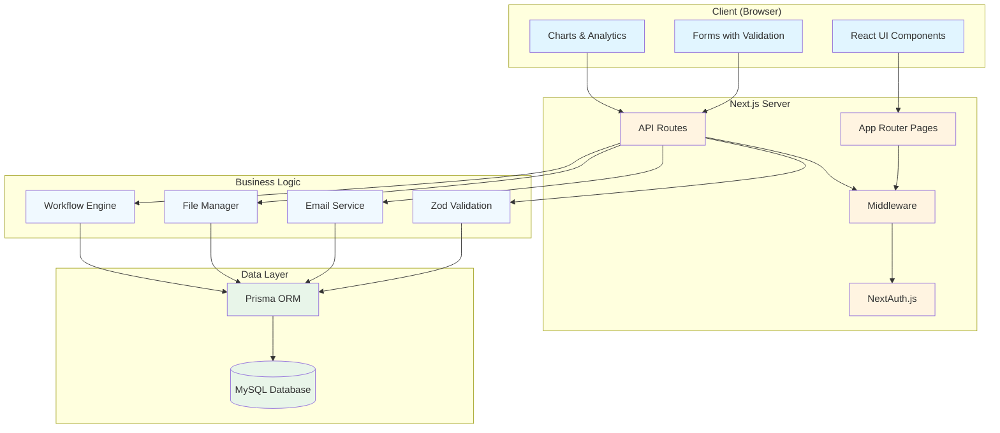

# Documentation Index

Welcome to the comprehensive documentation for the NextJS Template App! This documentation is designed to help new developers understand the codebase from scratch.

## 📚 Documentation Structure

This documentation is organized into several sections, each covering different aspects of the application:

### Getting Started
- **[01-getting-started.md](./01-getting-started.md)** - Initial setup, installation, and first steps
- **[02-project-overview.md](./02-project-overview.md)** - High-level overview of the project

### Architecture & Structure
- **[03-architecture.md](./03-architecture.md)** - System architecture and design patterns
- **[04-project-structure.md](./04-project-structure.md)** - Detailed file and folder organization
- **[05-routing.md](./05-routing.md)** - Next.js App Router routing system

### Core Systems
- **[06-authentication.md](./06-authentication.md)** - Authentication system with NextAuth.js
- **[07-database.md](./07-database.md)** - Database schema, Prisma ORM, and data models
- **[08-api-routes.md](./08-api-routes.md)** - API routes and server-side logic

### Frontend Development
- **[09-components-overview.md](./09-components-overview.md)** - Component architecture and organization
- **[10-ui-components.md](./10-ui-components.md)** - Reusable UI components (shadcn/ui)
- **[11-forms-validation.md](./11-forms-validation.md)** - Forms, validation with Zod, and form handling
- **[12-data-tables.md](./12-data-tables.md)** - Data tables with TanStack Table

### Advanced Features
- **[13-workflows.md](./13-workflows.md)** - Workflow system for transfer requests
- **[14-file-management.md](./14-file-management.md)** - File upload and management system
- **[15-dashboard-analytics.md](./15-dashboard-analytics.md)** - Dashboard and analytics implementation

### Styling & UI/UX
- **[16-styling-theming.md](./16-styling-theming.md)** - TailwindCSS, theming, and styling guidelines
- **[17-animations.md](./17-animations.md)** - Animations with Framer Motion

### Utilities & Helpers
- **[18-utilities.md](./18-utilities.md)** - Utility functions and helper libraries
- **[19-error-handling.md](./19-error-handling.md)** - Error handling and debugging

### Development & Deployment
- **[20-development-guidelines.md](./20-development-guidelines.md)** - Development best practices
- **[21-security.md](./21-security.md)** - Security features and best practices
- **[22-deployment.md](./22-deployment.md)** - Deployment guide and production considerations
- **[23-troubleshooting.md](./23-troubleshooting.md)** - Common issues and solutions

### Code Walkthroughs (Detailed Code Examples)
- **[24-code-walkthrough-pages.md](./24-code-walkthrough-pages.md)** - How pages work with real code examples
- **[25-code-walkthrough-api.md](./25-code-walkthrough-api.md)** - How API routes work with real code examples
- **[26-code-walkthrough-components.md](./26-code-walkthrough-components.md)** - How components work with real code examples
- **[27-code-walkthrough-database.md](./27-code-walkthrough-database.md)** - How database queries work with real code examples

### File & Folder Reference
- **[28-files-folders-interactions.md](./28-files-folders-interactions.md)** - Complete guide to all files and folders, their interactions, and when they're used
- **[29-files-quick-reference.md](./29-files-quick-reference.md)** - Quick reference for file relationships and where to find things
- **[30-file-interactions-examples.md](./30-file-interactions-examples.md)** - Real code examples showing how files interact

## 🎯 Quick Navigation

### 📖 Learning Path for Beginners

If you're new to this project, follow this recommended reading order:

#### Week 1: Foundation
1. **[Getting Started](./01-getting-started.md)** - Set up your development environment
   - **Time**: 30-60 minutes
   - **What you'll learn**: How to install and run the project
   
2. **[Project Overview](./02-project-overview.md)** - Understand what this project does
   - **Time**: 20 minutes
   - **What you'll learn**: Features, architecture, and use cases

3. **[Project Structure](./04-project-structure.md)** - Explore the codebase
   - **Time**: 30 minutes
   - **What you'll learn**: Where files are located and organized

#### Week 2: Core Concepts
4. **[Architecture](./03-architecture.md)** - Learn how everything connects
   - **Time**: 45 minutes
   - **What you'll learn**: Design patterns, data flow, system architecture

5. **[Routing](./05-routing.md)** - Understand Next.js routing
   - **Time**: 30 minutes
   - **What you'll learn**: How pages and routes work

6. **[Authentication System](./06-authentication.md)** - Learn about user authentication
   - **Time**: 45 minutes
   - **What you'll learn**: Login, signup, password reset, sessions

#### Week 3: Data & APIs
7. **[Database & Prisma](./07-database.md)** - Work with the database
   - **Time**: 60 minutes
   - **What you'll learn**: Database schema, Prisma ORM, queries

8. **[API Routes](./08-api-routes.md)** - Create backend endpoints
   - **Time**: 45 minutes
   - **What you'll learn**: API design, request handling, validation

#### Week 4: Frontend
9. **[Components Overview](./09-components-overview.md)** - Reusable components
   - **Time**: 45 minutes
   - **What you'll learn**: Component architecture, composition

10. **[UI Components](./10-ui-components.md)** - shadcn/ui components
    - **Time**: 30 minutes
    - **What you'll learn**: Available UI components and usage

11. **[Forms & Validation](./11-forms-validation.md)** - Build forms
    - **Time**: 45 minutes
    - **What you'll learn**: Form handling, Zod validation, React Hook Form

### 🚀 Quick Reference for Experienced Developers

| Topic | Document | Key Concepts |
|-------|----------|--------------|
| **Setup** | [Getting Started](./01-getting-started.md) | Installation, environment setup |
| **Architecture** | [Architecture](./03-architecture.md) | Design patterns, data flow |
| **Auth** | [Authentication](./06-authentication.md) | NextAuth.js, sessions, RBAC |
| **Database** | [Database](./07-database.md) | Prisma, schema, migrations |
| **APIs** | [API Routes](./08-api-routes.md) | Route handlers, validation |
| **Components** | [Components](./09-components-overview.md) | React components, composition |
| **Forms** | [Forms](./11-forms-validation.md) | React Hook Form, Zod |

### 📚 Code Walkthroughs (Must Read for New Developers!)

These detailed code walkthroughs explain **exactly how code works** with real examples:

| Document | What You'll Learn | Time |
|----------|------------------|------|
| **[Code Walkthrough: Authentication](./24-code-walkthrough-authentication.md)** | Step-by-step guide through registration, login, sessions | 60 min |
| **[Code Walkthrough: API Routes](./25-code-walkthrough-api-routes.md)** | Complete CRUD API implementation with real code | 45 min |

**Why These Are Important:**
- ✅ See actual code from the codebase
- ✅ Line-by-line explanations
- ✅ Understand how files connect
- ✅ Trace complete flows
- ✅ Learn patterns used throughout the app

**Start Here If:** You want to understand the code, not just the concepts!

### 🔬 Deep Dives for Advanced Users

Advanced topics for experienced developers:

| Document | Focus Area | Complexity |
|----------|-----------|------------|
| [Workflows System](./13-workflows.md) | State machines, approval flows | Advanced |
| [File Management](./14-file-management.md) | File uploads, storage, validation | Intermediate |
| [Dashboard Analytics](./15-dashboard-analytics.md) | Data visualization, charts | Intermediate |
| [Security](./21-security.md) | Security best practices | Advanced |
| [Deployment](./22-deployment.md) | Production deployment | Advanced |
| [Troubleshooting](./23-troubleshooting.md) | Common issues, debugging | All Levels |

### 💻 Code Walkthroughs (NEW!)

**Essential for understanding how the code actually works:**

| Document | What You'll Learn | Real Examples |
|----------|------------------|---------------|
| [Code Walkthrough: Pages](./24-code-walkthrough-pages.md) | How pages fetch data, handle forms, manage state | Doctors page breakdown |
| [Code Walkthrough: API Routes](./25-code-walkthrough-api.md) | How APIs validate, query database, return responses | Doctors API breakdown |
| [Code Walkthrough: Components](./26-code-walkthrough-components.md) | How reusable components work, TanStack Table | DataTable component |
| [Code Walkthrough: Database](./27-code-walkthrough-database.md) | How Prisma queries work, relations, transactions | Real query examples |
| [Files & Folders Guide](./28-files-folders-interactions.md) | Complete reference to all files, their interactions, and usage | File dependency maps |

**Start here if you want to understand the actual code!**

## 📋 Documentation Format

Each documentation file follows a consistent structure:
- **Overview** - What the document covers
- **Concepts** - Core concepts explained
- **Implementation Details** - Code examples and explanations
- **Tables** - Quick reference tables
- **Examples** - Practical examples
- **Best Practices** - Recommended approaches
- **References** - Related documentation links

## 🛠️ Technology Stack

This project uses a modern, full-stack technology stack. Here's a comprehensive breakdown:

### Frontend Technologies

| Technology | Version | Purpose | Documentation |
|------------|---------|---------|---------------|
| **Next.js** | 15.5 | React framework with App Router | [Next.js Docs](https://nextjs.org/docs) |
| **TypeScript** | 5.9 | Type-safe JavaScript | [TypeScript Docs](https://www.typescriptlang.org/docs) |
| **React** | 18 | UI library | [React Docs](https://react.dev) |
| **TailwindCSS** | 3.3 | Utility-first CSS framework | [TailwindCSS Docs](https://tailwindcss.com/docs) |
| **shadcn/ui** | Latest | Pre-built accessible components | [shadcn/ui](https://ui.shadcn.com) |
| **Framer Motion** | 10.18 | Animation library | [Framer Motion Docs](https://www.framer.com/motion) |
| **Recharts** | 3.1 | Chart library | [Recharts Docs](https://recharts.org) |
| **TanStack Table** | 8.11 | Data table library | [TanStack Table Docs](https://tanstack.com/table) |

### Backend Technologies

| Technology | Version | Purpose | Documentation |
|------------|---------|---------|---------------|
| **Next.js API Routes** | Built-in | Server-side API endpoints | [Next.js API Docs](https://nextjs.org/docs/app/building-your-application/routing/route-handlers) |
| **Prisma** | 5.8 | Database ORM | [Prisma Docs](https://www.prisma.io/docs) |
| **NextAuth.js** | 4.24 | Authentication library | [NextAuth.js Docs](https://next-auth.js.org) |
| **bcryptjs** | 2.4 | Password hashing | [bcryptjs](https://github.com/dcodeIO/bcrypt.js) |
| **Zod** | 3.22 | Schema validation | [Zod Docs](https://zod.dev) |
| **nodemailer** | 6.9 | Email sending | [nodemailer Docs](https://nodemailer.com) |

### Database

| Technology | Purpose | Documentation |
|------------|---------|---------------|
| **MySQL** | Relational database | [MySQL Docs](https://dev.mysql.com/doc) |
| **Prisma Client** | Type-safe database client | [Prisma Client Docs](https://www.prisma.io/docs/concepts/components/prisma-client) |

### Form & Validation

| Technology | Purpose |
|------------|---------|
| **React Hook Form** | Form state management |
| **Zod** | Schema validation |

## 🏗️ System Architecture Diagram

Here's a visual representation of how the different parts of the system work together:

## 📝 Contributing to Documentation

When adding new features:
1. Update the relevant documentation file
2. Add examples and code snippets
3. Update the index if adding new sections
4. Keep examples up-to-date with code changes

## 🔗 External Resources

- [Next.js Documentation](https://nextjs.org/docs)
- [Prisma Documentation](https://www.prisma.io/docs)
- [NextAuth.js Documentation](https://next-auth.js.org)
- [shadcn/ui Components](https://ui.shadcn.com)
- [TailwindCSS Documentation](https://tailwindcss.com/docs)
- [Zod Documentation](https://zod.dev)
- [TanStack Table](https://tanstack.com/table/latest)

---

**Last Updated**: 2024
**Version**: 1.0.0

