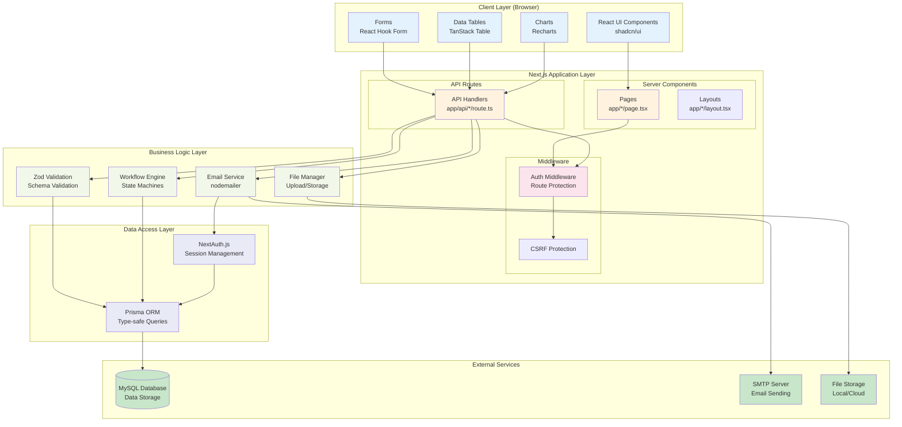
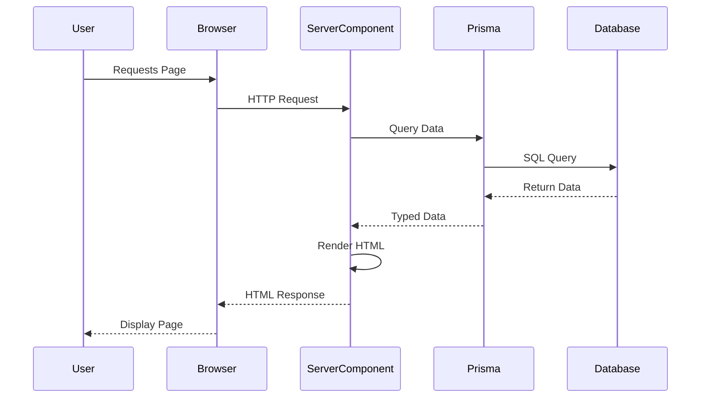
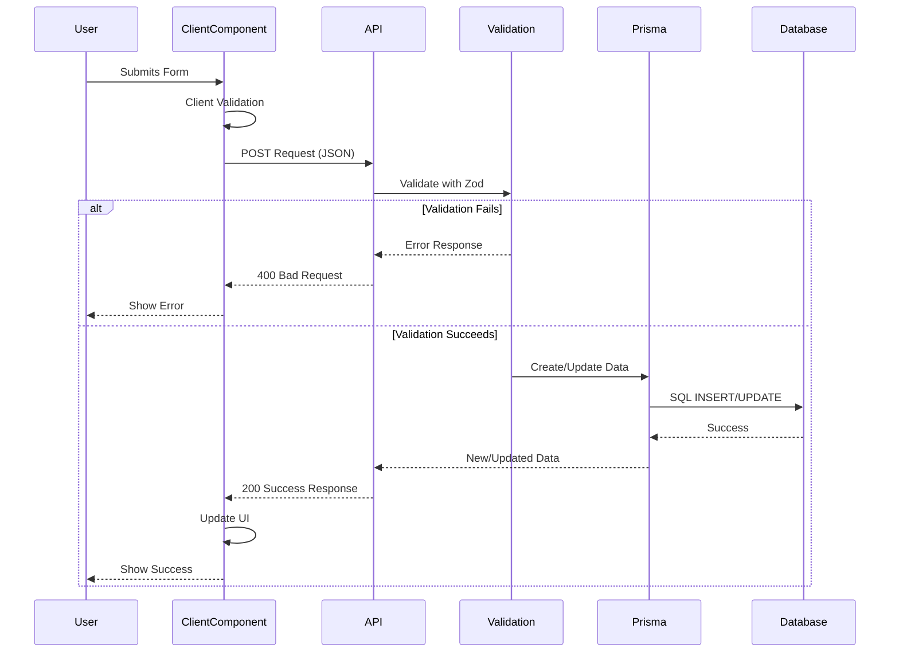
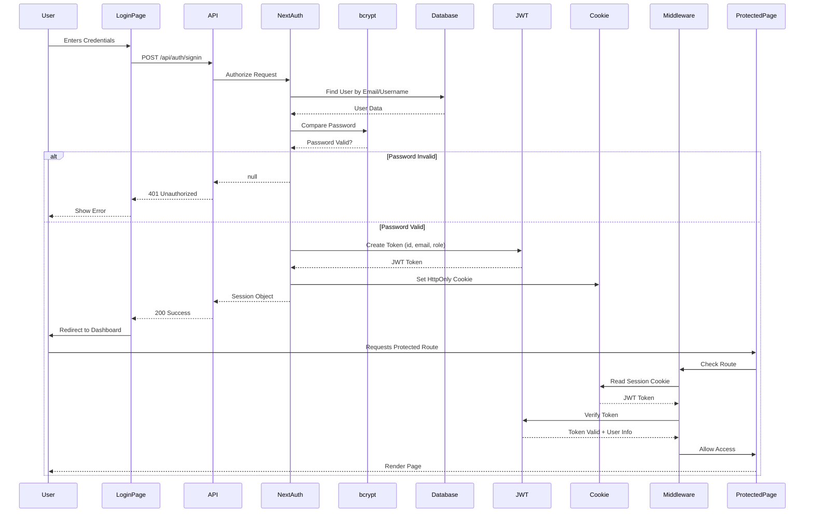
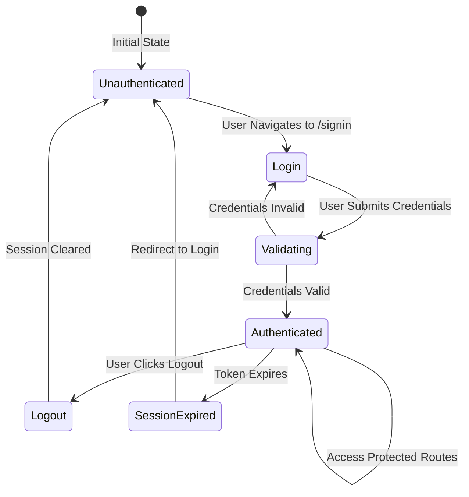

# Architecture Overview

This document explains the overall architecture of the NextJS Template App, including design patterns, architectural decisions, and how different parts of the system work together.

## 🏗️ System Architecture

### High-Level Architecture

This diagram shows how different layers of the application interact:



### Architecture Layers Explained

| Layer | Components | Purpose | Runs On |
|-------|-----------|---------|---------|
| **Client Layer** | React Components, UI, Forms | User interface and interactions | Browser |
| **Application Layer** | Next.js Pages, API Routes, Middleware | Request handling and routing | Server |
| **Business Logic Layer** | Validation, Email, Files, Workflows | Business rules and processing | Server |
| **Data Access Layer** | Prisma ORM, NextAuth.js | Database access and session management | Server |
| **External Services** | MySQL, SMTP, File Storage | Data persistence and external services | External |

## 🎯 Design Patterns

### 1. Server Components Pattern

Next.js App Router uses React Server Components by default.

**Benefits**:
- Reduced bundle size (server components don't ship to client)
- Better performance (no JavaScript needed for static content)
- Direct database access (no API layer needed)

**Example**:
```typescript
// app/page.tsx (Server Component by default)
export default async function Page() {
  // Direct database access - no API call needed!
  const data = await db.user.findMany()
  return <UserList users={data} />
}
```

### 2. Client Components Pattern

Components marked with `"use client"` run on the client.

**Use Cases**:
- Interactive components (buttons, forms)
- State management (useState, useEffect)
- Browser APIs (localStorage, window)
- Event handlers

**Example**:
```typescript
"use client"
import { useState } from "react"

export function InteractiveComponent() {
  const [count, setCount] = useState(0)
  return <button onClick={() => setCount(count + 1)}>{count}</button>
}
```

### 3. API Route Pattern

API routes handle data mutations and external integrations.

**Structure**:
```
app/api/
  resource/
    route.ts        # GET, POST handlers
    [id]/
      route.ts      # GET, PUT, DELETE handlers
```

**Example**:
```typescript
// app/api/users/route.ts
export async function GET() {
  const users = await db.user.findMany()
  return NextResponse.json({ users })
}

export async function POST(request: Request) {
  const data = await request.json()
  const user = await db.user.create({ data })
  return NextResponse.json({ user })
}
```

### 4. Route Groups Pattern

Route groups organize routes without affecting the URL structure.

**Structure**:
```
app/
  (app)/           # Protected routes - require auth
    dashboard/
  (auth)/           # Public auth routes
    signin/
  api/              # API routes
```

**Benefits**:
- Organized file structure
- Shared layouts per group
- URL structure remains clean (`/dashboard`, not `/(app)/dashboard`)

## 📦 Layered Architecture

### Layer 1: Presentation Layer

**Location**: `app/`, `components/`

**Responsibilities**:
- User interface
- User interactions
- Data visualization

**Technologies**:
- React Components
- TailwindCSS
- shadcn/ui

### Layer 2: Business Logic Layer

**Location**: `lib/`, API routes

**Responsibilities**:
- Business rules
- Data validation
- Data transformation

**Technologies**:
- TypeScript
- Zod (validation)
- Custom utilities

### Layer 3: Data Access Layer

**Location**: `lib/db.ts`, Prisma

**Responsibilities**:
- Database queries
- Data persistence
- Database schema

**Technologies**:
- Prisma ORM
- MySQL

### Layer 4: External Services Layer

**Location**: `lib/email.ts`, etc.

**Responsibilities**:
- Email sending
- File storage
- External APIs

**Technologies**:
- nodemailer (SMTP)
- File system
- Third-party APIs

## 🔄 Data Flow Patterns

### Read Pattern (Server Components)

This pattern is used when you need to **fetch and display data** that doesn't change frequently:



**Advantages**:
- ✅ No client-side JavaScript needed (faster page loads)
- ✅ SEO friendly (search engines can read the HTML)
- ✅ Secure (sensitive data never exposed to client)
- ✅ Lower bandwidth (no API calls needed)

**When to Use**: Displaying static or semi-static content like user lists, dashboards, read-only pages.

### Write Pattern (API Routes)

This pattern is used when you need to **create, update, or delete data**:



**Advantages**:
- ✅ Explicit data mutations (clear what's happening)
- ✅ Server-side validation (security)
- ✅ Error handling (user feedback)
- ✅ Can trigger side effects (emails, notifications)

**When to Use**: Form submissions, data mutations, user actions that change data.

### Data Flow Comparison Table

| Aspect | Server Components (Read) | API Routes (Write) |
|--------|-------------------------|-------------------|
| **Use Case** | Displaying data | Creating/updating data |
| **Client JS Needed** | No | Yes |
| **SEO Friendly** | Yes | No (but APIs don't need SEO) |
| **Security** | High (no exposed data) | High (server validation) |
| **Performance** | Fast (direct DB access) | Slower (HTTP overhead) |
| **Type Safety** | Yes (Prisma types) | Yes (Zod + Prisma) |
| **Error Handling** | Simple | Comprehensive |

## 🗄️ Database Architecture

### ORM Pattern

Prisma acts as the ORM (Object-Relational Mapping) layer.

**Benefits**:
- Type-safe queries
- Database migrations
- Schema management
- Auto-generated TypeScript types

**Example**:
```typescript
// lib/db.ts
export const db = new PrismaClient()

// Usage
const users = await db.user.findMany({
  where: { isActive: true },
  include: { role: true }
})
```

### Schema Management

**Location**: `prisma/schema.prisma`

**Pattern**:
- Define models in Prisma schema
- Generate client: `npm run db:generate`
- Apply migrations: `npm run db:migrate`

## 🔐 Authentication Architecture

### Session-Based Authentication Flow

Here's how authentication works in this application:



### Authentication Components

| Component | Purpose | Location |
|-----------|---------|----------|
| **NextAuth.js** | Authentication framework | `lib/auth.ts` |
| **Credentials Provider** | Username/password authentication | `lib/auth.ts` |
| **JWT Tokens** | Session token generation | NextAuth built-in |
| **bcryptjs** | Password hashing | Used in API routes |
| **Middleware** | Route protection | `middleware.ts` |
| **Session Cookie** | Client-side session storage | NextAuth managed |

### Authentication Flow States



### Authorization (Role-Based)

**Implementation**:
- Users have roles
- Middleware checks role
- Components check role
- API routes check role

## 📁 File Organization Patterns

### Feature-Based Organization

Each feature has its own folder structure:

```
app/
  (app)/
    feature-name/
      page.tsx          # Feature page
      components/       # Feature-specific components
api/
  feature-name/
    route.ts           # Feature API routes
```

### Shared Components

Common components in `components/`:

```
components/
  ui/                  # Base UI components
  forms/               # Form components
  charts/              # Chart components
  website-components/  # Site-wide components
```

## 🔌 Integration Patterns

### Email Service Integration

**Pattern**: Service abstraction

```typescript
// lib/email.ts
export async function sendEmail(...) {
  // Abstracted email sending
  // Can swap SMTP providers easily
}
```

### File Management

**Pattern**: Utility functions

```typescript
// lib/file-manager.ts
export async function uploadFile(...) {
  // Handles file upload, validation, storage
}
```

## 🎨 UI Component Architecture

### Component Hierarchy

```
Page Component
    ↓
Layout Component
    ↓
Feature Components
    ↓
UI Components (shadcn/ui)
    ↓
HTML Elements
```

### Component Composition

Components are built from smaller, reusable pieces:

```typescript
// Base Button
<Button />

// Composed Dialog
<Dialog>
  <DialogTrigger />
  <DialogContent>
    <DialogHeader />
    <DialogBody />
  </DialogContent>
</Dialog>
```

## 🚀 Performance Patterns

### Code Splitting

Next.js automatically code-splits by route and component.

**Benefits**:
- Smaller initial bundle
- Faster page loads
- Better caching

### Server-Side Rendering (SSR)

Pages are rendered on the server for SEO and performance.

### Static Generation (SSG)

Static pages are pre-rendered at build time.

### Incremental Static Regeneration (ISR)

Pages can be regenerated on-demand while serving static versions.

## 🔒 Security Patterns

### Authentication Pattern

- Middleware validates session
- Protected routes check authentication
- API routes verify session

### Validation Pattern

- Zod schemas validate all inputs
- Server-side validation required
- Client-side validation for UX

### Authorization Pattern

- Role-based access control
- Check permissions at route level
- Check permissions at component level

## 📊 State Management

### Server State

- Server Components (default)
- Fetch data on server
- Pass data as props

### Client State

- React hooks (useState, useEffect)
- Local component state
- No global state management needed (yet)

### Session State

- NextAuth session
- Accessible via `useSession()` hook
- Server-side via `getServerSession()`

## 🔄 Error Handling Pattern

### API Error Handling

```typescript
try {
  // Operation
} catch (error) {
  return NextResponse.json(
    { error: 'Message' },
    { status: 500 }
  )
}
```

### Client Error Handling

- Error boundaries for React errors
- Toast notifications for user feedback
- Error states in components

## 📝 Best Practices

### 1. Server Components First

Use Server Components by default, only use Client Components when needed.

### 2. Type Safety

Use TypeScript throughout. Leverage Prisma-generated types.

### 3. Validation

Validate all inputs with Zod schemas at API boundaries.

### 4. Error Handling

Always handle errors gracefully with proper error messages.

### 5. Code Organization

- Group related files together
- Use clear naming conventions
- Keep components small and focused

### 6. Performance

- Use Server Components for static content
- Optimize images
- Minimize client-side JavaScript

## 🔗 Related Documentation

- [Project Structure](./04-project-structure.md) - Detailed file organization
- [Routing](./05-routing.md) - Next.js routing system
- [Authentication](./06-authentication.md) - Auth implementation
- [Database](./07-database.md) - Database architecture
- [API Routes](./08-api-routes.md) - API design patterns

---

**Next**: [Project Structure](./04-project-structure.md) | [Routing](./05-routing.md)

