# Project Structure

This document provides a comprehensive breakdown of the project's file and folder structure, explaining what each directory and file does.

## 📂 Root Directory Structure

Here's the complete project structure with a visual tree:

```
nextjs-template/
├── app/                      # Next.js App Router (pages & API)
├── components/               # React components
├── lib/                      # Utility libraries and helpers
├── prisma/                   # Database schema and migrations
├── public/                   # Static assets
├── styles/                   # Global styles
├── types/                    # TypeScript type definitions
├── hooks/                    # Custom React hooks
├── tests/                    # Test files
├── docs/                     # Documentation (this folder)
├── uploads/                  # Uploaded files (gitignored)
├── scripts/                  # Utility scripts
├── .env                      # Environment variables (gitignored)
├── .env.example             # Example environment variables
├── package.json             # Dependencies and scripts
├── tsconfig.json            # TypeScript configuration
├── next.config.js           # Next.js configuration
├── tailwind.config.ts       # TailwindCSS configuration
├── postcss.config.js        # PostCSS configuration
└── README.md                # Project README
```

### Visual Directory Tree

```mermaid
graph TD
    Root[NextJS Template Root] --> App[app/<br/>Pages & API Routes]
    Root --> Components[components/<br/>React Components]
    Root --> Lib[lib/<br/>Utilities]
    Root --> Prisma[prisma/<br/>Database]
    Root --> Public[public/<br/>Static Files]
    Root --> Styles[styles/<br/>CSS]
    Root --> Types[types/<br/>TypeScript Types]
    Root --> Hooks[hooks/<br/>React Hooks]
    Root --> Docs[docs/<br/>Documentation]
    
    App --> AppPages[app/app/<br/>Protected Pages]
    App --> AuthPages[app/auth/<br/>Auth Pages]
    App --> APIRoutes[app/api/<br/>API Endpoints]
    
    Components --> UI[components/ui/<br/>Base UI Components]
    Components --> Forms[components/forms/<br/>Form Components]
    Components --> Charts[components/charts/<br/>Chart Components]
    Components --> Website[components/website-components/<br/>Site Components]
    
    Lib --> AuthLib[lib/auth.ts<br/>NextAuth Config]
    Lib --> DBLib[lib/db.ts<br/>Prisma Client]
    Lib --> Validations[lib/validations/<br/>Zod Schemas]
    
    Prisma --> Schema[prisma/schema.prisma<br/>Database Schema]
    Prisma --> Migrations[prisma/migrations/<br/>Database Migrations]
    Prisma --> Seed[prisma/seed.ts<br/>Seed Data]
    
    style Root fill:#e3f2fd
    style App fill:#fff3e0
    style Components fill:#e8f5e9
    style Lib fill:#f3e5f5
    style Prisma fill:#e0f2f1
```



### Directory Purpose Table

For beginners, here's what each folder does:

| Directory | Purpose | What Goes Here | Example Files |
|-----------|---------|----------------|---------------|
| **`app/`** | Next.js pages and API routes | All pages and API endpoints | `app/page.tsx`, `app/api/users/route.ts` |
| **`components/`** | Reusable React components | UI components, forms, charts | `components/ui/button.tsx` |
| **`lib/`** | Utility functions and configs | Helper functions, configurations | `lib/db.ts`, `lib/auth.ts` |
| **`prisma/`** | Database definition | Schema, migrations, seed data | `prisma/schema.prisma` |
| **`public/`** | Static files | Images, fonts, robots.txt | `public/logo.png` |
| **`styles/`** | Global CSS | Global styles, Tailwind imports | `styles/globals.css` |
| **`types/`** | TypeScript definitions | Type declarations | `types/next-auth.d.ts` |
| **`hooks/`** | Custom React hooks | Reusable hooks | `hooks/use-session-validator.ts` |
| **`tests/`** | Test files | Unit tests, integration tests | `tests/state-machine.test.ts` |
| **`docs/`** | Documentation | Markdown documentation files | `docs/01-getting-started.md` |
| **`uploads/`** | User-uploaded files | Files uploaded by users | `uploads/avatars/user-1.jpg` |
| **`scripts/`** | Utility scripts | Helper scripts for maintenance | `scripts/fix-admin-password.ts` |

## 📁 Detailed Directory Breakdown

### `/app` - Next.js App Router

The main application directory using Next.js 14+ App Router.

```
app/
├── (app)/                    # Route Group: Protected app routes
│   ├── dashboard/            # Analytics dashboard
│   │   └── page.tsx
│   ├── doctors/              # Doctor management
│   │   ├── page.tsx
│   │   └── columns.tsx
│   ├── engineers/           # Engineer management
│   ├── teachers/            # Teacher management
│   ├── lawyers/             # Lawyer management
│   ├── users/               # User management
│   ├── roles/               # Role management
│   ├── workflows/           # Workflow management
│   ├── files/               # File management
│   ├── profile/             # User profile
│   └── layout.tsx            # App layout with sidebar
│
├── (auth)/                   # Route Group: Authentication pages
│   ├── signin/               # Login page
│   ├── signup/               # Registration page
│   ├── verify/               # Email verification
│   ├── forgot-password/     # Password reset request
│   ├── reset-password/       # Password reset form
│   └── layout.tsx            # Auth layout
│
├── api/                      # API Routes
│   ├── auth/                 # Authentication endpoints
│   │   ├── [...nextauth]/   # NextAuth.js route
│   │   ├── signup/
│   │   ├── signin/
│   │   ├── verify/
│   │   ├── forgot-password/
│   │   └── reset-password/
│   ├── doctors/              # Doctor CRUD APIs
│   ├── engineers/            # Engineer CRUD APIs
│   ├── teachers/             # Teacher CRUD APIs
│   ├── lawyers/              # Lawyer CRUD APIs
│   ├── users/                # User CRUD APIs
│   ├── roles/                # Role CRUD APIs
│   ├── workflows/            # Workflow APIs
│   ├── dashboard/            # Dashboard APIs
│   └── upload/               # File upload API
│
├── layout.tsx                 # Root layout
├── page.tsx                  # Home page
├── robots.ts                 # Robots.txt generation
└── sitemap.ts                # Sitemap generation
```

**Key Files**:

| File | Purpose |
|------|---------|
| `app/layout.tsx` | Root HTML layout, includes SessionProvider |
| `app/page.tsx` | Homepage/landing page |
| `app/(app)/layout.tsx` | Layout for protected routes (sidebar, header) |
| `app/(auth)/layout.tsx` | Layout for auth pages |

### `/components` - React Components

Reusable React components organized by purpose.

```
components/
├── ui/                       # Base UI components (shadcn/ui)
│   ├── button.tsx
│   ├── input.tsx
│   ├── dialog.tsx
│   ├── table.tsx
│   ├── select.tsx
│   ├── card.tsx
│   ├── badge.tsx
│   └── ... (30+ components)
│
├── forms/                    # Form components
│   ├── password-input.tsx
│   ├── file-input.tsx
│   └── master-data-form.tsx
│
├── charts/                   # Chart components
│   ├── AreaChart.tsx
│   ├── BarChart.tsx
│   ├── LineChart.tsx
│   ├── PieChart.tsx
│   └── index.ts
│
├── dashboard/                # Dashboard components
│   ├── DashboardFilters.tsx
│   └── KPITiles.tsx
│
├── data-table/               # Data table components
│   ├── data-table.tsx        # Main table component
│   └── selection-column.tsx  # Row selection column
│
├── website-components/       # Site-wide components
│   ├── sidebar.tsx           # Sidebar navigation
│   ├── app-header.tsx        # App header
│   ├── app-footer.tsx        # App footer
│   └── auth-graphic.tsx     # Auth page graphics
│
├── providers/                # Context providers
│   └── session-provider.tsx
│
└── error-boundary.tsx       # Error boundary component
```

**Component Organization**:

| Directory | Purpose | Examples |
|-----------|---------|----------|
| `ui/` | Base UI components | Button, Input, Dialog |
| `forms/` | Form-specific components | PasswordInput, FileInput |
| `charts/` | Data visualization | BarChart, PieChart |
| `data-table/` | Data table functionality | DataTable |
| `website-components/` | Site-wide components | Sidebar, Header, Footer |

### `/lib` - Utility Libraries

Shared utility functions and configurations.

```
lib/
├── auth.ts                   # NextAuth configuration
├── db.ts                     # Prisma client instance
├── config.ts                 # App configuration & env vars
├── email.ts                  # Email utilities (nodemailer)
├── utils.ts                  # General utilities (cn, etc.)
├── navigation.ts             # Navigation configuration
├── styles.ts                 # Style utilities
├── animations.ts             # Animation utilities
├── error-handling.ts         # Error handling utilities
├── debug-utils.ts            # Debug utilities
├── dashboard-data.ts         # Dashboard data computation
├── file-manager.ts           # File management utilities
├── i18n.ts                   # Internationalization (if used)
│
├── validations/              # Zod validation schemas
│   ├── auth.ts               # Auth validation schemas
│   ├── users.ts              # User validation schemas
│   ├── roles.ts              # Role validation schemas
│   └── transfer-requests.ts   # Transfer request schemas
│
└── workflows/                 # Workflow logic
    └── transfer.ts           # Transfer workflow logic
```

**Key Files**:

| File | Purpose |
|------|---------|
| `lib/auth.ts` | NextAuth.js configuration |
| `lib/db.ts` | Prisma client singleton |
| `lib/config.ts` | Environment variables and config |
| `lib/email.ts` | Email sending functions |
| `lib/utils.ts` | Utility functions (cn, etc.) |

### `/prisma` - Database

Database schema and migrations.

```
prisma/
├── schema.prisma             # Database schema definition
├── seed.ts                   # Database seeding script
│
└── migrations/               # Migration files
    ├── 20250823192019_init/
    ├── 20250825041339_add_roles_and_update_users/
    ├── 20250825091451_add_admin_user_fields/
    └── ... (other migrations)
```

**Key Files**:

| File | Purpose |
|------|---------|
| `schema.prisma` | Prisma schema with all models |
| `seed.ts` | Database seeding script |

### `/public` - Static Assets

Static files served directly.

```
public/
└── robots.txt                # Robots.txt file
```

**Note**: Images, fonts, and other static assets go here.

### `/styles` - Global Styles

Global CSS and styling.

```
styles/
└── globals.css               # Global CSS with Tailwind imports
```

### `/types` - TypeScript Types

Type definitions and type augmentations.

```
types/
└── next-auth.d.ts            # NextAuth type augmentations
```

### `/hooks` - Custom Hooks

Custom React hooks.

```
hooks/
└── use-session-validator.ts  # Session validation hook
```

### `/tests` - Tests

Test files.

```
tests/
└── state-machine.test.ts     # Workflow state machine tests
```

### `/scripts` - Utility Scripts

Helper scripts for development and maintenance.

```
scripts/
├── check-user.ts             # User checking script
├── fix-admin-password.ts     # Password fixing script
├── fix-all-passwords.ts      # Bulk password fixing
└── create-missing-tables.sql # SQL for missing tables
```

## 📄 Important Configuration Files

### Root Level Files

| File | Purpose |
|------|---------|
| `package.json` | Dependencies and npm scripts |
| `tsconfig.json` | TypeScript compiler configuration |
| `next.config.js` | Next.js configuration |
| `tailwind.config.ts` | TailwindCSS configuration |
| `postcss.config.js` | PostCSS configuration |
| `.env` | Environment variables (not in git) |
| `.env.example` | Example environment variables |

### Configuration Details

**`package.json`**:
- Lists all dependencies
- Defines npm scripts (dev, build, etc.)
- Contains Prisma seed configuration

**`tsconfig.json`**:
- TypeScript compiler options
- Path aliases (`@/*` maps to root)
- Strict mode enabled

**`next.config.js`**:
- Next.js configuration
- Image optimization settings
- External packages configuration

**`tailwind.config.ts`**:
- TailwindCSS theme customization
- Color palette
- Plugin configuration

## 🔍 File Naming Conventions

### Components

- **PascalCase**: `Button.tsx`, `UserProfile.tsx`
- **Descriptive names**: Clear component purpose

### Pages

- **lowercase**: `page.tsx`, `layout.tsx`
- **Route files**: Match Next.js App Router conventions

### API Routes

- **lowercase**: `route.ts`
- **Nested routes**: `[id]/route.ts`

### Utilities

- **camelCase**: `auth.ts`, `db.ts`
- **Descriptive names**: Clear utility purpose

### Types

- **camelCase with `.d.ts`**: `next-auth.d.ts`
- **Type files**: `.d.ts` for type declarations

## 📦 Import Path Aliases

The project uses path aliases for cleaner imports:

```typescript
// From tsconfig.json
"paths": {
  "@/*": ["./*"]
}

// Usage
import { db } from "@/lib/db"
import { Button } from "@/components/ui/button"
```

**Common Import Patterns**:

| Pattern | Example |
|---------|---------|
| `@/lib/*` | `import { db } from "@/lib/db"` |
| `@/components/*` | `import { Button } from "@/components/ui/button"` |
| `@/app/*` | `import Layout from "@/app/(app)/layout"` |
| `@/types/*` | `import { User } from "@/types/user"` |

## 🗂️ Code Organization Principles

### 1. Feature-Based Organization

Related files are grouped together:

```
app/(app)/
  doctors/
    page.tsx       # Doctor page
    columns.tsx    # Table columns
api/
  doctors/
    route.ts       # Doctor API
```

### 2. Shared Components

Common components in `components/`:

```
components/
  ui/              # Reusable UI components
  forms/           # Form components
```

### 3. Utilities

Shared utilities in `lib/`:

```
lib/
  auth.ts          # Auth utilities
  db.ts            # Database utilities
```

## 🔄 File Relationships

### Typical Page Structure

```
app/(app)/doctors/
  ├── page.tsx              # Imports columns
  └── columns.tsx           # Defines table columns
       ↓
components/
  └── data-table/
      └── data-table.tsx    # Used by page
       ↓
app/api/doctors/
  └── route.ts              # API called by page
       ↓
lib/
  └── db.ts                 # Database used by API
```

## 📚 Related Documentation

- [Architecture](./03-architecture.md) - System architecture
- [Routing](./05-routing.md) - Next.js routing system
- [Components Overview](./09-components-overview.md) - Component details
- [API Routes](./08-api-routes.md) - API structure

---

**Next**: [Routing](./05-routing.md) | [Authentication](./06-authentication.md)

