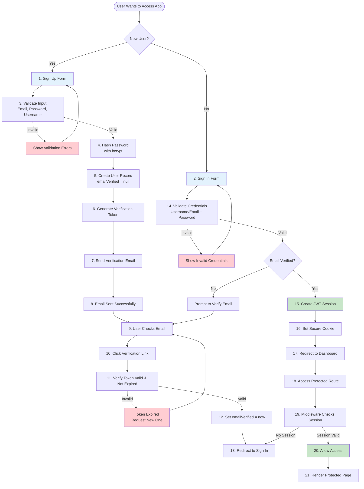
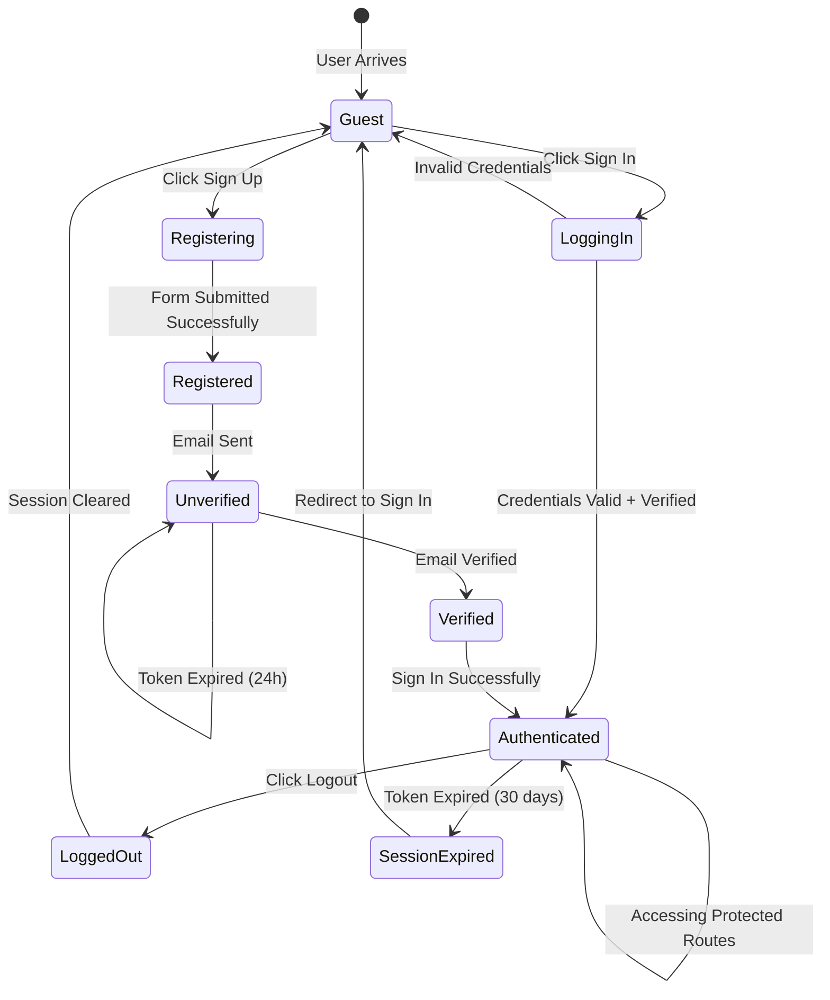
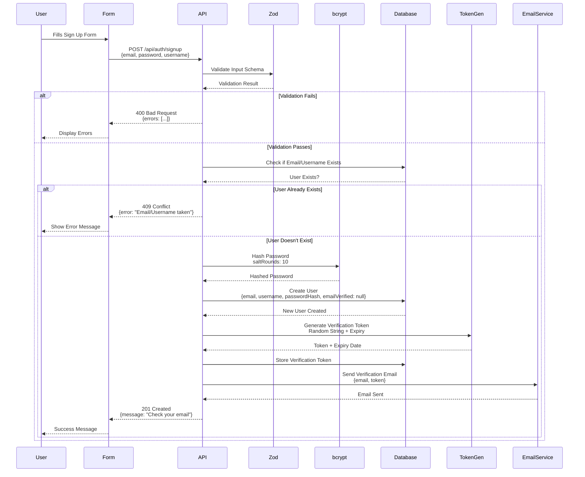

# Authentication System

This document explains the complete authentication system implemented using NextAuth.js v4.

## 🔐 Authentication Overview

The application uses NextAuth.js v4 for authentication with:
- Credentials provider (username/email + password)
- Email verification required
- Password reset functionality
- Role-based access control
- Session management (JWT)

## 🏗️ Authentication Architecture

### Complete Authentication Flow

Here's a comprehensive view of how authentication works from registration to accessing protected routes:



### Authentication States Diagram

Understanding the different states a user can be in:



### Key Authentication Concepts

For beginners, here's what you need to understand:

#### 1. **JWT (JSON Web Token)**
   - **What it is**: A secure way to store user information (like ID, email, role)
   - **Where it's stored**: In an HTTP-only cookie (can't be accessed by JavaScript, more secure)
   - **Lifespan**: 30 days in this application
   - **Contains**: User ID, email, role, profile image URL

#### 2. **Password Hashing**
   - **Why**: Never store passwords in plain text (security risk)
   - **How**: Use bcrypt to create a "hash" (one-way encryption)
   - **Comparison**: When user logs in, we hash their entered password and compare it to the stored hash
   - **Salt**: bcrypt automatically adds "salt" (random data) for extra security

#### 3. **Email Verification**
   - **Why**: Ensure users have access to their email (prevent fake accounts)
   - **How**: Send a unique token via email, user clicks link, we verify the token
   - **Expiration**: Tokens expire after 24 hours for security

#### 4. **Middleware Protection**
   - **What**: Code that runs before each request reaches your page/API
   - **Purpose**: Check if user is logged in before allowing access
   - **Action**: Redirect to login if not authenticated

### Components

| Component | Purpose |
|-----------|---------|
| **NextAuth.js** | Authentication framework |
| **Credentials Provider** | Username/email + password login |
| **Prisma Adapter** | Session storage in database |
| **bcryptjs** | Password hashing |
| **JWT** | Session tokens |
| **Middleware** | Route protection |

## 📁 File Structure

### Authentication Files

```
lib/
└── auth.ts                   # NextAuth configuration

app/
├── api/
│   └── auth/
│       ├── [...nextauth]/    # NextAuth API route
│       ├── signup/            # Registration endpoint
│       ├── signin/            # Login endpoint
│       ├── verify/            # Email verification
│       ├── forgot-password/   # Password reset request
│       └── reset-password/    # Password reset
├── (auth)/
│   ├── signup/                # Registration page
│   ├── signin/                # Login page
│   ├── verify/                # Email verification page
│   ├── forgot-password/       # Reset request page
│   └── reset-password/        # Reset form page

middleware.ts                  # Route protection
```

## ⚙️ Configuration

### NextAuth Configuration

**File**: `lib/auth.ts`

```typescript
export const authOptions: NextAuthOptions = {
  adapter: PrismaAdapter(db),
  providers: [
    CredentialsProvider({
      // Credentials provider config
    })
  ],
  session: {
    strategy: "jwt",
    maxAge: 30 * 24 * 60 * 60, // 30 days
  },
  // ... more config
}
```

### Environment Variables

**Required in `.env`**:

```env
NEXTAUTH_SECRET="your-secret-key"
NEXTAUTH_URL="http://localhost:3000"
```

## 🔑 Authentication Features

### 1. User Registration

**Endpoint**: `POST /api/auth/signup`

**Purpose**: Allows new users to create an account

**Step-by-Step Flow**:



**Registration Steps Table**:

| Step | Action | Code Location | Why It's Important |
|------|--------|---------------|-------------------|
| 1 | Validate Input | `lib/validations/auth.ts` | Prevent invalid data, ensure security |
| 2 | Check Duplicates | API route | Prevent duplicate accounts |
| 3 | Hash Password | API route with bcrypt | Security - never store plain passwords |
| 4 | Create User | `prisma.user.create()` | Save user to database |
| 5 | Generate Token | API route | Unique identifier for email verification |
| 6 | Send Email | `lib/email.ts` | Verify user owns the email address |

**Important Notes for Beginners**:
- ✅ User cannot login until email is verified (`emailVerified` must be set)
- ✅ Password is hashed using bcrypt with 10 salt rounds (industry standard)
- ✅ Token expires after 24 hours (security measure)
- ✅ Token is single-use (deleted after verification)

**Code Example**:
```typescript
// app/api/auth/signup/route.ts
const hashedPassword = await bcrypt.hash(password, 10)
const user = await db.user.create({
  data: {
    email,
    username,
    passwordHash: hashedPassword,
  }
})
await sendVerificationEmail(email, token)
```

### 2. Email Verification

**Endpoint**: `GET /api/auth/verify?token=xxx`

**Flow**:
1. Validate token
2. Check expiration
3. Update user (emailVerified = now)
4. Redirect to signin

**Code Example**:
```typescript
const token = await db.verificationToken.findUnique({
  where: { token }
})

if (token && token.expires > new Date()) {
  await db.user.update({
    where: { id: token.userId },
    data: { emailVerified: new Date() }
  })
}
```

### 3. Login

**Endpoint**: `POST /api/auth/signin`

**Flow**:
1. Find user by username or email
2. Verify password with bcrypt
3. Check email verified
4. Check user active
5. Create session (JWT)
6. Return session

**Code Example**:
```typescript
// lib/auth.ts
async authorize(credentials) {
  const user = await db.user.findFirst({
    where: {
      OR: [
        { username: credentials.identifier },
        { email: credentials.identifier },
      ],
    },
  })

  const isValid = await bcrypt.compare(
    credentials.password,
    user.passwordHash
  )

  if (isValid && user.emailVerified) {
    return {
      id: user.id,
      email: user.email,
      role: user.role?.name,
    }
  }
  return null
}
```

### 4. Password Reset

**Endpoint**: `POST /api/auth/forgot-password`

**Flow**:
1. Find user by email
2. Generate reset token
3. Send reset email
4. Return success

**Reset Endpoint**: `POST /api/auth/reset-password`

**Flow**:
1. Validate token
2. Check expiration
3. Hash new password
4. Update user
5. Delete token
6. Return success

### 5. Session Management

**JWT Strategy**:
- Sessions stored in JWT tokens
- Token includes: id, email, role, profileImage
- Cookies store session token
- Middleware validates sessions

**Session Lifecycle**:
```
Login → Create JWT → Store in Cookie → Validate on Requests → Logout → Clear Cookie
```

## 🛡️ Route Protection

### Middleware Protection

**File**: `middleware.ts`

```typescript
export default withAuth(
  function middleware(req) {
    // Check if route needs auth
    if (req.nextUrl.pathname.startsWith("/dashboard")) {
      if (!req.nextauth.token) {
        return NextResponse.redirect(new URL("/signin", req.url))
      }
    }
  },
  {
    callbacks: {
      authorized: ({ token, req }) => {
        // Check authentication
        return !!token
      }
    }
  }
)
```

### Protected Routes

| Route | Protection | Redirect |
|-------|-----------|----------|
| `/dashboard/*` | ✅ Required | `/signin` |
| `/doctors/*` | ✅ Required | `/signin` |
| `/signin` | ❌ Public | - |
| `/signup` | ❌ Public | - |

## 👥 Role-Based Access Control

### Roles

Roles are stored in the `Role` table and linked to users:

| Role | Description |
|------|-------------|
| `Admin` | Full access |
| `Manager` | Management access |
| `Analyst` | Read-only access |

### Role Checking

**In Components**:
```typescript
'use client'
import { useSession } from 'next-auth/react'

const { data: session } = useSession()
if (session?.user?.role === 'Admin') {
  // Admin-only content
}
```

**In API Routes**:
```typescript
const session = await getServerSession(authOptions)
if (session?.user?.role !== 'Admin') {
  return NextResponse.json({ error: 'Unauthorized' }, { status: 403 })
}
```

## 🔒 Security Features

### Password Security

- **Hashing**: bcrypt with salt rounds (10)
- **Verification**: bcrypt.compare()
- **Minimum Length**: 8 characters
- **Complexity**: Enforced by Zod validation

### Token Security

- **Verification Tokens**: Expire in 24 hours
- **Reset Tokens**: Expire in 1 hour
- **Secure Cookies**: httpOnly, secure in production
- **CSRF Protection**: Built into NextAuth

### Email Security

- **Verification Required**: Must verify email before login
- **Token Expiration**: Tokens expire after set time
- **Single Use**: Tokens are deleted after use

## 📧 Email Integration

### Email Functions

**File**: `lib/email.ts`

```typescript
// Verification email
await sendVerificationEmail(email, token)

// Password reset email
await sendPasswordResetEmail(email, token)

// Admin-created account
await sendAdminCreatedAccountVerificationEmail(email, token, firstName)
```

### Email Templates

Emails are HTML templates with:
- Verification links
- Reset password links
- Instructions
- Expiration warnings

## 🔄 Session Management

### Session Hooks

**Client Side**:
```typescript
'use client'
import { useSession } from 'next-auth/react'

const { data: session, status } = useSession()
// status: 'loading' | 'authenticated' | 'unauthenticated'
```

**Server Side**:
```typescript
import { getServerSession } from 'next-auth/next'
import { authOptions } from '@/lib/auth'

const session = await getServerSession(authOptions)
```

### Session Update

Update session when user data changes:

```typescript
import { useSession } from 'next-auth/react'

const { data: session, update } = useSession()

// Update session
await update({ profileImage: newImageUrl })
```

## 📊 Database Schema

### User Model

```prisma
model User {
  id                 String    @id @default(cuid())
  username           String    @unique
  email              String    @unique
  passwordHash       String
  roleId             String?
  emailVerified      DateTime?
  isActive           Boolean   @default(true)
  mustChangePassword Boolean   @default(false)
  createdAt          DateTime  @default(now())
  updatedAt          DateTime  @updatedAt
}
```

### Related Models

- `Session` - NextAuth sessions
- `Account` - OAuth accounts
- `VerificationToken` - Email verification tokens
- `PasswordResetToken` - Password reset tokens
- `Role` - User roles

## 🧪 Testing Authentication

### Test Accounts

After seeding:
- Username: `admin`, Password: `password123`
- Username: `manager`, Password: `password123`
- Username: `analyst`, Password: `password123`

### Testing Flow

1. **Signup**: Create new account
2. **Verify**: Check email, verify account
3. **Login**: Login with credentials
4. **Protected Route**: Access `/dashboard`
5. **Logout**: Sign out

## 🐛 Troubleshooting

### Common Issues

**Issue**: "Email not verified"
- **Solution**: Check email inbox, verify email

**Issue**: "Invalid credentials"
- **Solution**: Check username/email and password

**Issue**: "User not active"
- **Solution**: User may be deactivated, contact admin

**Issue**: Session expires too quickly
- **Solution**: Check session maxAge in auth.ts

## 📝 Best Practices

### 1. Always Verify Email

Never allow login without email verification.

### 2. Hash Passwords

Always use bcrypt, never store plain passwords.

### 3. Validate Inputs

Use Zod schemas for all inputs.

### 4. Secure Sessions

Use secure cookies in production.

### 5. Check Roles

Verify roles before allowing access.

## 🔗 Related Documentation

- [Database](./07-database.md) - User model schema
- [API Routes](./08-api-routes.md) - Auth API endpoints
- [Security](./21-security.md) - Security practices

---

**Next**: [Database](./07-database.md) | [API Routes](./08-api-routes.md)

