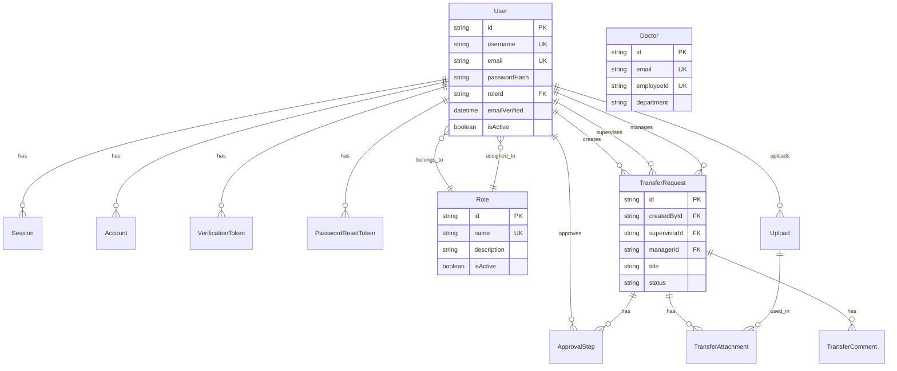

# Database System

This document explains the database architecture, Prisma ORM setup, schema design, and database operations.

## 🗄️ Database Overview

The application uses **MySQL** with **Prisma ORM** for type-safe database access.

### What is an ORM?

**ORM** stands for **Object-Relational Mapping**. For beginners, think of it this way:

| Traditional Way | ORM Way |
|----------------|---------|
| Write SQL queries manually | Write code that looks like JavaScript/TypeScript |
| `SELECT * FROM users WHERE email = ?` | `db.user.findMany({ where: { email } })` |
| Type errors found at runtime | Type errors found at compile time |
| Hard to maintain | Easy to maintain |

**Benefits of Prisma**:
- ✅ **Type Safety**: Your code editor knows what fields exist
- ✅ **Auto-completion**: IDE suggests available fields and methods
- ✅ **Migrations**: Changes to database structure are versioned
- ✅ **Relations**: Easy to work with related data (e.g., user's role)

## 📊 Database Technology Stack

| Component | Technology | Purpose |
|-----------|------------|---------|
| **Database** | MySQL 8.0+ | Relational database |
| **ORM** | Prisma 5.8 | Type-safe database client |
| **Migrations** | Prisma Migrate | Schema versioning |
| **Seeding** | Prisma Seed | Initial data population |

## 📁 Prisma File Structure

```
prisma/
├── schema.prisma             # Database schema definition
├── seed.ts                    # Database seeding script
└── migrations/                # Migration files
    ├── 20250823192019_init/
    │   └── migration.sql
    ├── 20250825041339_add_roles_and_update_users/
    │   └── migration.sql
    └── ...
```

## 🏗️ Database Schema

### Schema File

**Location**: `prisma/schema.prisma`

**What is a Schema?**
A schema is like a blueprint for your database. It defines:
- What tables exist (models in Prisma)
- What columns each table has (fields)
- How tables relate to each other (relations)
- What types of data are stored (String, Int, DateTime, etc.)

**Configuration**:
```prisma
datasource db {
  provider = "mysql"        // Database type
  url      = env("DATABASE_URL")  // Connection string from .env
}

generator client {
  provider = "prisma-client-js"  // Generate TypeScript client
}
```

### Database Relationships Diagram

Understanding how different tables connect to each other:



**Relationship Types Explained**:

| Symbol | Relationship Type | Meaning | Example |
|--------|------------------|---------|---------|
| `||--o{` | One-to-Many | One parent, many children | One User has many Sessions |
| `}o--||` | Many-to-One | Many children, one parent | Many Users belong to one Role |
| `||--||` | One-to-One | One-to-one relationship | One User has one Profile (if existed) |
| `}o--o{` | Many-to-Many | Many-to-many relationship | Users and Permissions (if existed) |

### Core Models

#### User Model

```prisma
model User {
  id                 String    @id @default(cuid())
  username           String    @unique
  email              String    @unique
  passwordHash       String
  firstName          String?
  lastName           String?
  profileImage       String?
  roleId             String?
  emailVerified      DateTime?
  isActive           Boolean   @default(true)
  mustChangePassword Boolean   @default(false)
  createdByAdmin     Boolean   @default(false)
  createdAt          DateTime  @default(now())
  updatedAt          DateTime  @updatedAt

  role    Role?              @relation(fields: [roleId], references: [id])
  accounts Account[]
  sessions Session[]
  // ... more relations
}
```

#### Role Model

```prisma
model Role {
  id          String   @id @default(cuid())
  name        String   @unique
  description String?
  permissions String?  // JSON string
  isActive    Boolean  @default(true)
  createdAt   DateTime @default(now())
  updatedAt   DateTime @updatedAt

  users User[]
}
```

#### Authentication Models

**Session**:
```prisma
model Session {
  id           String   @id @default(cuid())
  sessionToken String   @unique
  userId       String
  expires      DateTime
  user         User     @relation(fields: [userId], references: [id])
}
```

**Account** (OAuth):
```prisma
model Account {
  id                String  @id @default(cuid())
  userId            String
  type              String
  provider          String
  providerAccountId String
  // ... OAuth fields
  user User @relation(fields: [userId], references: [id])
}
```

**VerificationToken**:
```prisma
model VerificationToken {
  id        String   @id @default(cuid())
  token     String   @unique
  userId    String
  expires   DateTime
  user User @relation(fields: [userId], references: [id])
}
```

**PasswordResetToken**:
```prisma
model PasswordResetToken {
  id        String   @id @default(cuid())
  token     String   @unique
  userId    String
  expires   DateTime
  user User @relation(fields: [userId], references: [id])
}
```

### Business Models

#### Doctor Model

```prisma
model Doctor {
  id                 String   @id @default(cuid())
  createdAt          DateTime @default(now())
  updatedAt          DateTime @updatedAt
  
  firstName          String
  lastName           String
  email              String   @unique
  employeeId         String   @unique
  department         String
  specialization     String
  licenseNumber      String   @unique
  yearsOfExperience  Int?
  salary             Decimal? @db.Decimal(10, 2)
  isActive           Boolean  @default(true)

  @@index([isActive])
  @@index([department])
  @@index([email])
}
```

**Similar models**: `Teacher`, `Engineer`, `Lawyer`

#### Workflow Models

**TransferRequest**:
```prisma
model TransferRequest {
  id        String   @id @default(cuid())
  createdAt DateTime @default(now())
  updatedAt DateTime @updatedAt

  title        String
  purpose      String?
  fromLocation String
  toLocation   String
  itemsJson    String?
  status       RequestStatus @default(Draft)
  
  createdById  String
  supervisorId String?
  managerId    String?

  createdBy  User  @relation("CreatedByUser", fields: [createdById])
  supervisor User? @relation("SupervisorUser", fields: [supervisorId])
  manager    User? @relation("ManagerUser", fields: [managerId])

  steps       ApprovalStep[]
  attachments TransferAttachment[]
  comments    TransferComment[]

  @@index([status])
  @@index([createdById])
}
```

**ApprovalStep**:
```prisma
model ApprovalStep {
  id        String    @id @default(cuid())
  createdAt DateTime  @default(now())
  decidedAt DateTime?

  requestId  String
  role       ApprovalRole
  approverId String?
  status     StepStatus @default(Pending)
  comment    String?

  request  TransferRequest @relation(fields: [requestId])
  approver User?           @relation("ApproverUser", fields: [approverId])
}
```

**Enums**:
```prisma
enum RequestStatus {
  Draft
  Submitted
  SupervisorApproved
  SupervisorChangesRequested
  SupervisorRejected
  ManagerApproved
  ManagerChangesRequested
  ManagerRejected
}

enum StepStatus {
  Pending
  Approved
  ChangesRequested
  Rejected
}

enum ApprovalRole {
  Supervisor
  Manager
}
```

### File Management Models

**Upload**:
```prisma
model Upload {
  id           String   @id @default(cuid())
  filename     String
  originalName String
  mimeType     String
  size         Int
  path         String
  userId       String
  createdAt    DateTime @default(now())

  user        User                 @relation(fields: [userId])
  attachments TransferAttachment[] @relation("UploadAttachment")
}
```

## 🔧 Prisma Client

### Client Setup

**File**: `lib/db.ts`

```typescript
import { PrismaClient } from "@prisma/client"

const globalForPrisma = globalThis as unknown as {
  prisma: PrismaClient | undefined
}

export const db = globalForPrisma.prisma ?? new PrismaClient()

if (process.env.NODE_ENV !== "production") {
  globalForPrisma.prisma = db
}
```

**Usage Pattern**:
- Singleton pattern (prevents multiple instances)
- Global reuse in development
- Production optimization

## 💾 Database Operations

### Query Examples

**Find Many**:
```typescript
const users = await db.user.findMany({
  where: { isActive: true },
  include: { role: true },
  orderBy: { createdAt: 'desc' },
  take: 10,
  skip: 0
})
```

**Find Unique**:
```typescript
const user = await db.user.findUnique({
  where: { id: userId },
  include: { role: true }
})
```

**Create**:
```typescript
const user = await db.user.create({
  data: {
    email: 'user@example.com',
    username: 'user',
    passwordHash: hashedPassword,
  }
})
```

**Update**:
```typescript
const user = await db.user.update({
  where: { id: userId },
  data: { isActive: false }
})
```

**Delete**:
```typescript
await db.user.delete({
  where: { id: userId }
})
```

### Relations

**Include Relations**:
```typescript
const user = await db.user.findUnique({
  where: { id: userId },
  include: {
    role: true,
    sessions: true,
    accounts: true
  }
})
```

**Nested Writes**:
```typescript
const user = await db.user.create({
  data: {
    email: 'user@example.com',
    username: 'user',
    passwordHash: hashedPassword,
    role: {
      connect: { id: roleId }
    }
  }
})
```

### Advanced Queries

**Filtering**:
```typescript
const doctors = await db.doctor.findMany({
  where: {
    AND: [
      { department: 'Cardiology' },
      { isActive: true },
      { yearsOfExperience: { gte: 5 } }
    ]
  }
})
```

**Pagination**:
```typescript
const doctors = await db.doctor.findMany({
  skip: (page - 1) * limit,
  take: limit,
  orderBy: { createdAt: 'desc' }
})
```

**Aggregation**:
```typescript
const count = await db.doctor.count({
  where: { isActive: true }
})

const stats = await db.doctor.groupBy({
  by: ['department'],
  _count: true,
  _avg: { yearsOfExperience: true }
})
```

## 🔄 Migrations

### Migration Workflow

1. **Modify Schema**: Edit `prisma/schema.prisma`
2. **Create Migration**: `npm run db:migrate`
3. **Apply Migration**: Automatically applied
4. **Generate Client**: Automatically generated

### Migration Commands

| Command | Description |
|---------|-------------|
| `npm run db:migrate` | Create and apply migration |
| `npm run db:generate` | Generate Prisma Client |
| `npm run db:seed` | Seed database |
| `npm run db:studio` | Open Prisma Studio |
| `npm run db:reset` | Reset database (⚠️ deletes data) |

### Migration File Structure

```
prisma/migrations/
└── 20250823192019_init/
    └── migration.sql
```

**Migration SQL Example**:
```sql
-- CreateTable
CREATE TABLE `User` (
  `id` VARCHAR(191) NOT NULL,
  `email` VARCHAR(191) NOT NULL,
  `username` VARCHAR(191) NOT NULL,
  -- ... more columns
  UNIQUE INDEX `User_email_key`(`email`),
  UNIQUE INDEX `User_username_key`(`username`),
  PRIMARY KEY (`id`)
) DEFAULT CHARACTER SET utf8mb4 COLLATE utf8mb4_unicode_ci;
```

## 🌱 Seeding

### Seed Script

**File**: `prisma/seed.ts`

**Purpose**: Populate database with initial/test data

**Seeded Data**:
- Test users (admin, manager, analyst)
- Sample roles
- Sample doctors, teachers, engineers, lawyers
- Test file uploads

**Run Seed**:
```bash
npm run db:seed
```

## 📊 Database Indexes

### Index Types

**Single Column Index**:
```prisma
@@index([email])
```

**Composite Index**:
```prisma
@@index([department, isActive])
```

**Unique Index**:
```prisma
email String @unique
```

### Indexed Fields

Common indexed fields:
- User: `email`, `username`, `roleId`, `isActive`
- Doctor/Teacher/etc.: `email`, `employeeId`, `department`, `isActive`
- TransferRequest: `status`, `createdById`, `supervisorId`

## 🔒 Database Security

### Best Practices

1. **Parameterized Queries**: Prisma uses prepared statements (prevents SQL injection)
2. **Type Safety**: TypeScript + Prisma ensures type safety
3. **Input Validation**: Zod schemas validate inputs before DB
4. **Connection Pooling**: Prisma handles connection pooling
5. **Environment Variables**: Database URL in `.env` (not committed)

## 🐛 Troubleshooting

### Common Issues

**Issue**: "Prisma Client not generated"
- **Solution**: Run `npm run db:generate`

**Issue**: "Migration failed"
- **Solution**: Check database connection, fix schema issues

**Issue**: "Foreign key constraint"
- **Solution**: Ensure related records exist before creating relations

**Issue**: "Database connection error"
- **Solution**: Check DATABASE_URL in `.env`, verify MySQL is running

## 📝 Best Practices

### 1. Use Migrations

Always use migrations for schema changes, never edit database directly.

### 2. Generate Client

Run `db:generate` after schema changes.

### 3. Use Transactions

For multi-step operations:

```typescript
await db.$transaction([
  db.user.create({ data: {...} }),
  db.role.create({ data: {...} })
])
```

### 4. Use Relations

Use Prisma relations, not manual joins.

### 5. Index Important Fields

Index fields used in WHERE clauses and JOINs.

## 🔗 Related Documentation

- [Authentication](./06-authentication.md) - User model usage
- [API Routes](./08-api-routes.md) - Database operations in APIs
- [Workflows](./13-workflows.md) - Workflow models

---

**Next**: [API Routes](./08-api-routes.md) | [Components](./09-components-overview.md)

