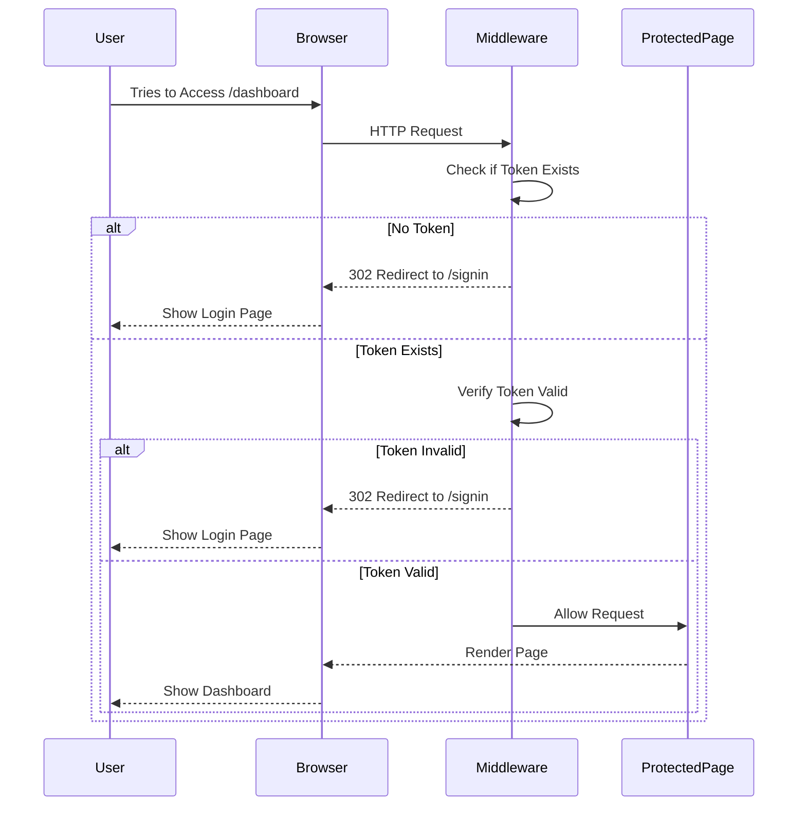
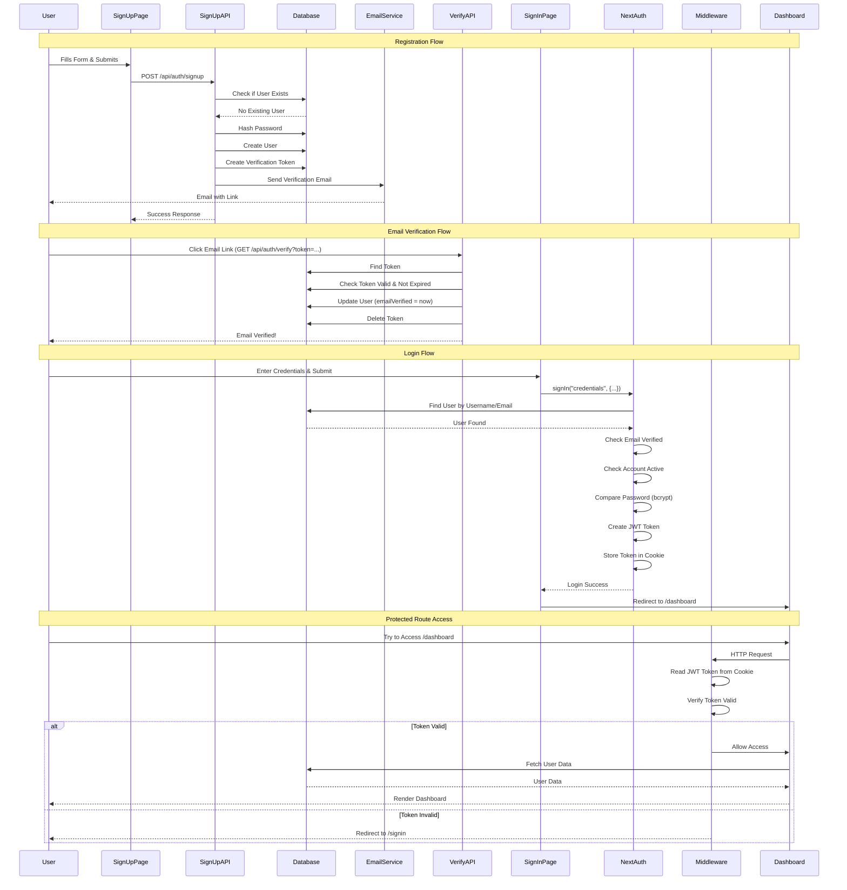

# Code Walkthrough: Authentication System

This document provides a **complete code walkthrough** of how authentication works in this application. We'll trace through actual code files and explain every step.

## 🎯 Learning Objective

By the end of this walkthrough, you'll understand:
- How user registration works (code by code)
- How login authentication works
- How sessions are created and managed
- How middleware protects routes
- How all the pieces connect together

## 📚 Prerequisites

Before reading this, you should understand:
- Basic JavaScript/TypeScript
- HTTP requests (GET, POST)
- Async/await
- Database concepts

## 🔍 Complete Authentication Flow - Code Trace

### Scenario: New User Registration

Let's trace through what happens when a new user signs up, step by step with actual code.

---

## Step 1: User Fills Out Sign Up Form

**File**: `app/(auth)/signup/page.tsx` (frontend page)

```typescript
// This is a React component that displays the sign up form
export default function SignUpPage() {
  // State management for form
  const [isLoading, setIsLoading] = useState(false)
  
  // Form submission handler
  const onSubmit = async (data: SignupForm) => {
    setIsLoading(true)
    
    try {
      // This is where we make the HTTP request
      const response = await fetch('/api/auth/signup', {
        method: 'POST',
        headers: { 'Content-Type': 'application/json' },
        body: JSON.stringify({
          firstName: data.firstName,
          lastName: data.lastName,
          username: data.username,
          email: data.email,
          password: data.password
        })
      })
      
      // Handle response...
    } catch (error) {
      // Handle error...
    }
  }
}
```

**What Happens Here:**
1. User types information into the form
2. React Hook Form validates the input (client-side)
3. When user clicks "Sign Up", the `onSubmit` function runs
4. It creates a POST request to `/api/auth/signup` with the form data

**Key Concepts:**
- `fetch()` is a JavaScript function that makes HTTP requests
- `POST` method is used to send data to the server
- `JSON.stringify()` converts JavaScript object to JSON string (required for HTTP)

---

## Step 2: Request Reaches API Route

**File**: `app/api/auth/signup/route.ts` (backend API endpoint)

Let's break down this file **line by line**:

```typescript
// Line 1-6: Import necessary libraries
import { NextRequest, NextResponse } from "next/server"  // Next.js types for requests/responses
import bcrypt from "bcryptjs"                            // Password hashing library
import { z } from "zod"                                  // Schema validation library
import { db } from "@/lib/db"                            // Prisma database client
import { sendVerificationEmail } from "@/lib/email"       // Email sending function
import { generateRandomString } from "@/lib/utils"        // Utility to generate random strings

// Line 8-14: Define validation schema
// This defines what data we expect and the rules
const signupSchema = z.object({
  firstName: z.string().min(1).max(50),      // String, minimum 1 char, max 50
  lastName: z.string().min(1).max(50),       // Same rules
  username: z.string().min(3).max(20),       // Username between 3-20 characters
  email: z.string().email(),                 // Must be valid email format
  password: z.string().min(8),               // Password at least 8 characters
})

// Line 16-103: Main API handler function
export async function POST(request: NextRequest) {
  // This function runs when a POST request comes to /api/auth/signup
  
  try {
    // Line 18: Parse the JSON body from the request
    // The request body contains: { firstName, lastName, username, email, password }
    const body = await request.json()
    
    // Line 19: Validate the data using Zod schema
    // If invalid, this will throw an error
    // If valid, it returns the parsed data with proper types
    const { firstName, lastName, username, email, password } = signupSchema.parse(body)
    
    // Line 21-36: Check if user already exists
    // We check both username and email to prevent duplicates
    const existingUser = await db.user.findFirst({
      where: {
        OR: [                           // OR condition: match either username OR email
          { username },                  // Check if username exists
          { email },                     // Check if email exists
        ],
      },
    })

    // If user exists, return error
    if (existingUser) {
      return NextResponse.json(
        { error: "User with this username or email already exists" },
        { status: 400 }                 // HTTP 400 = Bad Request
      )
    }

    // Line 38-39: Hash the password before storing
    // bcrypt.hash() creates a secure hash that cannot be reversed
    // 12 = number of salt rounds (how many times to hash, higher = more secure but slower)
    const passwordHash = await bcrypt.hash(password, 12)
    
    // Why hash? If database is compromised, attackers can't see plain passwords
    // Example: "mypassword123" becomes "$2a$12$xyz789..." (one-way encryption)

    // Line 41-51: Find the default "User" role
    // Every user needs a role for permissions
    const defaultRole = await db.role.findFirst({
      where: { name: "User" }            // Find role with name "User"
    })

    if (!defaultRole) {
      // This shouldn't happen if database is seeded properly
      return NextResponse.json(
        { error: "Default user role not found. Please contact administrator." },
        { status: 500 }                  // HTTP 500 = Internal Server Error
      )
    }

    // Line 53-63: Create the user in database
    // This is where the user record is actually saved
    const user = await db.user.create({
      data: {
        firstName,
        lastName,
        username,
        email,
        passwordHash,                   // Store hashed password, NOT plain password
        roleId: defaultRole.id,         // Assign default role
        // Note: emailVerified is NOT set here - it's null until user verifies email
      },
    })
    
    // At this point, user exists in database but cannot login yet
    // They need to verify their email first

    // Line 65-74: Create verification token
    // This token will be sent via email for verification
    const token = generateRandomString(32)    // Generate random 32-character string
    
    await db.verificationToken.create({
      data: {
        token,                                // The random token
        userId: user.id,                      // Link to the user
        expires: new Date(Date.now() + 24 * 60 * 60 * 1000),  // Expires in 24 hours
        // Date.now() = current time in milliseconds
        // 24 * 60 * 60 * 1000 = 24 hours in milliseconds
      },
    })

    // Line 76-82: Send verification email
    // This sends an email to the user with a link to verify
    try {
      await sendVerificationEmail(email, token)
      // Email sent successfully
    } catch (error) {
      // If email fails, log error but don't fail the signup
      // User can request new verification email later
      console.error("Failed to send verification email:", error)
    }

    // Line 84-87: Return success response
    return NextResponse.json({
      message: "User created successfully. Please check your email to verify your account.",
      userId: user.id,
    })
    // HTTP 200 = Success (default status)
    
  } catch (error) {
    // Line 89-101: Error handling
    console.error("Signup error:", error)
    
    // If it's a Zod validation error, return specific error
    if (error instanceof z.ZodError) {
      return NextResponse.json(
        { error: "Invalid input", details: error.errors },
        { status: 400 }
      )
    }

    // For any other error, return generic error message
    // We don't expose internal error details for security
    return NextResponse.json(
      { error: "Internal server error" },
      { status: 500 }
    )
  }
}
```

**Key Takeaways:**
1. **Validation First**: Always validate input before processing
2. **Security**: Passwords are NEVER stored in plain text
3. **Email Verification**: Users must verify email before login
4. **Error Handling**: Handle errors gracefully
5. **Database Transactions**: All operations use Prisma (type-safe)

---

## Step 3: Email Verification

**File**: `app/api/auth/verify/route.ts`

When user clicks the verification link in their email:

```typescript
export async function GET(request: NextRequest) {
  // GET request because it's a link click
  
  try {
    // Get the token from URL query parameters
    // Example URL: /api/auth/verify?token=abc123...
    const searchParams = request.nextUrl.searchParams
    const token = searchParams.get("token")

    if (!token) {
      return NextResponse.json(
        { error: "Token is required" },
        { status: 400 }
      )
    }

    // Find the verification token in database
    const verificationToken = await db.verificationToken.findUnique({
      where: { token },
      include: { user: true }  // Include the related user
    })

    // Check if token exists
    if (!verificationToken) {
      return NextResponse.json(
        { error: "Invalid verification token" },
        { status: 400 }
      )
    }

    // Check if token is expired
    if (verificationToken.expires < new Date()) {
      // Delete expired token
      await db.verificationToken.delete({
        where: { token }
      })
      
      return NextResponse.json(
        { error: "Verification token has expired. Please request a new one." },
        { status: 400 }
      )
    }

    // Token is valid! Update user to mark email as verified
    await db.user.update({
      where: { id: verificationToken.userId },
      data: {
        emailVerified: new Date()  // Set current timestamp
      }
    })

    // Delete the token (single-use token)
    await db.verificationToken.delete({
      where: { token }
    })

    // Return success
    return NextResponse.json({
      message: "Email verified successfully"
    })
  } catch (error) {
    // Error handling...
  }
}
```

**What Happens:**
1. User clicks email link → GET request to `/api/auth/verify?token=...`
2. Find token in database
3. Check if token is valid and not expired
4. Update user: set `emailVerified = now()`
5. Delete token (single-use)
6. User can now login!

---

## Step 4: User Logs In

**File**: `app/(auth)/signin/page.tsx` (frontend)

```typescript
const onSubmit = async (data: SigninForm) => {
  setIsLoading(true)
  
  try {
    // Use NextAuth's signIn function
    const result = await signIn("credentials", {
      identifier: data.identifier,  // username or email
      password: data.password,
      redirect: false,              // Don't auto-redirect (we'll handle it)
    })

    if (result?.error) {
      setError("Invalid credentials")
    } else if (result?.ok) {
      // Login successful! Redirect to dashboard
      router.replace("/dashboard")
    }
  } catch (error) {
    // Handle error...
  } finally {
    setIsLoading(false)
  }
}
```

**What Happens:**
1. User submits form
2. `signIn("credentials", ...)` calls NextAuth
3. NextAuth calls the `authorize` function (in `lib/auth.ts`)
4. If successful, session is created
5. User redirected to dashboard

---

## Step 5: NextAuth Authorize Function

**File**: `lib/auth.ts` - The `authorize` function (lines 18-72)

This is the **core authentication logic**:

```typescript
async authorize(credentials) {
  // This function is called by NextAuth when user tries to login
  
  // Step 1: Check if credentials exist
  if (!credentials?.identifier || !credentials?.password) {
    return null  // Invalid - return null to reject
  }

  // Step 2: Find user by username OR email
  const user = await db.user.findFirst({
    where: {
      OR: [
        { username: credentials.identifier },
        { email: credentials.identifier },
      ],
    },
    include: {
      role: {                          // Include role information
        select: {
          id: true,
          name: true,
          description: true,
        }
      }
    }
  })

  // Step 3: Check if user exists and email is verified
  if (!user || !user.emailVerified) {
    return null  // User doesn't exist OR email not verified
  }

  // Step 4: Check if account is active
  if (!user.isActive) {
    return null  // Account deactivated
  }

  // Step 5: Verify password using bcrypt
  const isPasswordValid = await bcrypt.compare(
    credentials.password,    // Plain password from user
    user.passwordHash        // Hashed password from database
  )
  
  // bcrypt.compare() hashes the plain password and compares it to stored hash
  // Returns true if they match, false otherwise

  if (!isPasswordValid) {
    return null  // Wrong password
  }

  // Step 6: All checks passed! Return user object
  // This object will be used to create the JWT token
  return {
    id: user.id,
    username: user.username,
    email: user.email,
    role: user.role?.name || 'User',
    roleId: user.roleId,
    profileImage: user.profileImage,
    createdAt: user.createdAt,
    rememberMe: credentials.rememberMe === "true",
  }
  // Returning this object means authentication succeeded
  // NextAuth will use this to create a session
}
```

**Authentication Checks (In Order):**
1. ✅ Credentials provided?
2. ✅ User exists?
3. ✅ Email verified?
4. ✅ Account active?
5. ✅ Password correct?

If ANY check fails → return `null` → login rejected

If ALL checks pass → return user object → login succeeds

---

## Step 6: JWT Token Creation

**File**: `lib/auth.ts` - The `jwt` callback (lines 84-120)

After `authorize()` returns a user object, NextAuth calls this function:

```typescript
async jwt({ token, user, account, trigger }) {
  // This function runs when:
  // 1. User first logs in (user object exists)
  // 2. Session is refreshed (trigger = "update")
  // 3. Token is accessed
  
  try {
    // If this is a session update (e.g., user changed profile image)
    if (trigger === "update") {
      const dbUser = await db.user.findUnique({
        where: { id: token.id as string },
        select: { profileImage: true }
      })
      if (dbUser) {
        token.profileImage = dbUser.profileImage  // Update token with latest data
      }
    }
    
    // If user just logged in (user object exists)
    if (user) {
      // Add user data to the JWT token
      token.id = user.id
      token.role = user.role
      token.roleId = user.roleId
      token.username = user.username
      token.profileImage = user.profileImage
      token.createdAt = user.createdAt
      token.rememberMe = user.rememberMe
      
      // Set token expiration based on "Remember Me"
      if (user.rememberMe) {
        // Remember me checked: 30 days
        token.exp = Math.floor(Date.now() / 1000) + (30 * 24 * 60 * 60)
      } else {
        // Remember me NOT checked: 8 hours (browser session)
        token.exp = Math.floor(Date.now() / 1000) + (8 * 60 * 60)
      }
    }
    
    return token  // This token will be stored in a secure cookie
  } catch (error) {
    console.warn('JWT callback error:', error)
    return token
  }
}
```

**What Gets Stored in JWT Token:**
- User ID
- Username
- Email
- Role
- Profile Image
- Expiration time

**Token Storage:**
- Stored in HTTP-only cookie (secure)
- Sent with every request
- Used to verify user identity

---

## Step 7: Session Creation

**File**: `lib/auth.ts` - The `session` callback (lines 121-140)

This function converts the JWT token into a session object:

```typescript
async session({ session, token }) {
  // This runs whenever getServerSession() or useSession() is called
  // It adds token data to the session object
  
  try {
    if (token && session?.user) {
      // Add token data to session
      session.user.id = token.id as string
      session.user.role = token.role as string
      session.user.roleId = token.roleId as string | null
      session.user.username = token.username as string
      session.user.image = token.profileImage as string | null | undefined
    }
    
    return session  // Return session with user data
  } catch (error) {
    console.error('Session callback error:', error)
    return session
  }
}
```

**How Session is Used:**
- In Server Components: `const session = await getServerSession(authOptions)`
- In Client Components: `const { data: session } = useSession()`
- Contains all user information

---

## Step 8: Middleware Protects Routes

**File**: `middleware.ts`

This file runs **before every request**:

```typescript
import { withAuth } from "next-auth/middleware"
import { NextResponse } from "next/server"

export default withAuth(
  function middleware(req) {
    // This function runs for every request to routes in the matcher
    
    // Check if route requires authentication
    if (req.nextUrl.pathname.startsWith("/dashboard") || 
        req.nextUrl.pathname.startsWith("/doctors") ||
        req.nextUrl.pathname.startsWith("/engineers") ||
        req.nextUrl.pathname.startsWith("/teachers") ||
        req.nextUrl.pathname.startsWith("/lawyers")) {
      
      // If no token (user not logged in)
      if (!req.nextauth.token) {
        // Redirect to login page
        return NextResponse.redirect(new URL("/signin", req.url))
      }
    }
    
    // If user has token, allow request to continue
    return NextResponse.next()
  },
  {
    callbacks: {
      authorized: ({ token, req }) => {
        // This callback determines if request is authorized
        
        // Public routes (auth pages) - allow without token
        if (req.nextUrl.pathname.startsWith("/signin") || 
            req.nextUrl.pathname.startsWith("/signup") ||
            req.nextUrl.pathname.startsWith("/verify") ||
            req.nextUrl.pathname.startsWith("/forgot-password") ||
            req.nextUrl.pathname.startsWith("/reset-password")) {
          return true  // Allow access
        }
        
        // Protected routes - require token
        if (req.nextUrl.pathname.startsWith("/dashboard") || 
            req.nextUrl.pathname.startsWith("/doctors") ||
            req.nextUrl.pathname.startsWith("/engineers") ||
            req.nextUrl.pathname.startsWith("/teachers") ||
            req.nextUrl.pathname.startsWith("/lawyers")) {
          return !!token  // true if token exists, false otherwise
        }
        
        // Other routes - allow
        return true
      },
    },
  }
)

// This defines which routes middleware should run on
export const config = {
  matcher: [
    "/dashboard/:path*",      // All dashboard routes
    "/doctors/:path*",        // All doctor routes
    "/engineers/:path*",      // All engineer routes
    "/teachers/:path*",       // All teacher routes
    "/lawyers/:path*",       // All lawyer routes
    "/signin",
    "/signup", 
    "/verify",
    "/forgot-password",
    "/reset-password"
  ]
}
```

**How Middleware Works:**



**Flow for Protected Route:**
1. User tries to access `/dashboard`
2. Middleware intercepts request
3. Middleware checks for JWT token in cookie
4. If no token → redirect to `/signin`
5. If token exists → verify it's valid
6. If valid → allow request to continue
7. Page renders with user data

---

## 📊 Complete Flow Diagram

Here's how everything connects:



---

## 🔑 Key Concepts Explained

### 1. HTTP Methods

| Method | Use Case | Example |
|--------|----------|---------|
| **GET** | Retrieve data | Getting user profile |
| **POST** | Create/send data | Signing up, logging in |
| **PUT** | Update data | Updating profile |
| **DELETE** | Remove data | Deleting account |

### 2. Status Codes

| Code | Meaning | When Used |
|------|---------|-----------|
| **200** | Success | Request completed successfully |
| **400** | Bad Request | Invalid input data |
| **401** | Unauthorized | Not logged in or invalid credentials |
| **403** | Forbidden | Logged in but no permission |
| **404** | Not Found | Resource doesn't exist |
| **500** | Server Error | Something went wrong on server |

### 3. Password Hashing

**Why Hash?**
- If database is compromised, attackers can't see passwords
- One-way encryption (can't reverse it)
- Even same password = different hash (due to salt)

**How It Works:**
```typescript
// When user signs up
const password = "mypassword123"
const passwordHash = await bcrypt.hash(password, 12)
// Result: "$2a$12$xyz789abc..." (long string)

// When user logs in
const enteredPassword = "mypassword123"
const isValid = await bcrypt.compare(enteredPassword, passwordHash)
// Result: true (if password matches)
```

### 4. JWT Tokens

**What is JWT?**
- JSON Web Token
- Contains user information (id, email, role)
- Signed cryptographically (can't be tampered with)
- Stored in secure HTTP-only cookie

**Token Structure:**
```
Header.Payload.Signature

Example:
eyJhbGciOiJIUzI1NiIsInR5cCI6IkpXVCJ9.eyJpZCI6IjEyMyIsImVtYWlsIjoi...xyz
```

### 5. Middleware

**What is Middleware?**
- Code that runs before every request
- Like a gatekeeper checking permissions
- Can redirect, block, or allow requests

**Execution Order:**
```
1. User makes request
2. Middleware runs (checks authentication)
3. If authorized → Request continues
4. If not authorized → Redirect to login
5. Page/API handler runs
```

---

## 📝 Common Patterns

### Pattern 1: Try-Catch for Error Handling

```typescript
try {
  // Code that might fail
  const result = await someOperation()
  return NextResponse.json({ success: true })
} catch (error) {
  // Handle error
  console.error("Error:", error)
  return NextResponse.json(
    { error: "Something went wrong" },
    { status: 500 }
  )
}
```

### Pattern 2: Validation Before Processing

```typescript
// Always validate input first
const validatedData = schema.parse(requestBody)

// Then process
const result = await processData(validatedData)
```

### Pattern 3: Database Queries

```typescript
// Find one record
const user = await db.user.findUnique({
  where: { id: userId }
})

// Find multiple records
const users = await db.user.findMany({
  where: { isActive: true }
})

// Create record
const newUser = await db.user.create({
  data: { name: "John", email: "john@example.com" }
})

// Update record
await db.user.update({
  where: { id: userId },
  data: { name: "John Updated" }
})

// Delete record
await db.user.delete({
  where: { id: userId }
})
```

---

## 🎓 Practice Exercises

To fully understand this, try:

1. **Trace through password reset flow**
   - Find `forgot-password` API route
   - Follow the code step by step
   - Draw a diagram of the flow

2. **Modify signup to require phone number**
   - Add phone field to signup schema
   - Update database migration
   - Update API route

3. **Add logging**
   - Add console.log statements to trace execution
   - See what data is passed between functions

4. **Test error cases**
   - What happens if email is invalid?
   - What happens if password is too short?
   - What happens if database is down?

---

## 🔗 Related Documentation

- [Authentication System](./06-authentication.md) - High-level overview
- [API Routes](./08-api-routes.md) - How API routes work
- [Database](./07-database.md) - Database operations
- [Middleware](./05-routing.md) - Next.js routing and middleware

---

**Next Steps:**
1. Read the actual code files mentioned in this walkthrough
2. Add console.log statements to see execution flow
3. Try modifying code to understand each part
4. Read [Code Walkthrough: API Routes](./25-code-walkthrough-api-routes.md)

