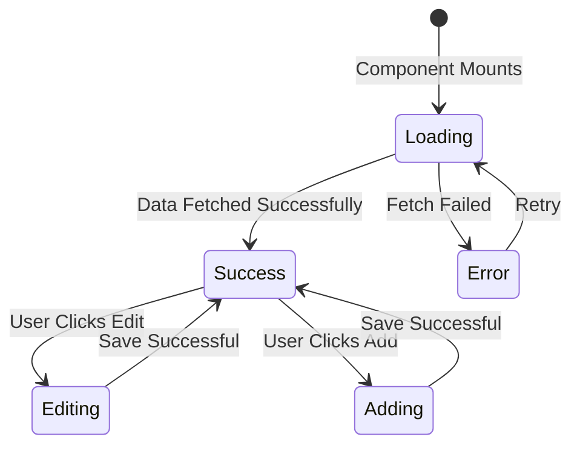
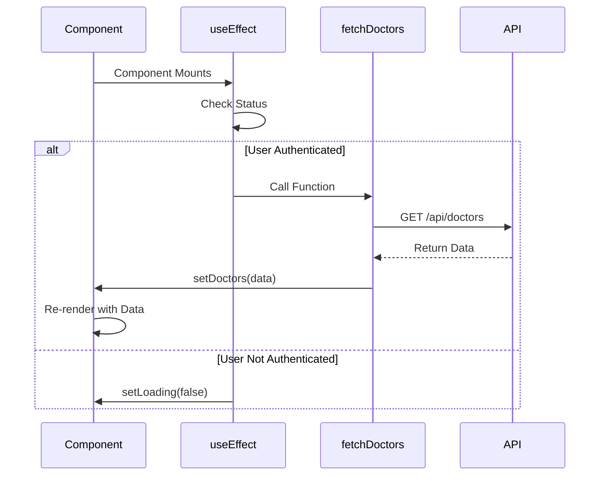
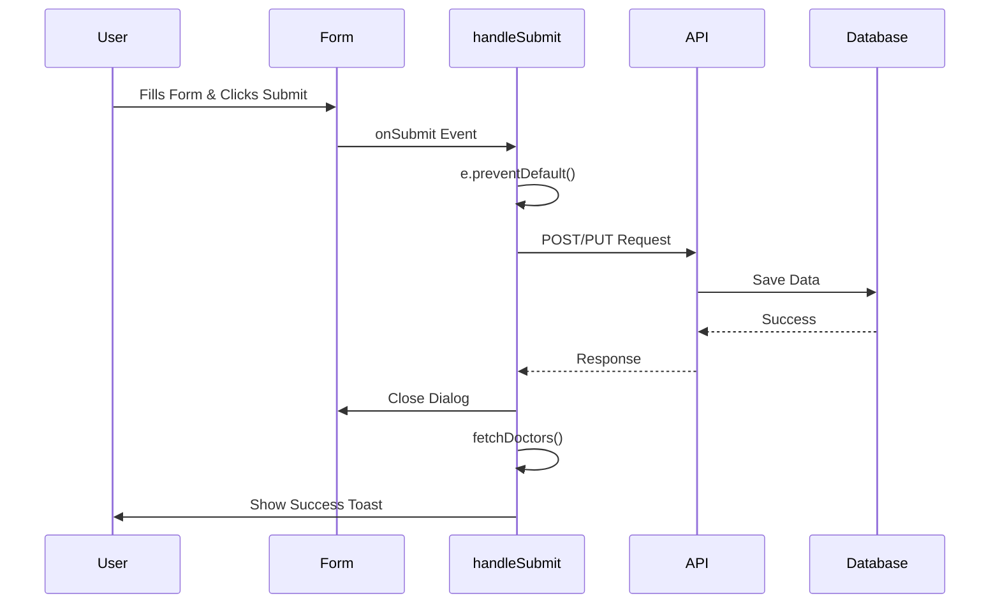
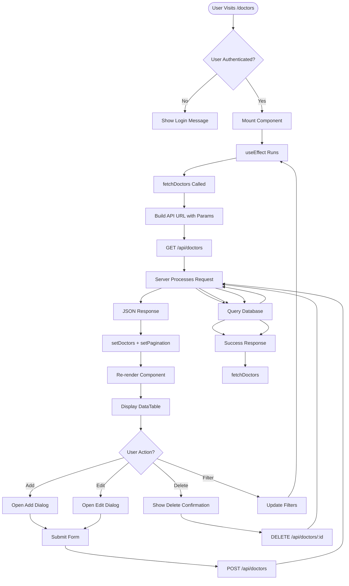

# Code Walkthrough: Pages

This document provides a detailed, line-by-line explanation of how pages work in this Next.js application, using real code examples from the codebase.

## 📄 Understanding Page Components

### What is a Page Component?

A **page component** is a React component that represents a route in your application. In Next.js App Router, any file named `page.tsx` in the `app` directory becomes a route.

### Example: Doctors Management Page

Let's walk through the complete `app/(app)/doctors/page.tsx` file:

## 🎯 Complete Code Breakdown

### 1. Imports and Dependencies

```typescript
"use client"  // ← This tells Next.js this component runs on the CLIENT (browser)

import { useState, useEffect } from "react"  // ← React hooks for state management
import { useSession } from "next-auth/react"  // ← Hook to get current user session
```

**Why `"use client"`?**
- This page needs interactivity (forms, buttons, state)
- Uses React hooks (`useState`, `useEffect`)
- Makes API calls from the browser
- **Without this**: Component would be a Server Component (no interactivity)

### 2. Component Structure

```typescript
export default function DoctorsPage() {
  // All component logic goes here
}
```

**What happens when this component loads:**
1. React renders the component
2. Runs `useEffect` hooks
3. Fetches data from API
4. Updates state with data
5. Re-renders with the data

### 3. State Management

```typescript
// Session state - tracks if user is logged in
const { data: session, status } = useSession()

// Data state - stores the list of doctors
const [doctors, setDoctors] = useState<Doctor[]>([])

// Loading state - shows spinner while fetching
const [loading, setLoading] = useState(true)

// Error state - stores error messages
const [error, setError] = useState<string | null>(null)

// Dialog state - controls which dialog is open
const [isAddDialogOpen, setIsAddDialogOpen] = useState(false)

// Editing state - tracks which doctor is being edited
const [editingDoctor, setEditingDoctor] = useState<Doctor | null>(null)
```

**State Flow Diagram:**



### 4. Data Fetching with useEffect

```typescript
useEffect(() => {
  // This runs when component mounts OR when dependencies change
  if (status === 'authenticated') {
    fetchDoctors()  // ← Only fetch if user is logged in
  } else if (status === 'unauthenticated') {
    setLoading(false)  // ← Stop loading if not authenticated
  }
}, [status, pagination.pageIndex, pagination.pageSize, searchQuery, ...])
// ↑ Dependencies: refetch when these values change
```

**How useEffect Works:**

| When | What Happens |
|------|-------------|
| Component first mounts | Runs the effect |
| `status` changes | Re-runs effect |
| User changes page | Re-runs effect |
| User changes filters | Re-runs effect |

**Visual Flow:**



### 5. API Fetch Function

```typescript
const fetchDoctors = async () => {
  setLoading(true)      // ← Show loading spinner
  setError(null)       // ← Clear any previous errors
  
  try {
    // Build query parameters
    const params = new URLSearchParams({
      page: (pagination.pageIndex + 1).toString(),
      limit: pagination.pageSize.toString(),
      sortBy,
      sortOrder,
    })
    
    // Add optional filters
    if (searchQuery) params.set('search', searchQuery)
    if (departmentFilter) params.set('department', departmentFilter)
    
    // Make HTTP request
    const response = await fetch(`/api/doctors?${params.toString()}`, {
      credentials: 'include'  // ← Include cookies (for authentication)
    })
    
    if (response.ok) {
      const result = await response.json()
      setDoctors(result.data)              // ← Update doctors list
      setPagination(prev => ({           // ← Update pagination info
        ...prev,
        total: result.pagination.total,
        pages: result.pagination.pages
      }))
    } else {
      // Handle errors
      setError(`API request failed: ${response.status}`)
      setDoctors([])
    }
  } catch (error) {
    setError(`Network error: ${error.message}`)
    setDoctors([])
  } finally {
    setLoading(false)  // ← Hide loading spinner
  }
}
```

**Step-by-Step Breakdown:**

| Step | Code | What It Does |
|------|------|-------------|
| 1 | `setLoading(true)` | Shows loading spinner to user |
| 2 | `const params = new URLSearchParams(...)` | Builds query string (e.g., `?page=1&limit=10`) |
| 3 | `if (searchQuery) params.set(...)` | Adds filters to query string |
| 4 | `fetch('/api/doctors?...')` | Makes HTTP GET request to API |
| 5 | `response.ok` | Checks if request succeeded (200-299 status) |
| 6 | `await response.json()` | Converts JSON response to JavaScript object |
| 7 | `setDoctors(result.data)` | Updates state with fetched data |
| 8 | `setLoading(false)` | Hides loading spinner |

### 6. Form Submission Handler

```typescript
const handleSubmit = async (e: React.FormEvent) => {
  e.preventDefault()  // ← Prevent page refresh
  
  try {
    // Determine if creating or updating
    const url = editingDoctor 
      ? `/api/doctors/${editingDoctor.id}`  // ← Update existing
      : '/api/doctors'                      // ← Create new
    
    const method = editingDoctor ? 'PUT' : 'POST'
    
    // Send data to API
    const response = await fetch(url, {
      method,
      headers: { 'Content-Type': 'application/json' },
      credentials: 'include',
      body: JSON.stringify(formData)  // ← Convert object to JSON string
    })
    
    if (response.ok) {
      // Success! Close dialog and refresh list
      setIsAddDialogOpen(false)
      setEditingDoctor(null)
      resetForm()
      fetchDoctors()  // ← Reload the list
      toast.success('Doctor saved successfully!')
    } else {
      // Show error message
      const errorData = await response.json()
      toast.error(`Error: ${errorData.error}`)
    }
  } catch (error) {
    toast.error('Network error occurred')
  }
}
```

**Form Submission Flow:**



### 7. Delete Handler

```typescript
const handleDelete = (id: string) => {
  // Find the doctor to delete
  const doctor = doctors.find(d => d.id === id)
  if (doctor) {
    // Show confirmation dialog
    setDeleteConfirmation({ open: true, doctor })
  }
}

const confirmDelete = async () => {
  if (!deleteConfirmation.doctor) return
  
  try {
    // Make DELETE request
    const response = await fetch(
      `/api/doctors/${deleteConfirmation.doctor.id}`, 
      { 
        method: 'DELETE',
        credentials: 'include'
      }
    )
    
    if (response.ok) {
      fetchDoctors()  // ← Reload list
      toast.success('Doctor deleted successfully!')
    } else {
      toast.error('Failed to delete doctor')
    }
  } catch (error) {
    toast.error('Network error occurred')
  }
}
```

### 8. Rendering the UI

```typescript
return (
  <ErrorBoundary>  {/* ← Catches React errors */}
    <div className="space-y-6">
      {/* Header */}
      <div className="flex items-center justify-between">
        <h1>Doctors Management</h1>
        <Button onClick={handleAddNew}>Add Doctor</Button>
      </div>
      
      {/* Stats Cards */}
      <div className="grid grid-cols-4 gap-4">
        <Card>
          <CardHeader>
            <CardTitle>Total Doctors</CardTitle>
          </CardHeader>
          <CardContent>
            <div className="text-2xl">{doctors.length}</div>
          </CardContent>
        </Card>
        {/* More cards... */}
      </div>
      
      {/* Data Table */}
      <Card>
        <CardContent>
          {error ? (
            <div>Error: {error}</div>
          ) : (
            <DataTable
              data={doctors}
              columns={columns}
              isLoading={loading}
              pagination={pagination}
              onPaginationChange={handlePaginationChange}
              meta={{ onView, onEdit, onDelete }}
            />
          )}
        </CardContent>
      </Card>
      
      {/* Dialog for Add/Edit */}
      <Dialog open={isAddDialogOpen}>
        {/* Form content... */}
      </Dialog>
    </div>
  </ErrorBoundary>
)
```

**Component Hierarchy:**

```
DoctorsPage
  ├── ErrorBoundary (error handling)
  │   └── div (container)
  │       ├── Header (title + button)
  │       ├── Stats Cards (4 cards showing metrics)
  │       ├── DataTable (main data display)
  │       │   ├── Filters
  │       │   ├── Search Input
  │       │   ├── Table Rows
  │       │   └── Pagination
  │       └── Dialog (add/edit form)
```

## 🔄 Complete Data Flow

Here's how everything connects:



## 📝 Key Concepts Explained

### Client Component vs Server Component

| Aspect | Client Component (`"use client"`) | Server Component (default) |
|--------|-----------------------------------|----------------------------|
| **Runs On** | Browser (client) | Server |
| **Interactivity** | Yes (buttons, forms, state) | No |
| **Hooks** | Can use `useState`, `useEffect` | Cannot use hooks |
| **API Calls** | From browser (`fetch`) | Direct database access |
| **Bundle Size** | Larger (includes JS) | Smaller (just HTML) |
| **When to Use** | Forms, interactive UI | Static content, data fetching |

### State Management Pattern

```typescript
// 1. Define state
const [doctors, setDoctors] = useState<Doctor[]>([])

// 2. Update state
setDoctors(newDoctors)  // ← Triggers re-render

// 3. Use state in render
{doctors.map(doctor => <div>{doctor.name}</div>)}
```

**State Update Flow:**

```
setState(newValue) 
  → React updates state 
  → Component re-renders 
  → UI updates
```

### Event Handling Pattern

```typescript
// 1. Define handler
const handleClick = () => {
  console.log('Clicked!')
}

// 2. Attach to element
<Button onClick={handleClick}>Click Me</Button>

// 3. Event fires
// User clicks button → handleClick runs → Action happens
```

## 🎓 Common Patterns in This Codebase

### Pattern 1: Fetch on Mount

```typescript
useEffect(() => {
  fetchData()
}, [])  // ← Empty array = run once on mount
```

### Pattern 2: Fetch on Dependency Change

```typescript
useEffect(() => {
  fetchData()
}, [searchQuery, pageIndex])  // ← Re-fetch when these change
```

### Pattern 3: Conditional Rendering

```typescript
{loading ? (
  <Spinner />
) : error ? (
  <ErrorDisplay />
) : (
  <DataTable data={doctors} />
)}
```

### Pattern 4: Form Handling

```typescript
const [formData, setFormData] = useState({ name: '' })

const handleChange = (e) => {
  setFormData({ ...formData, [e.target.name]: e.target.value })
}

const handleSubmit = async (e) => {
  e.preventDefault()
  await fetch('/api/endpoint', {
    method: 'POST',
    body: JSON.stringify(formData)
  })
}
```

## 🚀 Best Practices Used

1. **Error Handling**: Try-catch blocks around API calls
2. **Loading States**: Shows spinner while fetching
3. **Type Safety**: TypeScript types for all data
4. **Separation of Concerns**: API calls in separate functions
5. **User Feedback**: Toast notifications for actions
6. **Optimistic Updates**: UI updates immediately, syncs later

## 🔗 Related Documentation

- [API Routes](./08-api-routes.md) - How the API endpoints work
- [Components Overview](./09-components-overview.md) - Understanding components
- [Data Tables](./12-data-tables.md) - How DataTable component works
- [Authentication](./06-authentication.md) - Session management

---

**Next**: [Code Walkthrough: API Routes](./25-code-walkthrough-api.md)

