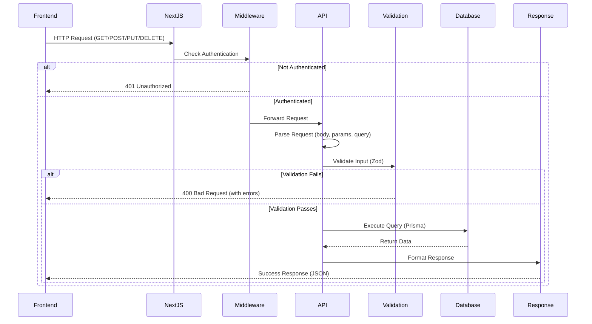

# Code Walkthrough: API Routes

This document provides a **complete code walkthrough** of how API routes work in this application. You'll learn how to create, read, update, and delete data through API endpoints.

## 🎯 Learning Objective

By the end of this walkthrough, you'll understand:
- How API routes are structured
- How HTTP methods work (GET, POST, PUT, DELETE)
- How to validate input data
- How to query the database
- How to handle errors
- How everything connects from frontend to backend

---

## 📁 File Structure

API routes are located in the `app/api/` directory:

```
app/api/
├── auth/                    # Authentication endpoints
├── doctors/                 # Doctor management endpoints
│   ├── route.ts            # GET (list), POST (create)
│   └── [id]/
│       └── route.ts        # GET (one), PUT (update), DELETE
├── users/                   # User management endpoints
├── roles/                   # Role management endpoints
└── ...
```

**Key Pattern:**
- `route.ts` = handles multiple HTTP methods for a resource
- `[id]/route.ts` = handles operations on a specific item

---

## 🔍 Complete CRUD Example: Doctors API

Let's trace through a complete CRUD (Create, Read, Update, Delete) API step by step.

---

## Step 1: List All Doctors (GET /api/doctors)

**File**: `app/api/doctors/route.ts`

```typescript
import { NextRequest, NextResponse } from "next/server"
import { getServerSession } from "next-auth/next"
import { authOptions } from "@/lib/auth"
import { db } from "@/lib/db"

// GET handler - Retrieve list of doctors
export async function GET(request: NextRequest) {
  try {
    // Step 1: Check authentication
    // Only logged-in users can see doctors
    const session = await getServerSession(authOptions)
    
    if (!session?.user) {
      return NextResponse.json(
        { error: "Unauthorized" },
        { status: 401 }  // 401 = Not authenticated
      )
    }

    // Step 2: Parse query parameters (for filtering, pagination)
    // Example: /api/doctors?page=1&limit=10&department=Cardiology
    const searchParams = request.nextUrl.searchParams
    const page = parseInt(searchParams.get("page") || "1")      // Default: page 1
    const limit = parseInt(searchParams.get("limit") || "10")    // Default: 10 items
    const department = searchParams.get("department")             // Optional filter
    const search = searchParams.get("search")                     // Optional search term

    // Step 3: Build database query
    // Start with base query
    const where: any = {
      // We can add filters here
    }

    // Add department filter if provided
    if (department) {
      where.department = department
    }

    // Add search filter if provided (search in name fields)
    if (search) {
      where.OR = [
        { firstName: { contains: search, mode: "insensitive" } },
        { lastName: { contains: search, mode: "insensitive" } },
        { email: { contains: search, mode: "insensitive" } },
      ]
    }

    // Step 4: Calculate pagination
    // If page = 1 and limit = 10, we need items 0-9
    // skip = (page - 1) * limit
    // take = limit
    const skip = (page - 1) * limit

    // Step 5: Query database
    // Get doctors with pagination
    const [doctors, totalCount] = await Promise.all([
      // Get the actual data
      db.doctor.findMany({
        where,                    // Apply filters
        skip,                     // Skip items for pagination
        take: limit,              // Limit number of items
        orderBy: {                // Sort by creation date (newest first)
          createdAt: "desc"
        }
      }),
      // Count total items (for pagination info)
      db.doctor.count({ where })
    ])

    // Step 6: Calculate pagination metadata
    const totalPages = Math.ceil(totalCount / limit)
    const hasNextPage = page < totalPages
    const hasPreviousPage = page > 1

    // Step 7: Return response
    return NextResponse.json({
      doctors,                    // The actual data
      pagination: {               // Pagination information
        page,
        limit,
        totalCount,
        totalPages,
        hasNextPage,
        hasPreviousPage
      }
    })
    
  } catch (error) {
    // Error handling
    console.error("Error fetching doctors:", error)
    return NextResponse.json(
      { error: "Failed to fetch doctors" },
      { status: 500 }
    )
  }
}
```

**What Happens When Frontend Calls This:**

```typescript
// Frontend code (React component)
const response = await fetch('/api/doctors?page=1&limit=10&department=Cardiology')
const data = await response.json()
// data = {
//   doctors: [...],  // Array of doctor objects
//   pagination: { page: 1, limit: 10, totalCount: 50, ... }
// }
```

**Key Concepts:**
- **Pagination**: Breaking large datasets into pages
- **Filtering**: Finding specific records (by department)
- **Searching**: Finding records by text match
- **Counting**: Getting total number of records

---

## Step 2: Create a Doctor (POST /api/doctors)

**File**: `app/api/doctors/route.ts` (same file, different function)

```typescript
import { z } from "zod"

// Define validation schema
// This ensures data is correct before processing
const createDoctorSchema = z.object({
  firstName: z.string().min(1, "First name is required"),
  lastName: z.string().min(1, "Last name is required"),
  email: z.string().email("Invalid email address"),
  employeeId: z.string().min(1, "Employee ID is required"),
  department: z.string().min(1, "Department is required"),
  specialization: z.string().min(1, "Specialization is required"),
  licenseNumber: z.string().min(1, "License number is required"),
  yearsOfExperience: z.number().optional(),
  salary: z.number().optional(),
})

// POST handler - Create a new doctor
export async function POST(request: NextRequest) {
  try {
    // Step 1: Check authentication
    const session = await getServerSession(authOptions)
    
    if (!session?.user) {
      return NextResponse.json(
        { error: "Unauthorized" },
        { status: 401 }
      )
    }

    // Optional: Check user role (only admins can create doctors?)
    // if (session.user.role !== "Admin") {
    //   return NextResponse.json(
    //     { error: "Forbidden" },
    //     { status: 403 }
    //   )
    // }

    // Step 2: Parse request body (JSON data from frontend)
    const body = await request.json()
    // body = {
    //   firstName: "John",
    //   lastName: "Doe",
    //   email: "john@example.com",
    //   ...
    // }

    // Step 3: Validate data using Zod schema
    // This will throw an error if data is invalid
    const validatedData = createDoctorSchema.parse(body)
    
    // If we get here, data is valid!

    // Step 4: Check for duplicates
    // Email and employeeId should be unique
    const existingDoctor = await db.doctor.findFirst({
      where: {
        OR: [
          { email: validatedData.email },
          { employeeId: validatedData.employeeId },
        ],
      },
    })

    if (existingDoctor) {
      return NextResponse.json(
        { 
          error: "Doctor with this email or employee ID already exists",
          field: existingDoctor.email === validatedData.email ? "email" : "employeeId"
        },
        { status: 400 }  // 400 = Bad Request (client error)
      )
    }

    // Step 5: Create doctor in database
    const doctor = await db.doctor.create({
      data: {
        firstName: validatedData.firstName,
        lastName: validatedData.lastName,
        email: validatedData.email,
        employeeId: validatedData.employeeId,
        department: validatedData.department,
        specialization: validatedData.specialization,
        licenseNumber: validatedData.licenseNumber,
        yearsOfExperience: validatedData.yearsOfExperience,
        salary: validatedData.salary,
        isActive: true,  // Default to active
      },
    })

    // Step 6: Return success response
    return NextResponse.json(
      {
        message: "Doctor created successfully",
        doctor,  // Return the created doctor object
      },
      { status: 201 }  // 201 = Created
    )
    
  } catch (error) {
    console.error("Error creating doctor:", error)
    
    // Handle Zod validation errors
    if (error instanceof z.ZodError) {
      return NextResponse.json(
        {
          error: "Validation failed",
          details: error.errors,  // Array of validation errors
          // Example: [
          //   { path: ["email"], message: "Invalid email address" },
          //   { path: ["firstName"], message: "First name is required" }
          // ]
        },
        { status: 400 }
      )
    }

    // Handle other errors
    return NextResponse.json(
      { error: "Failed to create doctor" },
      { status: 500 }
    )
  }
}
```

**What Happens When Frontend Calls This:**

```typescript
// Frontend code (form submission)
const formData = {
  firstName: "John",
  lastName: "Doe",
  email: "john@example.com",
  employeeId: "EMP001",
  department: "Cardiology",
  specialization: "Heart Surgery",
  licenseNumber: "LIC123"
}

const response = await fetch('/api/doctors', {
  method: 'POST',
  headers: { 'Content-Type': 'application/json' },
  body: JSON.stringify(formData)
})

if (response.ok) {
  const data = await response.json()
  // data = { message: "Doctor created successfully", doctor: {...} }
} else {
  const error = await response.json()
  // error = { error: "Validation failed", details: [...] }
}
```

**Key Concepts:**
- **Validation**: Always validate input before processing
- **Uniqueness**: Check for duplicate records
- **Error Handling**: Provide clear error messages
- **Status Codes**: Use appropriate HTTP status codes

---

## Step 3: Get Single Doctor (GET /api/doctors/[id])

**File**: `app/api/doctors/[id]/route.ts`

```typescript
// GET handler - Retrieve a single doctor by ID
export async function GET(
  request: NextRequest,
  { params }: { params: { id: string } }
) {
  try {
    // Step 1: Check authentication
    const session = await getServerSession(authOptions)
    
    if (!session?.user) {
      return NextResponse.json(
        { error: "Unauthorized" },
        { status: 401 }
      )
    }

    // Step 2: Get ID from URL parameters
    // URL: /api/doctors/abc123
    // params.id = "abc123"
    const doctorId = params.id

    // Step 3: Find doctor in database
    const doctor = await db.doctor.findUnique({
      where: { id: doctorId },
      // Can include related data if needed
      // include: { department: true }
    })

    // Step 4: Check if doctor exists
    if (!doctor) {
      return NextResponse.json(
        { error: "Doctor not found" },
        { status: 404 }  // 404 = Not Found
      )
    }

    // Step 5: Return doctor data
    return NextResponse.json({ doctor })
    
  } catch (error) {
    console.error("Error fetching doctor:", error)
    return NextResponse.json(
      { error: "Failed to fetch doctor" },
      { status: 500 }
    )
  }
}
```

**Dynamic Routes:**
- `[id]` = Dynamic segment
- `/api/doctors/abc123` → `params.id = "abc123"`
- `/api/doctors/xyz789` → `params.id = "xyz789"`

---

## Step 4: Update Doctor (PUT /api/doctors/[id])

**File**: `app/api/doctors/[id]/route.ts` (same file)

```typescript
import { z } from "zod"

// Update schema (some fields optional)
const updateDoctorSchema = z.object({
  firstName: z.string().min(1).optional(),
  lastName: z.string().min(1).optional(),
  email: z.string().email().optional(),
  department: z.string().optional(),
  specialization: z.string().optional(),
  yearsOfExperience: z.number().optional(),
  salary: z.number().optional(),
  isActive: z.boolean().optional(),
  // Note: employeeId and licenseNumber typically shouldn't be updated
})

// PUT handler - Update an existing doctor
export async function PUT(
  request: NextRequest,
  { params }: { params: { id: string } }
) {
  try {
    // Step 1: Check authentication
    const session = await getServerSession(authOptions)
    
    if (!session?.user) {
      return NextResponse.json(
        { error: "Unauthorized" },
        { status: 401 }
      )
    }

    // Step 2: Get ID and request body
    const doctorId = params.id
    const body = await request.json()

    // Step 3: Validate data
    const validatedData = updateDoctorSchema.parse(body)

    // Step 4: Check if doctor exists
    const existingDoctor = await db.doctor.findUnique({
      where: { id: doctorId }
    })

    if (!existingDoctor) {
      return NextResponse.json(
        { error: "Doctor not found" },
        { status: 404 }
      )
    }

    // Step 5: Check for email conflicts (if email is being updated)
    if (validatedData.email && validatedData.email !== existingDoctor.email) {
      const emailExists = await db.doctor.findUnique({
        where: { email: validatedData.email }
      })
      
      if (emailExists) {
        return NextResponse.json(
          { error: "Email already in use" },
          { status: 400 }
        )
      }
    }

    // Step 6: Update doctor in database
    const doctor = await db.doctor.update({
      where: { id: doctorId },
      data: validatedData,  // Only update provided fields
      // Prisma will only update fields that are defined in validatedData
    })

    // Step 7: Return updated doctor
    return NextResponse.json({
      message: "Doctor updated successfully",
      doctor
    })
    
  } catch (error) {
    console.error("Error updating doctor:", error)
    
    if (error instanceof z.ZodError) {
      return NextResponse.json(
        { error: "Validation failed", details: error.errors },
        { status: 400 }
      )
    }

    return NextResponse.json(
      { error: "Failed to update doctor" },
      { status: 500 }
    )
  }
}
```

**Key Points:**
- Use `update()` to modify existing records
- Only update fields that are provided (partial updates)
- Check for conflicts (e.g., duplicate email)
- Validate data before updating

---

## Step 5: Delete Doctor (DELETE /api/doctors/[id])

**File**: `app/api/doctors/[id]/route.ts` (same file)

```typescript
// DELETE handler - Delete a doctor
export async function DELETE(
  request: NextRequest,
  { params }: { params: { id: string } }
) {
  try {
    // Step 1: Check authentication
    const session = await getServerSession(authOptions)
    
    if (!session?.user) {
      return NextResponse.json(
        { error: "Unauthorized" },
        { status: 401 }
      )
    }

    // Optional: Check if user has permission to delete
    // if (session.user.role !== "Admin") {
    //   return NextResponse.json(
    //     { error: "Forbidden" },
    //     { status: 403 }
    //   )
    // }

    // Step 2: Get ID
    const doctorId = params.id

    // Step 3: Check if doctor exists
    const doctor = await db.doctor.findUnique({
      where: { id: doctorId }
    })

    if (!doctor) {
      return NextResponse.json(
        { error: "Doctor not found" },
        { status: 404 }
      )
    }

    // Step 4: Delete doctor from database
    await db.doctor.delete({
      where: { id: doctorId }
    })

    // Step 5: Return success
    return NextResponse.json({
      message: "Doctor deleted successfully"
    })
    
  } catch (error) {
    console.error("Error deleting doctor:", error)
    
    // Handle foreign key constraint errors
    // If doctor has related records, deletion might fail
    if (error.code === "P2003") {
      return NextResponse.json(
        { error: "Cannot delete doctor with existing records" },
        { status: 400 }
      )
    }

    return NextResponse.json(
      { error: "Failed to delete doctor" },
      { status: 500 }
    )
  }
}
```

**Important Notes:**
- Deletion is permanent (be careful!)
- Consider soft deletes (set `isActive: false`) instead
- Handle related data (cascade deletes or prevent deletion)

---

## 🔄 Complete Request Flow

Here's how a typical API request flows through the system:



---

## 📋 Common Patterns

### Pattern 1: Authentication Check

```typescript
const session = await getServerSession(authOptions)

if (!session?.user) {
  return NextResponse.json(
    { error: "Unauthorized" },
    { status: 401 }
  )
}
```

### Pattern 2: Role-Based Authorization

```typescript
if (session.user.role !== "Admin") {
  return NextResponse.json(
    { error: "Forbidden" },
    { status: 403 }
  )
}
```

### Pattern 3: Input Validation

```typescript
const schema = z.object({
  email: z.string().email(),
  name: z.string().min(1),
})

try {
  const validatedData = schema.parse(requestBody)
} catch (error) {
  if (error instanceof z.ZodError) {
    return NextResponse.json(
      { error: "Validation failed", details: error.errors },
      { status: 400 }
    )
  }
}
```

### Pattern 4: Check Existence

```typescript
const item = await db.model.findUnique({
  where: { id: itemId }
})

if (!item) {
  return NextResponse.json(
    { error: "Item not found" },
    { status: 404 }
  )
}
```

### Pattern 5: Error Handling

```typescript
try {
  // Operation that might fail
} catch (error) {
  console.error("Error:", error)
  
  // Specific error handling
  if (error instanceof SpecificError) {
    return NextResponse.json(
      { error: "Specific error message" },
      { status: 400 }
    )
  }
  
  // Generic error handling
  return NextResponse.json(
    { error: "Internal server error" },
    { status: 500 }
  )
}
```

---

## 🎓 Practice Exercises

1. **Create a new API route** for teachers (similar to doctors)
   - Implement GET (list), POST (create), GET/[id], PUT, DELETE
   - Add validation schemas
   - Add error handling

2. **Add filtering** to list endpoint
   - Filter by department
   - Sort by different fields
   - Search functionality

3. **Implement soft delete**
   - Instead of deleting, set `isActive: false`
   - Filter out inactive items in GET requests
   - Add endpoint to restore deleted items

4. **Add pagination**
   - Implement cursor-based pagination (more efficient for large datasets)
   - Add metadata about total count, pages, etc.

---

## 🔗 Related Documentation

- [Code Walkthrough: Authentication](./24-code-walkthrough-authentication.md) - Auth system
- [API Routes](./08-api-routes.md) - API routes overview
- [Database](./07-database.md) - Database operations
- [Forms & Validation](./11-forms-validation.md) - Frontend form handling

---

**Next Steps:**
1. Open `app/api/doctors/route.ts` in your editor
2. Trace through each function with this guide
3. Try modifying the code
4. Add console.log statements to see data flow
5. Test with Postman or your frontend

