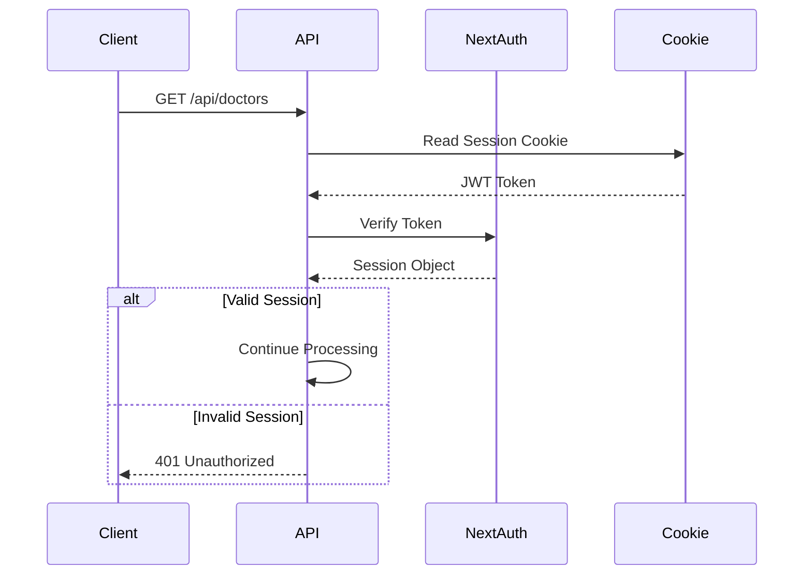
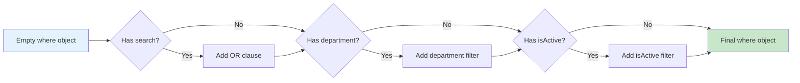
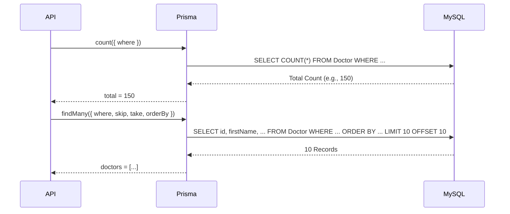
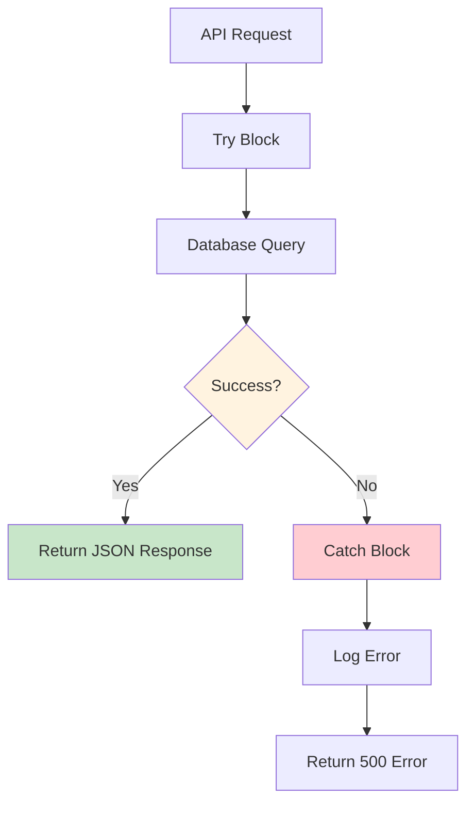
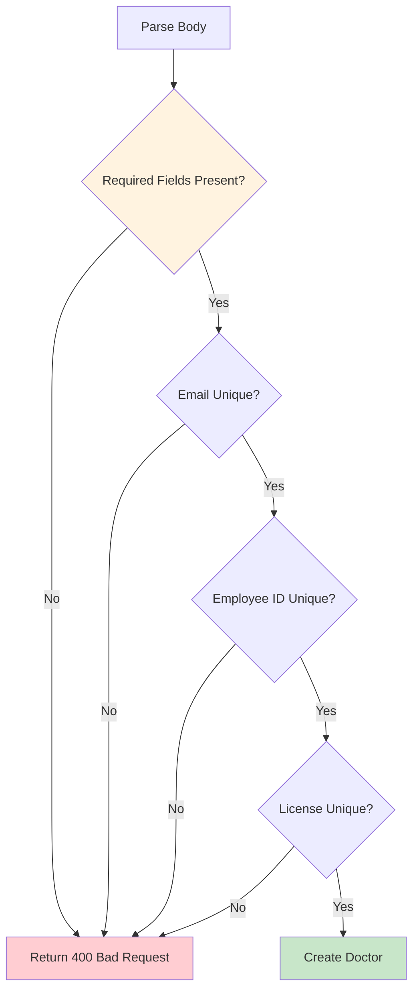
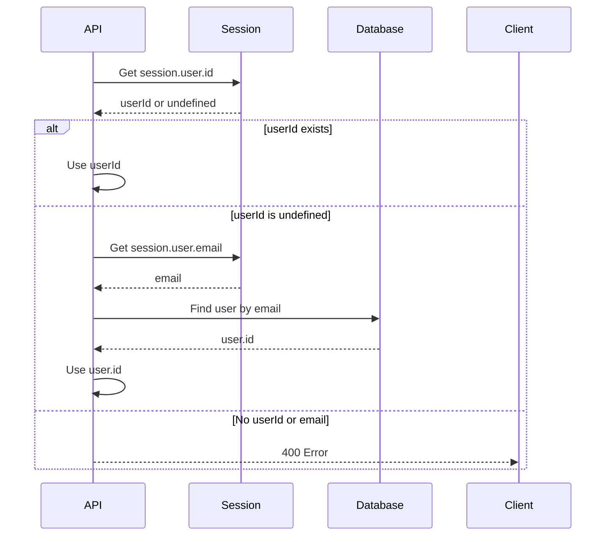
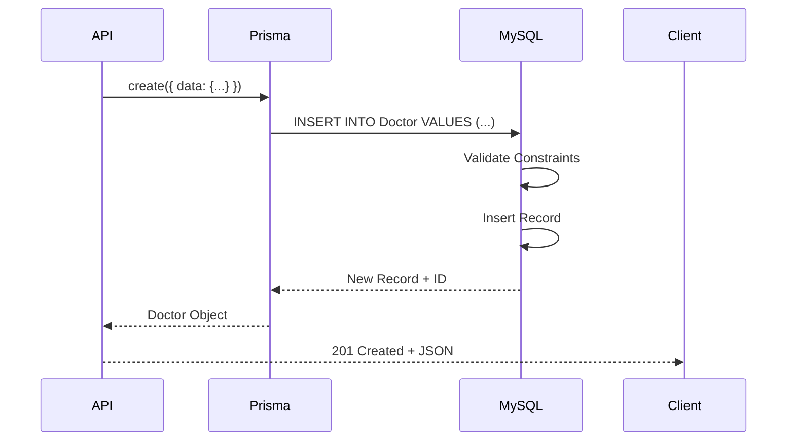
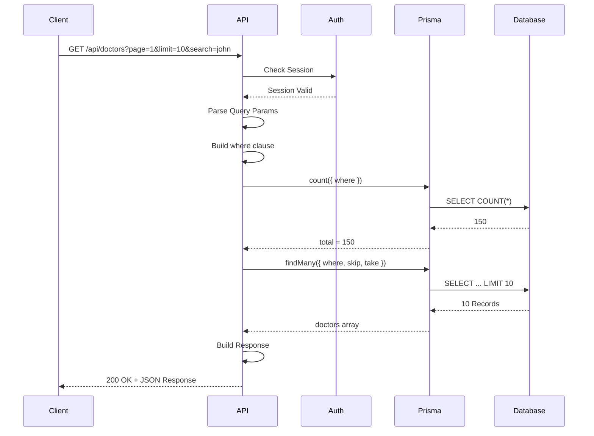
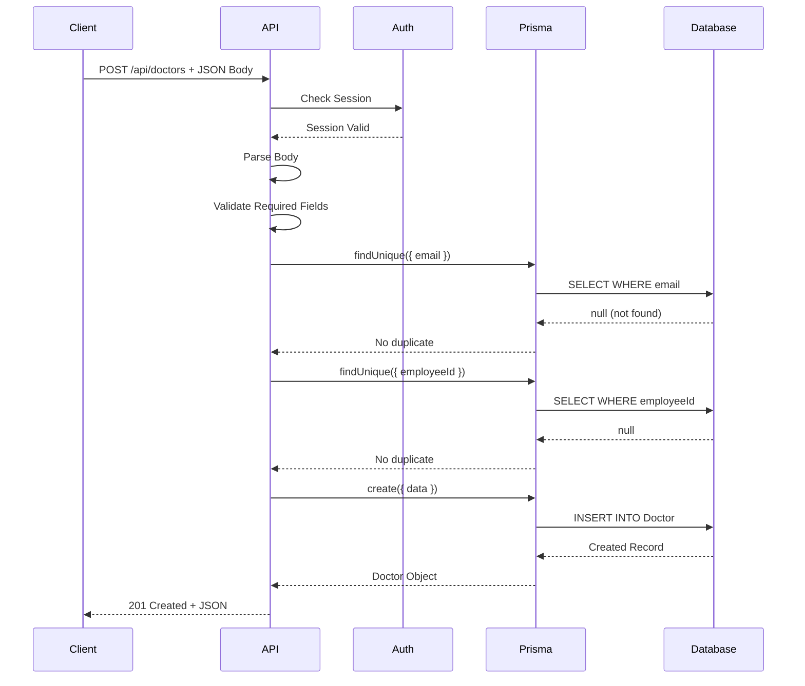

# Code Walkthrough: API Routes

This document provides a detailed, line-by-line explanation of how API routes work in this Next.js application, using real code examples from the codebase.

## 🌐 Understanding API Routes

### What is an API Route?

An **API route** is a server-side endpoint that handles HTTP requests (GET, POST, PUT, DELETE) and returns JSON responses. In Next.js App Router, API routes are defined in `app/api/*/route.ts` files.

### Example: Doctors API Route

Let's walk through `app/api/doctors/route.ts`:

## 📋 GET Endpoint - Fetching Doctors

### Complete Code Breakdown

```typescript
import { NextRequest, NextResponse } from 'next/server'
import { getServerSession } from 'next-auth'
import { authOptions } from '@/lib/auth'
import { prisma } from '@/lib/db'

export async function GET(request: NextRequest) {
  try {
    // Step 1: Check Authentication
    const session = await getServerSession(authOptions)
    
    if (!session) {
      return NextResponse.json({ error: 'Unauthorized' }, { status: 401 })
    }
```

**Line-by-Line Explanation:**

| Line | What It Does | Why It's Important |
|------|-------------|-------------------|
| `import NextRequest` | Imports Next.js request type | Type safety for request object |
| `import getServerSession` | Gets user session from cookies | Verify user is logged in |
| `const session = await ...` | Checks if user is authenticated | Prevents unauthorized access |
| `if (!session)` | Returns error if not logged in | Security: blocks unauthenticated requests |

### Authentication Check Flow



### Step 2: Parse Query Parameters

```typescript
    // Parse query parameters for pagination and filtering
    const { searchParams } = new URL(request.url)
    const page = parseInt(searchParams.get('page') || '1')
    const limit = Math.min(parseInt(searchParams.get('limit') || '10'), 100)
    const search = searchParams.get('search') || ''
    const department = searchParams.get('department') || ''
    const sortBy = searchParams.get('sortBy') || 'createdAt'
    const sortOrder = searchParams.get('sortOrder') || 'desc'
```

**What This Does:**

| Parameter | Example URL | Value | Purpose |
|-----------|-------------|-------|---------|
| `page` | `?page=2` | `2` | Which page of results |
| `limit` | `?limit=20` | `20` | How many results per page |
| `search` | `?search=john` | `"john"` | Search query |
| `department` | `?department=Cardiology` | `"Cardiology"` | Filter by department |
| `sortBy` | `?sortBy=name` | `"name"` | Field to sort by |
| `sortOrder` | `?sortOrder=asc` | `"asc"` | Sort direction |

**Visual Example:**

```
URL: /api/doctors?page=2&limit=20&search=john&department=Cardiology&sortBy=name&sortOrder=asc
     └─┬──┘ └─┬─┘ └─┬─┘ └──┬───┘ └────┬─────┘ └────┬─────┘ └──────┬──────┘ └─────┬─────┘
       │      │      │       │          │           │             │              │
     Base    Page  Limit  Search   Department    SortBy       SortOrder
```

### Step 3: Build Database Query

```typescript
    const skip = (page - 1) * limit  // ← Calculate offset for pagination
    
    // Build where clause for filtering
    const where: any = {}
    
    if (search) {
      where.OR = [
        { firstName: { contains: search } },
        { lastName: { contains: search } },
        { email: { contains: search } },
        { employeeId: { contains: search } },
      ]
    }
    
    if (department) {
      if (department.startsWith('!')) {
        // Handle "not equals" filter (!Cardiology means NOT Cardiology)
        const value = department.substring(1)
        where.department = { not: { equals: value } }
      } else {
        where.department = { contains: department }
      }
    }
    
    if (isActive !== '') {
      where.isActive = isActive === 'true'
    }
```

**Prisma Query Building:**



**Example Query Building:**

```typescript
// Input: ?search=john&department=Cardiology&isActive=true

// Step 1: Start with empty object
const where = {}

// Step 2: Add search (OR condition)
where.OR = [
  { firstName: { contains: 'john' } },
  { lastName: { contains: 'john' } },
  { email: { contains: 'john' } },
  { employeeId: { contains: 'john' } }
]

// Step 3: Add department filter
where.department = { contains: 'Cardiology' }

// Step 4: Add isActive filter
where.isActive = true

// Final where object:
{
  OR: [
    { firstName: { contains: 'john' } },
    { lastName: { contains: 'john' } },
    { email: { contains: 'john' } },
    { employeeId: { contains: 'john' } }
  ],
  department: { contains: 'Cardiology' },
  isActive: true
}
```

### Step 4: Build Sort Order

```typescript
    // Build orderBy clause
    const orderBy: any = {}
    if (sortBy === 'name') {
      orderBy.firstName = sortOrder
    } else if (sortBy === 'email') {
      orderBy.email = sortOrder
    } else if (sortBy === 'department') {
      orderBy.department = sortOrder
    } else {
      orderBy.createdAt = sortOrder
    }
```

**Sort Order Examples:**

| sortBy | sortOrder | Result |
|--------|-----------|--------|
| `name` | `asc` | Sort by firstName ascending |
| `email` | `desc` | Sort by email descending |
| `department` | `asc` | Sort by department ascending |
| `createdAt` | `desc` | Sort by createdAt descending (default) |

### Step 5: Execute Database Queries

```typescript
    // Get total count for pagination
    const total = await prisma.doctor.count({ where })
    
    // Get paginated data
    const doctors = await prisma.doctor.findMany({
      where,           // ← Filter conditions
      skip,            // ← Skip N records (for pagination)
      take: limit,     // ← Take N records (page size)
      orderBy,         // ← Sort order
      select: {        // ← Only return specific fields
        id: true,
        firstName: true,
        lastName: true,
        email: true,
        // ... more fields
      }
    })
```

**Database Query Breakdown:**



**SQL Equivalent:**

```sql
-- Count query
SELECT COUNT(*) FROM Doctor 
WHERE (firstName LIKE '%john%' OR lastName LIKE '%john%' OR ...)
  AND department LIKE '%Cardiology%'
  AND isActive = true

-- FindMany query
SELECT id, firstName, lastName, email, ... 
FROM Doctor 
WHERE (firstName LIKE '%john%' OR lastName LIKE '%john%' OR ...)
  AND department LIKE '%Cardiology%'
  AND isActive = true
ORDER BY firstName ASC
LIMIT 10 OFFSET 10
```

### Step 6: Calculate Pagination Metadata

```typescript
    // Calculate pages - ensure at least 1 page even when total is 0
    const pages = total === 0 ? 1 : Math.ceil(total / limit)
    
    const response = {
      data: doctors,
      pagination: {
        page,
        limit,
        total,
        pages,
        hasNext: page < pages,
        hasPrev: page > 1
      },
      filters: {
        search,
        department,
        specialization,
        isActive,
        sortBy,
        sortOrder
      }
    }
    
    return NextResponse.json(response)
```

**Pagination Calculation Example:**

```typescript
// Example: total = 150, limit = 10, page = 2

pages = Math.ceil(150 / 10) = 15
hasNext = 2 < 15 = true   // There are more pages
hasPrev = 2 > 1 = true    // There are previous pages

// Response:
{
  data: [/* 10 doctors */],
  pagination: {
    page: 2,
    limit: 10,
    total: 150,
    pages: 15,
    hasNext: true,
    hasPrev: true
  }
}
```

### Step 7: Error Handling

```typescript
  } catch (error) {
    console.error('❌ [API ERROR] Error fetching doctors:', error)
    console.error('❌ [API ERROR] Error stack:', error instanceof Error ? error.stack : 'No stack trace')
    return NextResponse.json(
      { error: 'Internal server error', details: error instanceof Error ? error.message : 'Unknown error' },
      { status: 500 }
    )
  }
}
```

**Error Handling Flow:**



## 📝 POST Endpoint - Creating a Doctor

### Complete Code Breakdown

```typescript
export async function POST(request: NextRequest) {
  try {
    // Step 1: Check Authentication
    const session = await getServerSession(authOptions)
    
    if (!session) {
      return NextResponse.json({ error: 'Unauthorized' }, { status: 401 })
    }
```

### Step 2: Parse Request Body

```typescript
    // Step 2: Get data from request body
    const body = await request.json()
    const {
      firstName,
      lastName,
      email,
      employeeId,
      department,
      specialization,
      licenseNumber,
      yearsOfExperience,
      salary,
      isActive
    } = body
```

**Request Body Structure:**

```json
{
  "firstName": "Dr. Sarah",
  "lastName": "Johnson",
  "email": "sarah.johnson@hospital.com",
  "employeeId": "DOC1234",
  "department": "Cardiology",
  "specialization": "Interventional Cardiology",
  "licenseNumber": "MD123456",
  "yearsOfExperience": 10,
  "salary": 150000,
  "isActive": true
}
```

### Step 3: Validate Required Fields

```typescript
    // Validate required fields
    if (!firstName || !lastName || !email || !employeeId || 
        !department || !specialization || !licenseNumber) {
      return NextResponse.json(
        { error: 'Missing required fields' },
        { status: 400 }
      )
    }
```

**Validation Flow:**



### Step 4: Check for Duplicates

```typescript
    // Check if email already exists
    const existingEmail = await prisma.doctor.findUnique({
      where: { email }
    })
    
    if (existingEmail) {
      return NextResponse.json(
        { error: 'Email already exists' },
        { status: 400 }
      )
    }
    
    // Check if employee ID already exists
    const existingEmployeeId = await prisma.doctor.findUnique({
      where: { employeeId }
    })
    
    if (existingEmployeeId) {
      return NextResponse.json(
        { error: 'Employee ID already exists' },
        { status: 400 }
      )
    }
    
    // Check if license number already exists
    const existingLicenseNumber = await prisma.doctor.findUnique({
      where: { licenseNumber }
    })
    
    if (existingLicenseNumber) {
      return NextResponse.json(
        { error: 'License number already exists' },
        { status: 400 }
      )
    }
```

**Why Check Duplicates?**

| Field | Why Unique? | What Happens if Duplicate? |
|-------|------------|---------------------------|
| `email` | Each doctor has one email | Can't identify doctor uniquely |
| `employeeId` | Each employee has unique ID | Payroll/HR system conflicts |
| `licenseNumber` | Medical license is unique | Legal/regulatory requirement |

### Step 5: Get User ID from Session

```typescript
    // Get user ID from session
    let userId = session.user.id
    
    if (!userId && session.user.email) {
      // Fallback: lookup user by email
      const user = await prisma.user.findUnique({
        where: { email: session.user.email },
        select: { id: true }
      })
      if (user) {
        userId = user.id
      }
    }
    
    if (!userId) {
      return NextResponse.json(
        { error: 'User ID not found in session' },
        { status: 400 }
      )
    }
```

**Session User ID Flow:**



### Step 6: Create Doctor Record

```typescript
    // Create the doctor record
    const doctor = await prisma.doctor.create({
      data: {
        firstName,
        lastName,
        email,
        employeeId,
        department,
        specialization,
        licenseNumber,
        yearsOfExperience: yearsOfExperience ? parseInt(yearsOfExperience) : null,
        salary: salary ? parseFloat(salary) : null,
        isActive: isActive !== undefined ? isActive : true,
      }
    })
    
    return NextResponse.json(doctor, { status: 201 })
```

**Database Create Flow:**



**SQL Equivalent:**

```sql
INSERT INTO Doctor (
  firstName, lastName, email, employeeId, 
  department, specialization, licenseNumber,
  yearsOfExperience, salary, isActive
) VALUES (
  'Dr. Sarah', 'Johnson', 'sarah.johnson@hospital.com',
  'DOC1234', 'Cardiology', 'Interventional Cardiology',
  'MD123456', 10, 150000.00, true
)

-- Returns: The created record with generated ID
```

## 🔄 Complete Request-Response Flow

### GET Request Flow



### POST Request Flow



## 📊 Response Format Standards

### Success Response (GET)

```json
{
  "data": [
    {
      "id": "clx123abc",
      "firstName": "Dr. Sarah",
      "lastName": "Johnson",
      "email": "sarah.johnson@hospital.com",
      ...
    }
  ],
  "pagination": {
    "page": 1,
    "limit": 10,
    "total": 150,
    "pages": 15,
    "hasNext": true,
    "hasPrev": false
  },
  "filters": {
    "search": "john",
    "department": "Cardiology",
    ...
  }
}
```

### Success Response (POST)

```json
{
  "id": "clx123abc",
  "firstName": "Dr. Sarah",
  "lastName": "Johnson",
  "email": "sarah.johnson@hospital.com",
  "createdAt": "2024-01-15T10:30:00Z",
  ...
}
```

### Error Responses

```json
// 401 Unauthorized
{
  "error": "Unauthorized"
}

// 400 Bad Request
{
  "error": "Missing required fields"
}

// 500 Internal Server Error
{
  "error": "Internal server error",
  "details": "Database connection failed"
}
```

## 🎓 Key Concepts

### 1. Async/Await Pattern

```typescript
// ❌ Wrong: Promise chains
prisma.doctor.findMany().then(data => {
  return data
})

// ✅ Right: Async/await
const data = await prisma.doctor.findMany()
return data
```

### 2. Error Handling Pattern

```typescript
try {
  // Code that might fail
  const result = await riskyOperation()
  return NextResponse.json(result)
} catch (error) {
  // Handle error gracefully
  console.error('Error:', error)
  return NextResponse.json(
    { error: 'Something went wrong' },
    { status: 500 }
  )
}
```

### 3. Query Building Pattern

```typescript
// Start with empty object
const where: any = {}

// Conditionally add filters
if (search) where.OR = [...]
if (department) where.department = { contains: department }
if (isActive) where.isActive = isActive === 'true'

// Use in query
const results = await prisma.doctor.findMany({ where })
```

## 🔗 Related Documentation

- [Code Walkthrough: Pages](./24-code-walkthrough-pages.md) - How pages call APIs
- [Database](./07-database.md) - Prisma ORM details
- [Authentication](./06-authentication.md) - Session management
- [API Routes](./08-api-routes.md) - General API patterns

---

**Next**: [Code Walkthrough: Components](./26-code-walkthrough-components.md)

