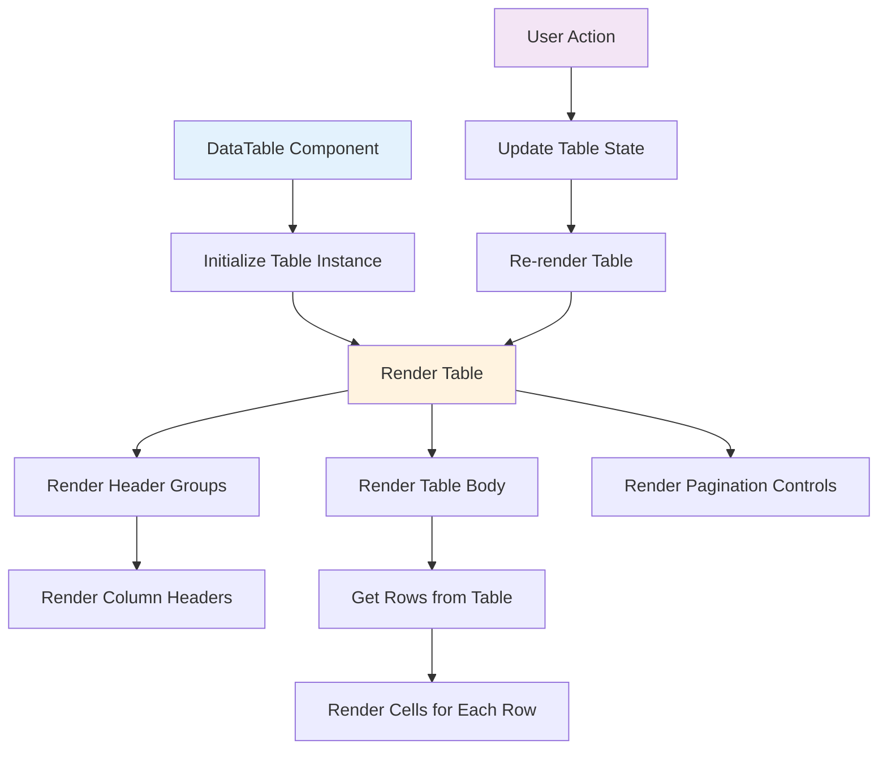
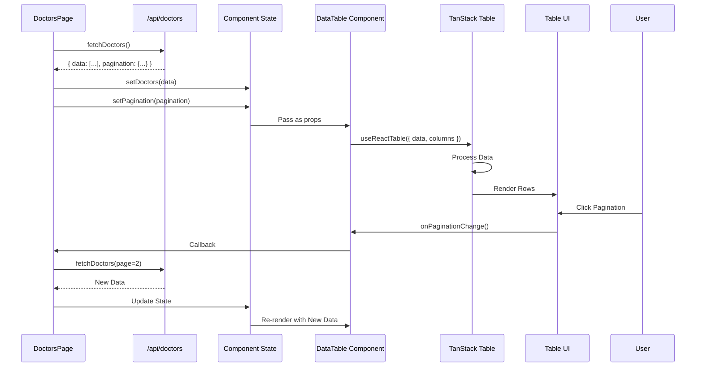
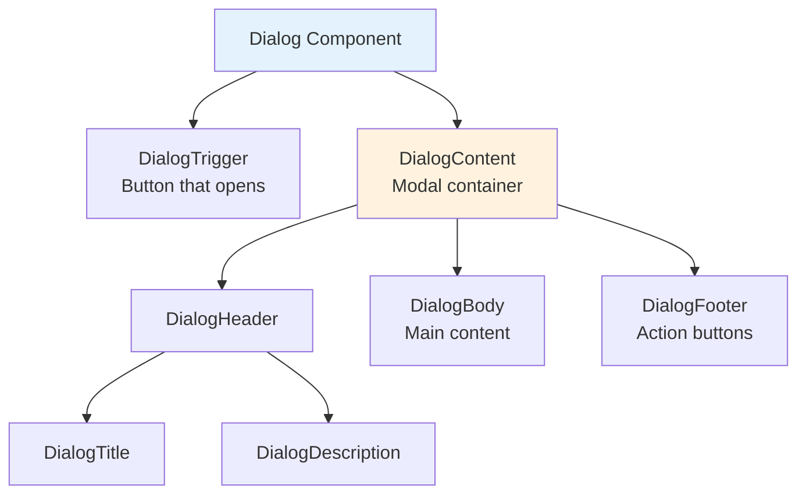

# Code Walkthrough: Components

This document provides a detailed explanation of how reusable components work in this application, using real code examples.

## 🧩 Understanding Components

### What is a Component?

A **component** is a reusable piece of UI that encapsulates both structure and behavior. Components can be composed together to build complex interfaces.

## 📊 DataTable Component

The `DataTable` component is one of the most complex and reusable components. Let's break it down:

### Component Structure

```typescript
"use client"  // ← Client component (needs interactivity)

import { useState, useEffect } from "react"
import { useReactTable, ... } from "@tanstack/react-table"

interface DataTableProps<TData, TValue> {
  columns: ColumnDef<TData, TValue>[]  // ← Column definitions
  data: TData[]                         // ← Data to display
  isLoading?: boolean                  // ← Loading state
  pagination?: {...}                   // ← Pagination config
  onPaginationChange?: (pagination) => void  // ← Callback
  meta?: Record<string, any>          // ← Additional metadata
}

export function DataTable<TData, TValue>({
  columns,
  data,
  isLoading = false,
  pagination,
  onPaginationChange,
  meta,
}: DataTableProps<TData, TValue>) {
  // Component implementation
}
```

**Component Props Explained:**

| Prop | Type | Purpose | Example |
|------|------|---------|---------|
| `columns` | `ColumnDef[]` | Defines table columns | `[{ accessorKey: 'name', header: 'Name' }]` |
| `data` | `TData[]` | Array of data rows | `[{ id: '1', name: 'John' }, ...]` |
| `isLoading` | `boolean` | Shows loading spinner | `true` when fetching |
| `pagination` | `object` | Page info | `{ pageIndex: 0, pageSize: 10 }` |
| `onPaginationChange` | `function` | Callback when page changes | Updates parent state |
| `meta` | `object` | Extra data (callbacks) | `{ onEdit: handleEdit }` |

### How TanStack Table Works

```typescript
const table = useReactTable({
  data,                    // ← Your data array
  columns,                 // ← Column definitions
  getCoreRowModel: getCoreRowModel(),           // ← Core functionality
  getPaginationRowModel: getPaginationRowModel(), // ← Pagination
  getSortedRowModel: getSortedRowModel(),       // ← Sorting
  getFilteredRowModel: getFilteredRowModel(),  // ← Filtering
  manualPagination: true,  // ← Server-side pagination
  pageCount: pagination?.pageCount ?? 0,
})
```

**Table Instance Methods:**

```typescript
table.getRowModel()        // ← Get current page rows
table.getHeaderGroups()    // ← Get column headers
table.previousPage()        // ← Go to previous page
table.nextPage()           // ← Go to next page
table.setPageIndex(2)      // ← Jump to page 2
```

### Rendering the Table

```typescript
return (
  <div>
    {/* Search Input */}
    <Input
      placeholder="Search..."
      value={globalFilter}
      onChange={(e) => setGlobalFilter(e.target.value)}
    />
    
    {/* Table */}
    <Table>
      <TableHeader>
        {table.getHeaderGroups().map(headerGroup => (
          <TableRow key={headerGroup.id}>
            {headerGroup.headers.map(header => (
              <TableHead key={header.id}>
                {header.isPlaceholder
                  ? null
                  : flexRender(
                      header.column.columnDef.header,
                      header.getContext()
                    )}
              </TableHead>
            ))}
          </TableRow>
        ))}
      </TableHeader>
      
      <TableBody>
        {table.getRowModel().rows.map(row => (
          <TableRow key={row.id}>
            {row.getVisibleCells().map(cell => (
              <TableCell key={cell.id}>
                {flexRender(
                  cell.column.columnDef.cell,
                  cell.getContext()
                )}
              </TableCell>
            ))}
          </TableRow>
        ))}
      </TableBody>
    </Table>
    
    {/* Pagination Controls */}
    <div>
      <Button onClick={() => table.previousPage()}>Previous</Button>
      <span>Page {table.getState().pagination.pageIndex + 1}</span>
      <Button onClick={() => table.nextPage()}>Next</Button>
    </div>
  </div>
)
```

**Rendering Flow:**



## 🎨 Column Definitions

### Example: Doctors Table Columns

```typescript
// app/(app)/doctors/columns.tsx

export const columns: ColumnDef<Doctor>[] = [
  {
    accessorKey: 'firstName',  // ← Field name in data
    header: 'First Name',       // ← Column header text
    cell: ({ row }) => {        // ← Custom cell renderer
      return <div>{row.original.firstName}</div>
    }
  },
  {
    accessorKey: 'email',
    header: 'Email',
    cell: ({ row }) => (
      <a href={`mailto:${row.original.email}`}>
        {row.original.email}
      </a>
    )
  },
  {
    id: 'actions',              // ← Custom column ID
    header: 'Actions',
    cell: ({ row }) => {
      return (
        <div>
          <Button onClick={() => meta.onView(row.original.id)}>
            View
          </Button>
          <Button onClick={() => meta.onEdit(row.original.id)}>
            Edit
          </Button>
          <Button onClick={() => meta.onDelete(row.original.id)}>
            Delete
          </Button>
        </div>
      )
    }
  }
]
```

**Column Definition Structure:**

```typescript
{
  accessorKey: 'fieldName',  // ← Data field to display
  header: 'Column Title',    // ← Header text
  cell: ({ row }) => {       // ← Custom rendering (optional)
    return <div>...</div>
  },
  enableSorting: true,       // ← Allow sorting (optional)
  enableFiltering: true,     // ← Allow filtering (optional)
}
```

## 🔄 Component Data Flow

### How Data Flows Through Components



## 🎯 Common Component Patterns

### Pattern 1: Controlled Component

```typescript
// Parent controls the value
const [value, setValue] = useState('')

<Input
  value={value}                    // ← Controlled value
  onChange={(e) => setValue(e.target.value)}  // ← Update parent
/>
```

### Pattern 2: Uncontrolled Component

```typescript
// Component manages its own state
<Input
  defaultValue="initial"          // ← Initial value only
  // onChange handled internally
/>
```

### Pattern 3: Callback Pattern

```typescript
// Parent passes callback function
<DataTable
  onPaginationChange={(pagination) => {
    // Parent handles the change
    setPagination(pagination)
    fetchData(pagination.pageIndex)
  }}
/>
```

### Pattern 4: Render Props Pattern

```typescript
// Component accepts render function
<DataTable
  renderCell={(row) => (
    <CustomCell data={row.original} />
  )}
/>
```

## 🧩 Component Composition

### How Components Work Together

```typescript
// Page Component (Parent)
export default function DoctorsPage() {
  const [doctors, setDoctors] = useState<Doctor[]>([])
  
  return (
    <Card>                    {/* ← Container component */}
      <CardHeader>            {/* ← Header component */}
        <CardTitle>Doctors</CardTitle>
      </CardHeader>
      <CardContent>           {/* ← Content component */}
        <DataTable            {/* ← Data table component */}
          data={doctors}
          columns={columns}
          meta={{
            onEdit: handleEdit,   {/* ← Callback */}
            onDelete: handleDelete
          }}
        />
      </CardContent>
    </Card>
  )
}
```

**Component Hierarchy:**

```
DoctorsPage
  └── Card (container)
      ├── CardHeader
      │   └── CardTitle
      └── CardContent
          └── DataTable
              ├── Input (search)
              ├── Table
              │   ├── TableHeader
              │   └── TableBody
              └── Pagination Controls
```

## 🎨 UI Component Examples

### Button Component

```typescript
// components/ui/button.tsx

interface ButtonProps extends React.ButtonHTMLAttributes<HTMLButtonElement> {
  variant?: 'default' | 'outline' | 'destructive'
  size?: 'sm' | 'md' | 'lg'
}

export const Button = ({ 
  variant = 'default', 
  size = 'md',
  className,
  ...props 
}: ButtonProps) => {
  return (
    <button
      className={cn(
        'base-button-styles',
        variant === 'outline' && 'outline-styles',
        variant === 'destructive' && 'destructive-styles',
        size === 'sm' && 'small-styles',
        className
      )}
      {...props}
    />
  )
}
```

**Usage:**

```typescript
<Button variant="outline" size="sm" onClick={handleClick}>
  Click Me
</Button>
```

### Dialog Component

```typescript
// Dialog is composed of multiple sub-components
<Dialog open={isOpen} onOpenChange={setIsOpen}>
  <DialogTrigger>Open Dialog</DialogTrigger>
  <DialogContent>
    <DialogHeader>
      <DialogTitle>Title</DialogTitle>
      <DialogDescription>Description</DialogDescription>
    </DialogHeader>
    <DialogBody>
      {/* Content */}
    </DialogBody>
    <DialogFooter>
      <Button>Cancel</Button>
      <Button>Confirm</Button>
    </DialogFooter>
  </DialogContent>
</Dialog>
```

**Dialog Component Structure:**



## 🔄 State Management in Components

### Local State Pattern

```typescript
// Component manages its own state
function MyComponent() {
  const [count, setCount] = useState(0)
  
  return (
    <div>
      <p>Count: {count}</p>
      <Button onClick={() => setCount(count + 1)}>
        Increment
      </Button>
    </div>
  )
}
```

### Lifted State Pattern

```typescript
// State lifted to parent
function Parent() {
  const [value, setValue] = useState('')
  
  return (
    <div>
      <Child value={value} onChange={setValue} />
      <AnotherChild value={value} />
    </div>
  )
}

function Child({ value, onChange }) {
  return <Input value={value} onChange={onChange} />
}
```

### Context Pattern

```typescript
// State shared via Context
const ThemeContext = createContext()

function App() {
  const [theme, setTheme] = useState('light')
  
  return (
    <ThemeContext.Provider value={{ theme, setTheme }}>
      <ThemedComponent />
    </ThemeContext.Provider>
  )
}

function ThemedComponent() {
  const { theme } = useContext(ThemeContext)
  return <div className={theme}>...</div>
}
```

## 🎓 Key Concepts

### 1. Props vs State

| Aspect | Props | State |
|--------|-------|-------|
| **Source** | Passed from parent | Managed internally |
| **Mutable** | No (read-only) | Yes (use setState) |
| **Purpose** | Configuration | Internal data |
| **Changes** | Cause re-render | Cause re-render |

### 2. Component Lifecycle

```typescript
// Component mounts
useEffect(() => {
  // Runs once when component mounts
  console.log('Component mounted')
  
  return () => {
    // Cleanup: runs when component unmounts
    console.log('Component unmounting')
  }
}, [])  // ← Empty array = run once

// Component updates
useEffect(() => {
  // Runs when dependencies change
  console.log('State updated')
}, [count])  // ← Runs when count changes
```

### 3. Re-rendering

```typescript
// When does a component re-render?
// 1. Props change
<Child name="New Name" />  // ← Re-renders Child

// 2. State changes
setCount(count + 1)  // ← Re-renders component

// 3. Parent re-renders
// (unless using React.memo)
```

## 🔗 Related Documentation

- [Code Walkthrough: Pages](./24-code-walkthrough-pages.md) - How pages use components
- [UI Components](./10-ui-components.md) - Available UI components
- [Data Tables](./12-data-tables.md) - DataTable component details

---

**Next**: [Code Walkthrough: Database](./27-code-walkthrough-database.md)

