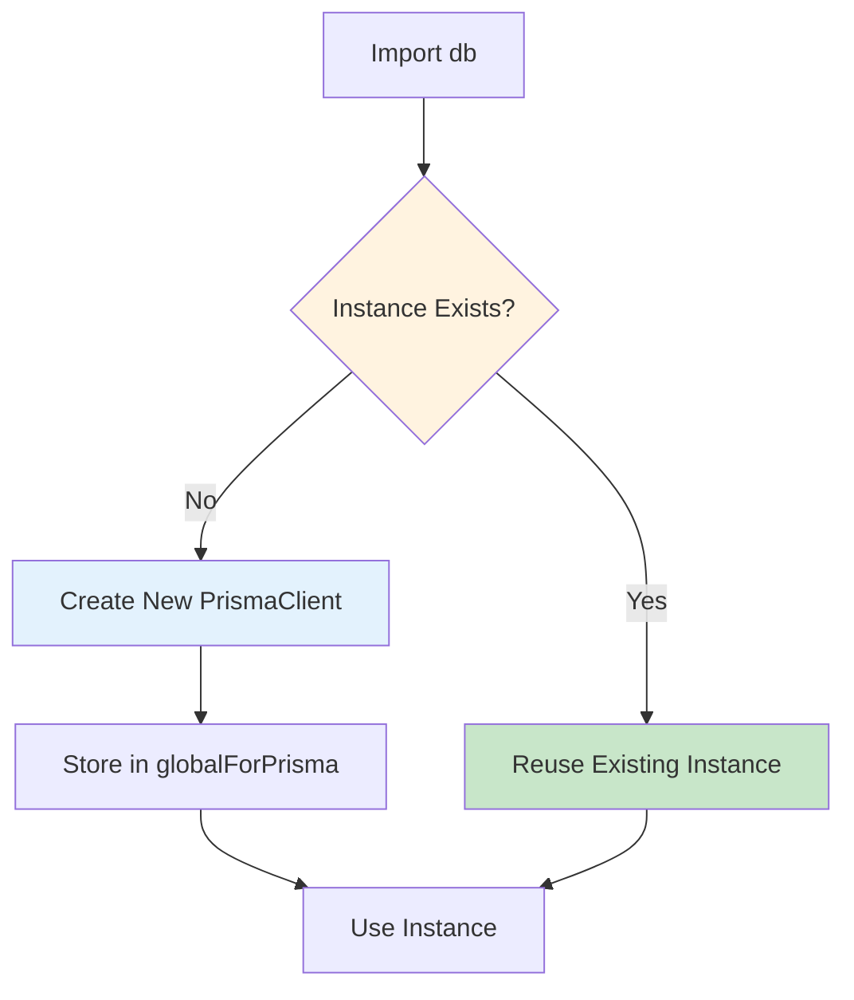
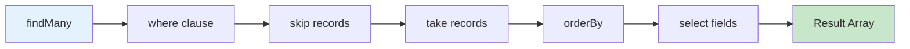
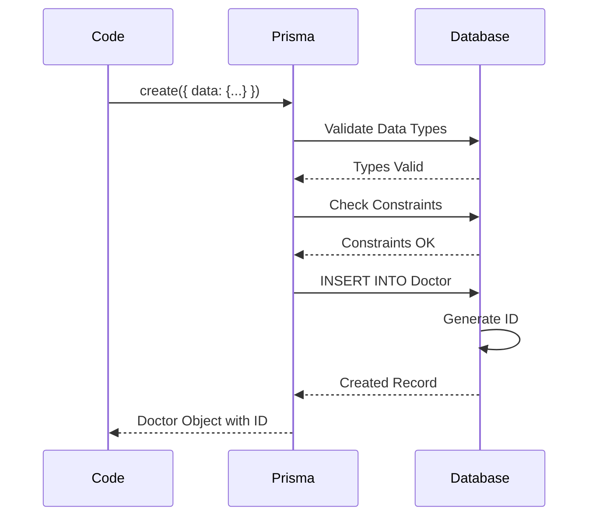
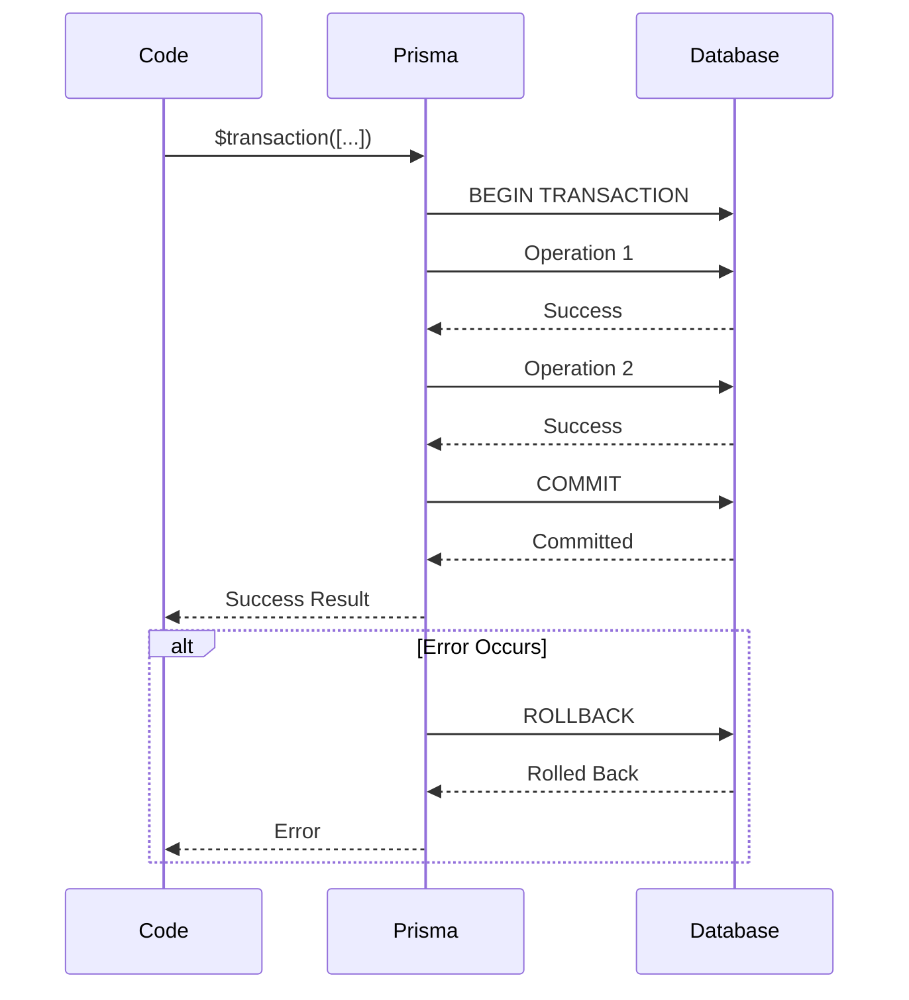

# Code Walkthrough: Database

This document provides a detailed explanation of how database operations work in this application, using Prisma ORM with real code examples.

## 🗄️ Database Connection Setup

### Prisma Client Singleton

```typescript
// lib/db.ts

import { PrismaClient } from "@prisma/client"

// Global variable to store Prisma instance
const globalForPrisma = globalThis as unknown as {
  prisma: PrismaClient | undefined
}

// Create or reuse Prisma instance
export const db = globalForPrisma.prisma ?? new PrismaClient()
export const prisma = db  // ← Alias for convenience

// In development, reuse the same instance
if (process.env.NODE_ENV !== "production") {
  globalForPrisma.prisma = db
}
```

**Why This Pattern?**

| Reason | Explanation |
|--------|-------------|
| **Prevent Multiple Instances** | Avoids creating multiple database connections |
| **Development Hot Reload** | Reuses instance during Next.js hot reload |
| **Performance** | Single connection pool is more efficient |
| **Resource Management** | Prevents connection leaks |

**How It Works:**



## 📊 Query Operations

### 1. Find Many (List)

```typescript
// Get all doctors with pagination and filters
const doctors = await prisma.doctor.findMany({
  where: {                    // ← Filter conditions
    isActive: true,
    department: 'Cardiology'
  },
  skip: 10,                  // ← Skip first 10 records (pagination)
  take: 20,                   // ← Take 20 records (page size)
  orderBy: {                  // ← Sort order
    createdAt: 'desc'
  },
  select: {                   // ← Only return specific fields
    id: true,
    firstName: true,
    lastName: true,
    email: true
  }
})
```

**SQL Equivalent:**

```sql
SELECT id, firstName, lastName, email
FROM Doctor
WHERE isActive = true
  AND department = 'Cardiology'
ORDER BY createdAt DESC
LIMIT 20 OFFSET 10
```

**Query Breakdown:**



### 2. Find Unique (Single Record)

```typescript
// Get one doctor by unique field
const doctor = await prisma.doctor.findUnique({
  where: {
    id: 'clx123abc'           // ← Must be unique field
  },
  include: {                  // ← Include related data
    role: true
  }
})
```

**When to Use:**

| Use Case | Method | Example |
|----------|--------|---------|
| Get by ID | `findUnique` | `where: { id: '123' }` |
| Get by unique field | `findUnique` | `where: { email: '...' }` |
| Get first match | `findFirst` | `where: { name: 'John' }` |

### 3. Create (Insert)

```typescript
// Create a new doctor
const doctor = await prisma.doctor.create({
  data: {
    firstName: 'Dr. Sarah',
    lastName: 'Johnson',
    email: 'sarah@hospital.com',
    employeeId: 'DOC1234',
    department: 'Cardiology',
    specialization: 'Cardiologist',
    licenseNumber: 'MD123456',
    yearsOfExperience: 10,
    salary: 150000,
    isActive: true
  }
})
```

**SQL Equivalent:**

```sql
INSERT INTO Doctor (
  firstName, lastName, email, employeeId,
  department, specialization, licenseNumber,
  yearsOfExperience, salary, isActive
) VALUES (
  'Dr. Sarah', 'Johnson', 'sarah@hospital.com',
  'DOC1234', 'Cardiology', 'Cardiologist',
  'MD123456', 10, 150000, true
)

-- Returns: Created record with generated ID
```

**Create Flow:**



### 4. Update

```typescript
// Update a doctor
const updatedDoctor = await prisma.doctor.update({
  where: {
    id: 'clx123abc'           // ← Identify record to update
  },
  data: {
    isActive: false,          // ← Fields to update
    salary: 160000
  }
})
```

**SQL Equivalent:**

```sql
UPDATE Doctor
SET isActive = false,
    salary = 160000
WHERE id = 'clx123abc'
```

**Update Patterns:**

```typescript
// Update specific fields
await prisma.doctor.update({
  where: { id },
  data: { isActive: false }
})

// Increment/decrement numeric fields
await prisma.doctor.update({
  where: { id },
  data: {
    yearsOfExperience: {
      increment: 1  // ← Add 1 to current value
    }
  }
})

// Update relation
await prisma.doctor.update({
  where: { id },
  data: {
    role: {
      connect: { id: roleId }  // ← Link to existing role
    }
  }
})
```

### 5. Delete

```typescript
// Delete a doctor
await prisma.doctor.delete({
  where: {
    id: 'clx123abc'
  }
})
```

**SQL Equivalent:**

```sql
DELETE FROM Doctor
WHERE id = 'clx123abc'
```

## 🔍 Advanced Query Patterns

### Pattern 1: Filtering with OR

```typescript
const doctors = await prisma.doctor.findMany({
  where: {
    OR: [                      // ← OR condition
      { firstName: { contains: 'john' } },
      { lastName: { contains: 'john' } },
      { email: { contains: 'john' } }
    ]
  }
})
```

**SQL Equivalent:**

```sql
SELECT * FROM Doctor
WHERE firstName LIKE '%john%'
   OR lastName LIKE '%john%'
   OR email LIKE '%john%'
```

### Pattern 2: Filtering with AND

```typescript
const doctors = await prisma.doctor.findMany({
  where: {
    AND: [                     // ← AND condition
      { isActive: true },
      { department: 'Cardiology' },
      { yearsOfExperience: { gte: 5 } }  // ← Greater than or equal
    ]
  }
})
```

**SQL Equivalent:**

```sql
SELECT * FROM Doctor
WHERE isActive = true
  AND department = 'Cardiology'
  AND yearsOfExperience >= 5
```

### Pattern 3: Complex Filtering

```typescript
const doctors = await prisma.doctor.findMany({
  where: {
    OR: [
      { firstName: { contains: search } },
      { lastName: { contains: search } }
    ],
    AND: [
      { isActive: true },
      {
        OR: [
          { department: 'Cardiology' },
          { department: 'Neurology' }
        ]
      }
    ],
    salary: {
      gte: 100000,            // ← Greater than or equal
      lte: 200000             // ← Less than or equal
    }
  }
})
```

**SQL Equivalent:**

```sql
SELECT * FROM Doctor
WHERE (
  firstName LIKE '%search%' OR lastName LIKE '%search%'
)
AND isActive = true
AND (
  department = 'Cardiology' OR department = 'Neurology'
)
AND salary >= 100000
AND salary <= 200000
```

### Pattern 4: Counting Records

```typescript
// Count total records
const total = await prisma.doctor.count({
  where: {
    isActive: true
  }
})
```

**SQL Equivalent:**

```sql
SELECT COUNT(*) FROM Doctor
WHERE isActive = true
```

### Pattern 5: Aggregations

```typescript
// Group by department and count
const stats = await prisma.doctor.groupBy({
  by: ['department'],         // ← Group by field
  _count: true,              // ← Count records
  _avg: {                    // ← Average
    salary: true,
    yearsOfExperience: true
  },
  _max: { salary: true },    // ← Maximum
  _min: { salary: true },    // ← Minimum
  where: {
    isActive: true
  }
})
```

**SQL Equivalent:**

```sql
SELECT 
  department,
  COUNT(*) as _count,
  AVG(salary) as _avg_salary,
  AVG(yearsOfExperience) as _avg_yearsOfExperience,
  MAX(salary) as _max_salary,
  MIN(salary) as _min_salary
FROM Doctor
WHERE isActive = true
GROUP BY department
```

## 🔗 Working with Relations

### Including Related Data

```typescript
// Get user with their role
const user = await prisma.user.findUnique({
  where: { id: userId },
  include: {
    role: true,              // ← Include role relation
    sessions: true           // ← Include sessions relation
  }
})
```

**Result Structure:**

```json
{
  "id": "user123",
  "email": "user@example.com",
  "role": {
    "id": "role123",
    "name": "Admin"
  },
  "sessions": [
    { "id": "session1", ... },
    { "id": "session2", ... }
  ]
}
```

### Creating with Relations

```typescript
// Create user and link to role
const user = await prisma.user.create({
  data: {
    email: 'newuser@example.com',
    username: 'newuser',
    passwordHash: 'hashed',
    role: {
      connect: { id: roleId }  // ← Link to existing role
    }
  }
})
```

### Updating Relations

```typescript
// Change user's role
await prisma.user.update({
  where: { id: userId },
  data: {
    role: {
      connect: { id: newRoleId }  // ← Change to new role
    }
  }
})

// Disconnect relation
await prisma.user.update({
  where: { id: userId },
  data: {
    role: {
      disconnect: true  // ← Remove role link
    }
  }
})
```

## 🔄 Transactions

### Single Transaction

```typescript
// Execute multiple operations atomically
const result = await prisma.$transaction(async (tx) => {
  // Create user
  const user = await tx.user.create({
    data: { email, username, passwordHash }
  })
  
  // Create related record
  const profile = await tx.profile.create({
    data: { userId: user.id, firstName, lastName }
  })
  
  return { user, profile }
})
```

**Why Transactions?**

| Benefit | Explanation |
|---------|-------------|
| **Atomicity** | All operations succeed or all fail |
| **Consistency** | Database stays in valid state |
| **Error Handling** | Rollback on any error |

### Transaction Flow



## 🎯 Common Query Patterns

### Pattern 1: Pagination

```typescript
const page = 1
const limit = 10
const skip = (page - 1) * limit

const [doctors, total] = await Promise.all([
  prisma.doctor.findMany({
    skip,
    take: limit,
    orderBy: { createdAt: 'desc' }
  }),
  prisma.doctor.count()
])

const pages = Math.ceil(total / limit)
```

### Pattern 2: Search

```typescript
const search = 'john'

const doctors = await prisma.doctor.findMany({
  where: {
    OR: [
      { firstName: { contains: search, mode: 'insensitive' } },
      { lastName: { contains: search, mode: 'insensitive' } },
      { email: { contains: search, mode: 'insensitive' } }
    ]
  }
})
```

### Pattern 3: Conditional Queries

```typescript
const where: any = {}

if (department) {
  where.department = department
}

if (isActive !== undefined) {
  where.isActive = isActive
}

if (minSalary) {
  where.salary = { gte: minSalary }
}

const doctors = await prisma.doctor.findMany({ where })
```

## 🔒 Error Handling

### Common Errors

```typescript
try {
  const doctor = await prisma.doctor.create({
    data: { email: 'duplicate@example.com' }
  })
} catch (error) {
  if (error.code === 'P2002') {
    // Unique constraint violation
    console.error('Email already exists')
  } else if (error.code === 'P2025') {
    // Record not found
    console.error('Record not found')
  } else {
    // Other errors
    console.error('Unknown error:', error)
  }
}
```

**Prisma Error Codes:**

| Code | Meaning | Common Cause |
|------|---------|--------------|
| `P2002` | Unique constraint | Duplicate unique field |
| `P2025` | Record not found | Updating/deleting non-existent record |
| `P2003` | Foreign key constraint | Referencing non-existent record |
| `P2014` | Required field missing | Missing required field in create |

## 📊 Performance Optimization

### 1. Select Only Needed Fields

```typescript
// ❌ Bad: Selects all fields
const doctors = await prisma.doctor.findMany()

// ✅ Good: Select only needed fields
const doctors = await prisma.doctor.findMany({
  select: {
    id: true,
    firstName: true,
    lastName: true
  }
})
```

### 2. Use Indexes

```prisma
// prisma/schema.prisma
model Doctor {
  // ...
  @@index([department])      // ← Index for faster queries
  @@index([isActive])
  @@index([email])
}
```

### 3. Batch Operations

```typescript
// ❌ Bad: Multiple queries
for (const id of ids) {
  await prisma.doctor.delete({ where: { id } })
}

// ✅ Good: Single query
await prisma.doctor.deleteMany({
  where: { id: { in: ids } }
})
```

## 🔗 Related Documentation

- [Database](./07-database.md) - Database schema and models
- [Code Walkthrough: API Routes](./25-code-walkthrough-api.md) - How APIs use Prisma
- [Prisma Documentation](https://www.prisma.io/docs) - Official Prisma docs

---

**Complete Code Walkthrough Series**:
- [Pages](./24-code-walkthrough-pages.md)
- [API Routes](./25-code-walkthrough-api.md)
- [Components](./26-code-walkthrough-components.md)
- [Database](./27-code-walkthrough-database.md) ← You are here

