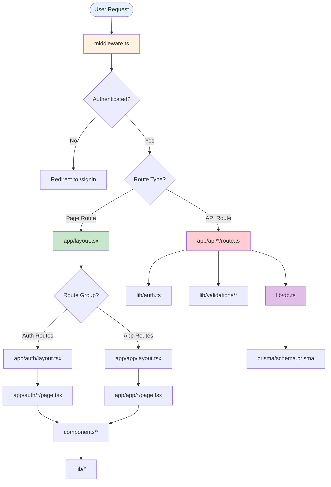
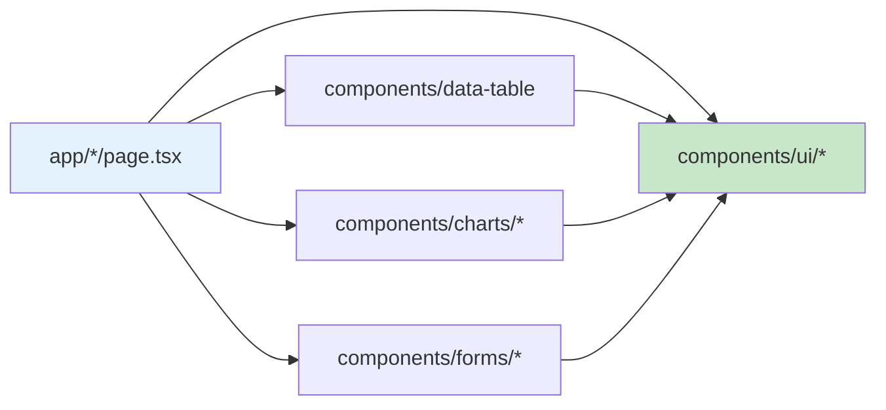
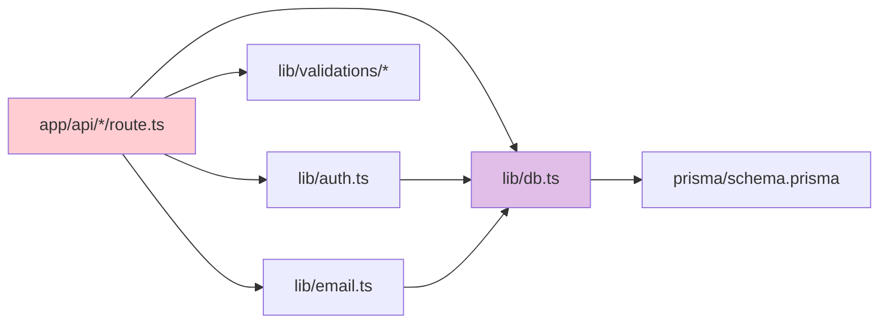
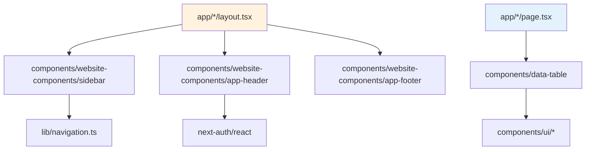
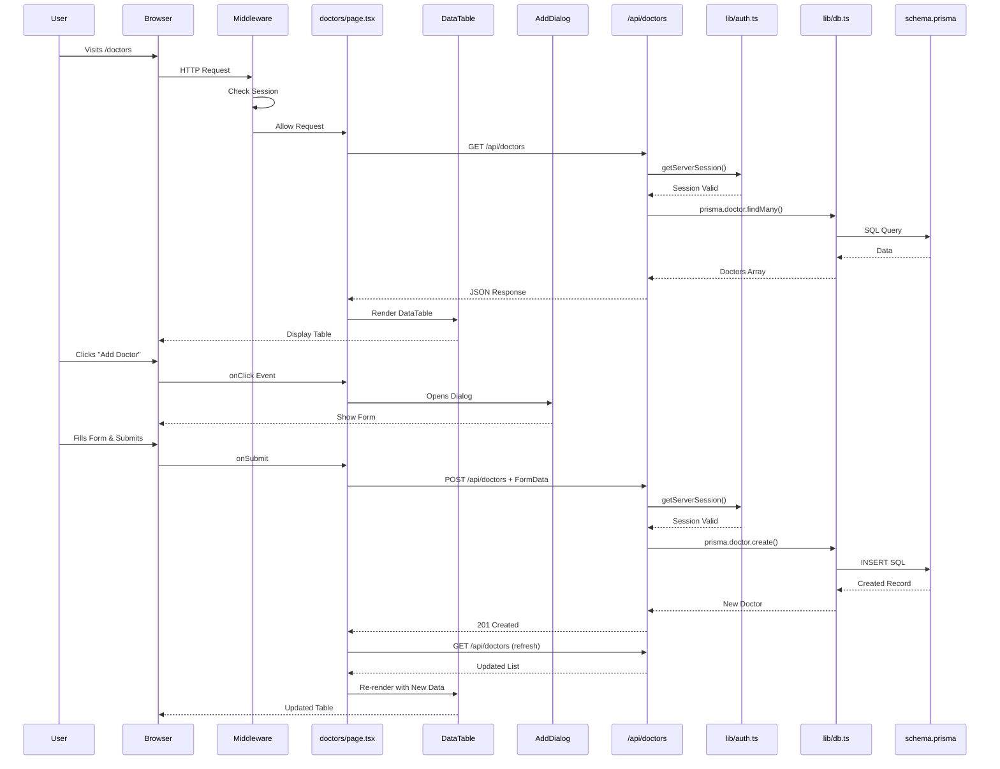
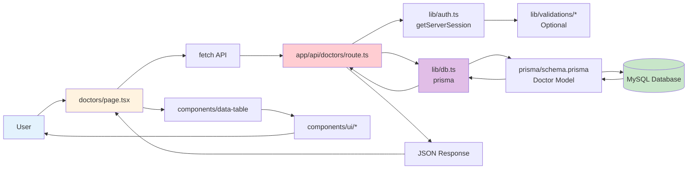
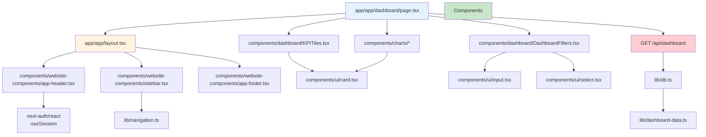

# Files & Folders: Complete Reference Guide

This document provides a comprehensive guide to all files and folders in the project, how they interact with each other, and when they are used in the application flow.

## 📁 Complete File Structure

```
nextjs-template/
├── app/                          # Next.js App Router (pages & API)
│   ├── (app)/                   # Route Group: Protected app routes
│   │   ├── dashboard/           # Dashboard page
│   │   ├── doctors/             # Doctors management
│   │   ├── engineers/          # Engineers management
│   │   ├── teachers/            # Teachers management
│   │   ├── lawyers/             # Lawyers management
│   │   ├── users/               # User management
│   │   ├── roles/               # Role management
│   │   ├── workflows/          # Workflow management
│   │   ├── files/               # File management
│   │   ├── profile/             # User profile
│   │   └── layout.tsx           # Layout for protected routes
│   ├── (auth)/                  # Route Group: Authentication pages
│   │   ├── signin/              # Login page
│   │   ├── signup/              # Registration page
│   │   ├── verify/              # Email verification
│   │   ├── forgot-password/     # Password reset request
│   │   ├── reset-password/      # Password reset form
│   │   └── layout.tsx           # Layout for auth pages
│   ├── api/                     # API Routes
│   │   ├── auth/                # Authentication endpoints
│   │   ├── dashboard/           # Dashboard data endpoints
│   │   ├── doctors/             # Doctors CRUD endpoints
│   │   ├── engineers/           # Engineers CRUD endpoints
│   │   ├── teachers/            # Teachers CRUD endpoints
│   │   ├── lawyers/             # Lawyers CRUD endpoints
│   │   ├── users/               # Users CRUD endpoints
│   │   ├── roles/               # Roles CRUD endpoints
│   │   ├── workflows/           # Workflow endpoints
│   │   ├── file-manager/        # File management endpoints
│   │   └── upload/              # File upload endpoints
│   ├── layout.tsx               # Root layout (applies to all pages)
│   ├── page.tsx                 # Home page (redirects to /signin)
│   ├── robots.ts                # Robots.txt generator
│   └── sitemap.ts               # Sitemap generator
│
├── components/                  # React Components
│   ├── ui/                      # Base UI components (shadcn/ui)
│   ├── forms/                   # Form components
│   ├── charts/                  # Chart components
│   ├── dashboard/               # Dashboard-specific components
│   ├── data-table/              # Data table components
│   ├── website-components/      # Site-wide components
│   ├── providers/               # Context providers
│   └── error-boundary.tsx       # Error boundary component
│
├── lib/                         # Utility Libraries
│   ├── auth.ts                  # NextAuth configuration
│   ├── db.ts                    # Prisma client instance
│   ├── config.ts                # App configuration
│   ├── email.ts                 # Email utilities
│   ├── utils.ts                 # General utilities
│   ├── validations/             # Zod validation schemas
│   └── workflows/               # Workflow logic
│
├── prisma/                      # Database
│   ├── schema.prisma            # Database schema
│   ├── seed.ts                  # Database seeding script
│   └── migrations/              # Migration files
│
├── hooks/                       # Custom React Hooks
├── types/                       # TypeScript type definitions
├── styles/                      # Global styles
├── public/                      # Static assets
├── scripts/                     # Utility scripts
├── tests/                       # Test files
├── uploads/                     # Uploaded files (gitignored)
├── docs/                        # Documentation
│
├── middleware.ts                # Next.js middleware (runs on every request)
├── next.config.js               # Next.js configuration
├── tsconfig.json                # TypeScript configuration
├── tailwind.config.ts           # TailwindCSS configuration
├── postcss.config.js            # PostCSS configuration
├── package.json                 # Dependencies and scripts
├── .env                         # Environment variables (gitignored)
└── .env.example                 # Environment template
```

## 🔄 File Interaction Flow

### Request Flow Diagram



## 📂 Detailed Folder Breakdown

### `/app` - Next.js App Router

**Purpose**: Contains all pages and API routes. This is the core of the Next.js application.

#### `/app/layout.tsx` - Root Layout
- **When Used**: Renders on EVERY page request
- **What It Does**:
  - Provides HTML structure (`<html>`, `<body>`)
  - Includes SessionProvider for authentication
  - Loads global CSS
  - Sets up font (Inter)
- **Imports**:
  - `@/components/providers/session-provider`
  - `@/styles/globals.css`
- **Used By**: All pages automatically
- **Interaction Flow**:
  ```
  Request → middleware.ts → app/layout.tsx → Route Group Layout → Page
  ```

#### `/app/page.tsx` - Home Page
- **When Used**: When user visits `/` (root URL)
- **What It Does**: Redirects to `/signin`
- **Imports**: `next/navigation`
- **Used By**: Root route only
- **Interaction**: Simple redirect, no other interactions

#### `/app/(app)/layout.tsx` - App Layout
- **When Used**: On ALL protected routes (`/dashboard`, `/doctors`, etc.)
- **What It Does**:
  - Provides sidebar navigation
  - Adds header and footer
  - Handles session validation
  - Redirects unauthenticated users
- **Imports**:
  - `@/components/website-components` (Sidebar, AppHeader, AppFooter)
  - `@/components/ui/toast-container`
  - `@/hooks/use-session-validator`
  - `next-auth/react`
- **Used By**: All pages in `(app)` route group
- **Interaction Flow**:
  ```
  User visits /dashboard
    → middleware.ts checks auth
    → app/layout.tsx wraps
    → app/(app)/layout.tsx adds sidebar
    → app/(app)/dashboard/page.tsx renders
  ```

#### `/app/(app)/dashboard/page.tsx` - Dashboard Page
- **When Used**: When user visits `/dashboard`
- **What It Does**:
  - Fetches dashboard data from API
  - Displays charts and KPI tiles
  - Shows filters
- **Imports**:
  - `@/components/dashboard/*` (KPITiles, DashboardFilters)
  - `@/components/charts/*` (BarChart, PieChart, etc.)
  - `@/components/ui/*` (Card, Button)
- **Uses API**: `GET /api/dashboard`
- **Interaction Flow**:
  ```
  Page loads
    → useEffect calls fetch('/api/dashboard')
    → API route queries database via lib/db.ts
    → Returns data
    → Page renders charts and KPIs
  ```

#### `/app/(app)/doctors/page.tsx` - Doctors Page
- **When Used**: When user visits `/doctors`
- **What It Does**:
  - Lists doctors in a data table
  - Provides add/edit/delete functionality
  - Handles search and filtering
- **Imports**:
  - `@/components/data-table/data-table`
  - `@/components/ui/*` (Dialog, Button, Input, etc.)
  - `./columns` (table column definitions)
- **Uses API**: `GET /api/doctors`, `POST /api/doctors`, `PUT /api/doctors/:id`, `DELETE /api/doctors/:id`
- **Interaction Flow**:
  ```
  Page loads
    → Fetches doctors from /api/doctors
    → Renders DataTable with columns
    → User clicks "Add Doctor"
    → Opens Dialog with form
    → Form submits to POST /api/doctors
    → Page refreshes data
  ```

#### `/app/(app)/doctors/columns.tsx` - Doctors Table Columns
- **When Used**: By `doctors/page.tsx` to define table columns
- **What It Does**: Defines column structure for TanStack Table
- **Imports**: `@tanstack/react-table`, `@/components/ui/*`
- **Used By**: `app/(app)/doctors/page.tsx`
- **Interaction**: 
  ```
  doctors/page.tsx imports columns
    → Passes to DataTable component
    → DataTable renders columns
  ```

#### `/app/(auth)/layout.tsx` - Auth Layout
- **When Used**: On ALL auth pages (`/signin`, `/signup`, etc.)
- **What It Does**:
  - Provides centered layout for auth pages
  - Includes auth graphics
  - No sidebar (clean auth UI)
- **Imports**: `@/components/website-components/auth-graphic`
- **Used By**: All pages in `(auth)` route group
- **Interaction**: Wraps auth pages with consistent styling

#### `/app/(auth)/signin/page.tsx` - Sign In Page
- **When Used**: When user visits `/signin`
- **What It Does**:
  - Displays login form
  - Handles form submission
  - Calls NextAuth signin
  - Redirects on success
- **Imports**:
  - `next-auth/react` (signIn function)
  - `@/components/ui/*` (Input, Button, Label)
  - `@/components/forms/password-input`
- **Uses**: NextAuth credentials provider (configured in `lib/auth.ts`)
- **Interaction Flow**:
  ```
  User submits form
    → Calls signIn('credentials', {...})
    → NextAuth calls lib/auth.ts authorize function
    → Checks database via lib/db.ts
    → Creates session
    → Redirects to /dashboard
  ```

#### `/app/api/auth/[...nextauth]/route.ts` - NextAuth API Route
- **When Used**: Handles all NextAuth requests (`/api/auth/signin`, `/api/auth/session`, etc.)
- **What It Does**: NextAuth.js API endpoint handler
- **Imports**: `@/lib/auth` (authOptions)
- **Used By**: NextAuth.js automatically
- **Interaction**: Core authentication endpoint

#### `/app/api/doctors/route.ts` - Doctors API Route
- **When Used**: When frontend calls `/api/doctors`
- **What It Does**:
  - `GET`: Returns paginated list of doctors
  - `POST`: Creates new doctor
- **Imports**:
  - `@/lib/auth` (getServerSession)
  - `@/lib/db` (prisma client)
- **Used By**: `app/(app)/doctors/page.tsx`
- **Interaction Flow**:
  ```
  Frontend: fetch('/api/doctors')
    → Route handler executes
    → Checks authentication (getServerSession)
    → Queries database (prisma.doctor.findMany)
    → Returns JSON response
    → Frontend receives data
  ```

### `/components` - React Components

#### `/components/ui/*` - UI Components
- **When Used**: Imported by pages and other components
- **What They Do**: Provide reusable UI elements (buttons, inputs, dialogs, etc.)
- **Import Pattern**: `import { Button } from "@/components/ui/button"`
- **Used By**: Almost every page and component
- **Interaction**: These are leaf components (depend on nothing, used by everything)

#### `/components/data-table/data-table.tsx` - Data Table Component
- **When Used**: By pages that need to display tabular data
- **What It Does**: Provides sorting, filtering, pagination for tables
- **Imports**: `@tanstack/react-table`, `@/components/ui/*`
- **Used By**: `doctors/page.tsx`, `teachers/page.tsx`, `engineers/page.tsx`, etc.
- **Interaction Flow**:
  ```
  Page component
    → Passes data and columns to DataTable
    → DataTable uses TanStack Table
    → Renders table with UI components
    → Handles user interactions
    → Calls callbacks (onEdit, onDelete) passed from page
  ```

#### `/components/website-components/sidebar.tsx` - Sidebar Component
- **When Used**: Only in `app/(app)/layout.tsx`
- **What It Does**: Renders navigation sidebar
- **Imports**: `@/lib/navigation` (navigation config)
- **Used By**: `app/(app)/layout.tsx`
- **Interaction**: Receives navigation config from `lib/navigation.ts`

#### `/components/website-components/app-header.tsx` - App Header
- **When Used**: Only in `app/(app)/layout.tsx`
- **What It Does**: Displays header with user profile and logout
- **Imports**: `next-auth/react`, `@/components/ui/*`
- **Used By**: `app/(app)/layout.tsx`
- **Interaction**: Uses session data from NextAuth

### `/lib` - Utility Libraries

#### `/lib/db.ts` - Database Client
- **When Used**: Imported by API routes and server components
- **What It Does**: Provides Prisma client instance
- **Import Pattern**: `import { db } from "@/lib/db"` or `import { prisma } from "@/lib/db"`
- **Used By**: All API routes, server components that need database access
- **Interaction Flow**:
  ```
  API Route
    → import { prisma } from "@/lib/db"
    → prisma.doctor.findMany()
    → Returns data
  ```

#### `/lib/auth.ts` - NextAuth Configuration
- **When Used**: By NextAuth API route and for getting sessions
- **What It Does**: Configures NextAuth.js with providers, callbacks, etc.
- **Imports**: `@/lib/db`, `@auth/prisma-adapter`, `bcryptjs`
- **Used By**: 
  - `app/api/auth/[...nextauth]/route.ts`
  - API routes that need `getServerSession(authOptions)`
- **Interaction**: Central authentication configuration

#### `/lib/email.ts` - Email Utilities
- **When Used**: By API routes that need to send emails
- **What It Does**: Provides functions to send emails via SMTP
- **Imports**: `nodemailer`, `@/lib/config`
- **Used By**: 
  - `app/api/auth/signup/route.ts` (verification emails)
  - `app/api/auth/forgot-password/route.ts` (reset emails)
  - `app/api/workflows/*` (notification emails)
- **Interaction**: Uses SMTP config from `.env` file

#### `/lib/validations/*` - Validation Schemas
- **When Used**: By API routes for input validation
- **What It Does**: Defines Zod schemas for validating request data
- **Import Pattern**: `import { signupSchema } from "@/lib/validations/auth"`
- **Used By**: API routes before processing requests
- **Interaction Flow**:
  ```
  API Route receives request
    → Validates with Zod schema
    → If invalid: returns 400 error
    → If valid: continues processing
  ```

#### `/lib/navigation.ts` - Navigation Configuration
- **When Used**: By sidebar component
- **What It Does**: Defines navigation menu structure
- **Used By**: `components/website-components/sidebar.tsx`
- **Interaction**: Sidebar reads config and renders menu items

### `/prisma` - Database

#### `/prisma/schema.prisma` - Database Schema
- **When Used**: 
  - When running migrations: `npm run db:migrate`
  - When generating Prisma client: `npm run db:generate`
- **What It Does**: Defines database models and relationships
- **Used By**: Prisma CLI to generate TypeScript types and migrations
- **Interaction Flow**:
  ```
  Developer edits schema.prisma
    → Runs: npm run db:migrate
    → Prisma creates migration SQL
    → Applies migration to database
    → Generates Prisma client types
    → lib/db.ts can now use new types
  ```

#### `/prisma/seed.ts` - Database Seeding
- **When Used**: When running `npm run db:seed`
- **What It Does**: Populates database with sample data
- **Imports**: `@prisma/client`, `@/lib/db`
- **Used By**: Development setup scripts
- **Interaction**: Creates test users, roles, and sample data

### `/middleware.ts` - Next.js Middleware
- **When Used**: Runs on EVERY request BEFORE pages/API routes
- **What It Does**:
  - Checks authentication status
  - Redirects unauthenticated users
  - Protects routes
- **Imports**: `next-auth/middleware`, `@/lib/auth`
- **Used By**: Next.js automatically (runs first)
- **Interaction Flow**:
  ```
  Request arrives
    → middleware.ts runs FIRST
    → Checks auth token
    → If protected route and no auth: redirect to /signin
    → If auth OK: allow request to continue
    → Request reaches page/API route
  ```

## 🔗 Import Dependency Graph

### Pages Import Components


### API Routes Import Libraries


### Components Import Each Other


## 📊 File Usage Patterns

### Pattern 1: Page Component Pattern
```
app/(app)/doctors/page.tsx
  ├── imports: components/data-table/data-table.tsx
  ├── imports: components/ui/* (Button, Dialog, Input)
  ├── imports: ./columns.tsx
  ├── calls: GET /api/doctors (fetch)
  ├── calls: POST /api/doctors (form submit)
  └── uses: next-auth/react (useSession)
```

### Pattern 2: API Route Pattern
```
app/api/doctors/route.ts
  ├── imports: lib/auth.ts (getServerSession)
  ├── imports: lib/db.ts (prisma)
  ├── imports: lib/validations/* (optional)
  ├── calls: prisma.doctor.findMany() (GET)
  ├── calls: prisma.doctor.create() (POST)
  └── returns: NextResponse.json()
```

### Pattern 3: Component Pattern
```
components/data-table/data-table.tsx
  ├── imports: @tanstack/react-table
  ├── imports: components/ui/* (Table, Button, Input)
  ├── receives: data, columns, callbacks as props
  └── renders: table with sorting, filtering, pagination
```

## 🕐 When Files Are Used

### Application Startup
1. **middleware.ts** - Runs first, checks every request
2. **app/layout.tsx** - Root layout wraps everything
3. **lib/db.ts** - Prisma client initialized
4. **lib/auth.ts** - NextAuth configuration loaded

### User Visits Home Page (/)
1. **middleware.ts** - Checks request
2. **app/layout.tsx** - Wraps page
3. **app/page.tsx** - Redirects to /signin

### User Signs In (/signin)
1. **middleware.ts** - Allows access (public route)
2. **app/layout.tsx** - Root layout
3. **app/(auth)/layout.tsx** - Auth layout (centered)
4. **app/(auth)/signin/page.tsx** - Sign in form
5. **components/ui/*** - Form components
6. **components/forms/password-input** - Password field
7. User submits → **lib/auth.ts** (authorize function)
8. **lib/db.ts** - Checks user credentials
9. **app/api/auth/[...nextauth]/route.ts** - Creates session
10. Redirects to /dashboard

### User Visits Dashboard (/dashboard)
1. **middleware.ts** - Checks authentication
2. **app/layout.tsx** - Root layout
3. **app/(app)/layout.tsx** - App layout (sidebar, header, footer)
4. **app/(app)/dashboard/page.tsx** - Dashboard page
5. Page calls **GET /api/dashboard**
6. **app/api/dashboard/route.ts** - API handler
7. **lib/db.ts** - Queries database
8. **lib/dashboard-data.ts** - Processes data
9. **components/dashboard/*** - Renders charts and KPIs
10. **components/charts/*** - Chart components

### User Manages Doctors (/doctors)
1. **middleware.ts** - Checks authentication
2. **app/layout.tsx** - Root layout
3. **app/(app)/layout.tsx** - App layout
4. **app/(app)/doctors/page.tsx** - Doctors page
5. **app/(app)/doctors/columns.tsx** - Column definitions
6. Page calls **GET /api/doctors**
7. **app/api/doctors/route.ts** - API handler
8. **lib/db.ts** - Queries database
9. **components/data-table/data-table.tsx** - Renders table
10. User clicks "Add" → Opens dialog
11. Form submits → **POST /api/doctors**
12. **app/api/doctors/route.ts** - Creates doctor
13. **lib/db.ts** - Saves to database
14. Page refreshes data

## 🔄 Complete Request Flow Example

### Flow: User Creates a Doctor



## 📋 File Dependency Table

| File/Folder | Depends On | Used By | When Used |
|-------------|-----------|---------|-----------|
| `middleware.ts` | `lib/auth.ts` | Next.js (automatic) | Every request |
| `app/layout.tsx` | `components/providers/session-provider` | All pages | Every page load |
| `app/(app)/layout.tsx` | `components/website-components/*`, `hooks/use-session-validator` | All protected pages | Protected route access |
| `app/(app)/doctors/page.tsx` | `components/data-table`, `components/ui/*`, `./columns` | User navigation | User visits /doctors |
| `app/api/doctors/route.ts` | `lib/auth.ts`, `lib/db.ts` | `doctors/page.tsx` | API calls from frontend |
| `lib/db.ts` | `prisma/schema.prisma` | All API routes | Database queries |
| `lib/auth.ts` | `lib/db.ts`, `@auth/prisma-adapter` | NextAuth, API routes | Authentication checks |
| `components/data-table/data-table.tsx` | `components/ui/*`, `@tanstack/react-table` | Page components | Table display |
| `components/ui/*` | Nothing (leaf components) | Everything | UI rendering |
| `prisma/schema.prisma` | Nothing | Prisma CLI, `lib/db.ts` | Migration, type generation |

## 🎯 Key Concepts

### 1. Route Groups `(app)` and `(auth)`
- **Purpose**: Organize routes without affecting URL structure
- **URL Impact**: `/dashboard` NOT `/(app)/dashboard`
- **Layout Impact**: Each group has its own `layout.tsx`

### 2. File Naming Conventions
- `page.tsx` = Route page (creates URL)
- `layout.tsx` = Layout wrapper (affects multiple routes)
- `route.ts` = API endpoint (in `/api` folder)
- `columns.tsx` = Table column definitions (used by pages)

### 3. Import Path Aliases (`@/*`)
- `@/components` = `./components`
- `@/lib` = `./lib`
- `@/app` = `./app`
- Configured in `tsconfig.json`

### 4. Client vs Server Components
- **Server Components** (default): Run on server, no `"use client"`
- **Client Components**: Need `"use client"` for interactivity
- **Pattern**: Pages often server, components often client

### 5. Layout Hierarchy
```
app/layout.tsx (root)
  └── app/(app)/layout.tsx (protected routes)
      └── app/(app)/dashboard/page.tsx
  └── app/(auth)/layout.tsx (auth routes)
      └── app/(auth)/signin/page.tsx
```

## 🔍 Finding Files by Purpose

### Need to add a new page?
→ Create `app/(app)/new-page/page.tsx`

### Need to add a new API endpoint?
→ Create `app/api/new-endpoint/route.ts`

### Need to add a reusable component?
→ Add to `components/ui/` or `components/` folder

### Need to add database model?
→ Edit `prisma/schema.prisma`, then run `npm run db:migrate`

### Need to add validation schema?
→ Add to `lib/validations/` folder

### Need to configure authentication?
→ Edit `lib/auth.ts`

### Need to add navigation item?
→ Edit `lib/navigation.ts`

## 🔍 Detailed File Interaction Patterns

### Pattern 1: Page-to-API-to-Database Flow

**Scenario**: User views doctors list



### Pattern 2: Authentication Flow

**Scenario**: User signs in

```mermaid
graph TB
    User[User] --> SigninPage[app/auth/signin/page.tsx]
    SigninPage --> Form[components/ui/*<br/>Form Components]
    Form --> Submit[Form Submit]
    Submit --> NextAuth[app/api/auth/[...nextauth]/route.ts]
    NextAuth --> AuthConfig[lib/auth.ts<br/>authOptions]
    AuthConfig --> Authorize[lib/auth.ts<br/>authorize function]
    Authorize --> DB[lib/db.ts<br/>prisma.user.findFirst]
    DB --> Prisma[prisma/schema.prisma<br/>User Model]
    Prisma --> MySQL[(MySQL Database)]
    MySQL --> Prisma
    Prisma --> DB
    DB --> Bcrypt[bcrypt.compare<br/>Password Check]
    Bcrypt --> JWT[Create JWT Token]
    JWT --> Cookie[Set Cookie]
    Cookie --> Redirect[Redirect to /dashboard]
    Redirect --> Middleware[middleware.ts]
    Middleware --> Dashboard[app/app/dashboard/page.tsx]
    
    style User fill:#e3f2fd
    style SigninPage fill:#fff3e0
    style AuthConfig fill:#f3e5f5
    style DB fill:#e1bee7
    style MySQL fill:#c8e6c9
```

### Pattern 3: Component Composition Flow

**Scenario**: Dashboard page rendering



## 📊 Complete File Dependency Matrix

### Import Relationships

| File | Imports From | Used By | Import Count |
|------|-------------|---------|--------------|
| `app/(app)/doctors/page.tsx` | `components/data-table`, `components/ui/*`, `next-auth/react` | Browser | ~15 imports |
| `app/api/doctors/route.ts` | `lib/auth.ts`, `lib/db.ts` | `doctors/page.tsx` | ~5 imports |
| `components/data-table/data-table.tsx` | `components/ui/*`, `@tanstack/react-table` | Multiple pages | ~20 imports |
| `lib/db.ts` | `@prisma/client` | All API routes | 1 import |
| `lib/auth.ts` | `lib/db.ts`, `@auth/prisma-adapter`, `next-auth` | NextAuth, API routes | ~10 imports |
| `middleware.ts` | `next-auth/middleware` | Next.js automatic | 2 imports |

### Dependency Hierarchy

```
Level 0 (No dependencies - Leaf nodes):
  - components/ui/* (pure UI components)
  - prisma/schema.prisma
  - types/*.d.ts

Level 1 (Depend on Level 0):
  - lib/db.ts (depends on Prisma)
  - lib/utils.ts (standalone utilities)

Level 2 (Depend on Level 1):
  - lib/auth.ts (depends on lib/db.ts)
  - lib/email.ts (depends on lib/config.ts)
  - lib/validations/* (standalone Zod schemas)

Level 3 (Depend on Level 2):
  - app/api/*/route.ts (depends on lib/auth.ts, lib/db.ts)
  - components/data-table (depends on components/ui/*)

Level 4 (Depend on Level 3):
  - app/(app)/*/page.tsx (depends on components/*, calls API routes)
  - app/(auth)/*/page.tsx (depends on components/*, uses NextAuth)

Level 5 (Depend on Level 4):
  - middleware.ts (depends on lib/auth.ts, checks pages)
```

## 🎯 File Usage Context Table

### When Each File Type is Used

| File Type | When Used | Frequency | Example |
|-----------|-----------|-----------|---------|
| **`page.tsx`** | User visits URL | Per page visit | `app/(app)/doctors/page.tsx` |
| **`layout.tsx`** | Every page in route group | Every request | `app/(app)/layout.tsx` |
| **`route.ts`** | API call from frontend | Per API request | `app/api/doctors/route.ts` |
| **`middleware.ts`** | Every HTTP request | Every request | Runs first |
| **`components/ui/*`** | Imported by pages/components | Multiple times per page | Button, Input |
| **`lib/db.ts`** | Database operation needed | Per database query | All API routes |
| **`lib/auth.ts`** | Authentication check needed | Per auth check | API routes, middleware |
| **`columns.tsx`** | Table display needed | Per table render | `doctors/columns.tsx` |
| **`schema.prisma`** | Migration or type generation | Development time | Schema changes |

## 🔄 Request Lifecycle: Complete Breakdown

### Lifecycle 1: Unauthenticated User Visits Protected Route

```
1. User types: http://localhost:3000/dashboard
   ↓
2. Browser sends HTTP GET request
   ↓
3. middleware.ts runs FIRST
   ├── Checks: req.nextUrl.pathname.startsWith("/dashboard")
   ├── Calls: getServerSession(authOptions)
   ├── Result: No session token found
   └── Action: NextResponse.redirect("/signin")
   ↓
4. Browser receives 302 redirect
   ↓
5. Browser automatically requests: http://localhost:3000/signin
   ↓
6. middleware.ts runs again
   ├── Checks: req.nextUrl.pathname.startsWith("/signin")
   ├── Result: Public route (allowed)
   └── Action: NextResponse.next() (allow)
   ↓
7. app/layout.tsx renders (root layout)
   ├── Loads: SessionProviderWrapper
   └── Wraps: children
   ↓
8. app/(auth)/layout.tsx renders (auth layout)
   ├── Provides: Centered layout
   └── Shows: Auth graphic
   ↓
9. app/(auth)/signin/page.tsx renders
   ├── Displays: Login form
   └── Uses: components/ui/* components
   ↓
10. User sees sign-in page
```

### Lifecycle 2: Authenticated User Creates a Doctor

```
1. User is on /doctors page (already authenticated)
   ↓
2. User clicks "Add Doctor" button
   ↓
3. doctors/page.tsx handles click
   ├── Sets: setIsAddDialogOpen(true)
   └── Opens: Dialog component
   ↓
4. User fills form and clicks "Submit"
   ↓
5. doctors/page.tsx handleSubmit function runs
   ├── Prevents default: e.preventDefault()
   ├── Prepares: JSON.stringify(formData)
   └── Calls: fetch('/api/doctors', { method: 'POST', body: ... })
   ↓
6. Browser sends POST request to /api/doctors
   ↓
7. middleware.ts runs
   ├── Checks: Path is /api/doctors
   ├── Calls: getServerSession(authOptions)
   ├── Result: Valid session token
   └── Action: NextResponse.next() (allow)
   ↓
8. app/api/doctors/route.ts POST handler runs
   ├── Step 1: const session = await getServerSession(authOptions)
   │   └── Uses: lib/auth.ts
   ├── Step 2: Validates session (if (!session) return 401)
   ├── Step 3: const body = await request.json()
   ├── Step 4: Validates required fields
   ├── Step 5: Checks for duplicates
   │   └── Calls: prisma.doctor.findUnique()
   ├── Step 6: Creates doctor record
   │   └── Calls: prisma.doctor.create({ data: {...} })
   │       └── Uses: lib/db.ts
   │           └── Uses: prisma/schema.prisma (type definitions)
   └── Step 7: Returns NextResponse.json(doctor, { status: 201 })
   ↓
9. Browser receives 201 Created response
   ↓
10. doctors/page.tsx handles response
    ├── Closes: Dialog (setIsAddDialogOpen(false))
    ├── Shows: Success toast
    └── Calls: fetchDoctors() (refresh list)
    ↓
11. fetchDoctors() makes GET /api/doctors request
    ↓
12. GET handler runs (similar to POST but simpler)
    ├── Queries: prisma.doctor.findMany()
    └── Returns: JSON with doctors array
    ↓
13. doctors/page.tsx receives new data
    ├── Updates: setDoctors(newData)
    └── Re-renders: DataTable component
    ↓
14. User sees updated table with new doctor
```

## 📋 File Interaction Checklist

### When Adding a New Feature

**Step 1: Define Data Model**
- [ ] Edit `prisma/schema.prisma`
- [ ] Run `npm run db:migrate`
- [ ] Run `npm run db:generate`

**Step 2: Create API Endpoint**
- [ ] Create `app/api/[feature]/route.ts`
- [ ] Import `lib/auth.ts` for authentication
- [ ] Import `lib/db.ts` for database access
- [ ] Add validation schema in `lib/validations/[feature].ts`
- [ ] Implement GET, POST, PUT, DELETE handlers

**Step 3: Create Page**
- [ ] Create `app/(app)/[feature]/page.tsx`
- [ ] Create `app/(app)/[feature]/columns.tsx` (if table needed)
- [ ] Import `components/data-table` (if table needed)
- [ ] Import `components/ui/*` for UI elements
- [ ] Call API endpoints using `fetch()`

**Step 4: Add Navigation**
- [ ] Edit `lib/navigation.ts`
- [ ] Add new menu item
- [ ] Sidebar automatically updates

**Step 5: Test**
- [ ] Verify middleware allows access
- [ ] Test authentication flow
- [ ] Test API endpoints
- [ ] Test page rendering

## 🔗 Import Chain Examples

### Example 1: Simple Component Import
```
doctors/page.tsx
  → import { Button } from "@/components/ui/button"
  → button.tsx (no further imports, renders HTML)
```

### Example 2: Component with Dependency
```
doctors/page.tsx
  → import { DataTable } from "@/components/data-table/data-table"
  → data-table.tsx
    → import { Table } from "@/components/ui/table"
    → import { Button } from "@/components/ui/button"
    → import { Input } from "@/components/ui/input"
    → All UI components render HTML
```

### Example 3: API Route with Full Chain
```
doctors/page.tsx
  → fetch('/api/doctors')
  
app/api/doctors/route.ts
  → import { getServerSession } from "next-auth"
  → import { authOptions } from "@/lib/auth"
  
lib/auth.ts
  → import { PrismaAdapter } from "@auth/prisma-adapter"
  → import { db } from "@/lib/db"
  
lib/db.ts
  → import { PrismaClient } from "@prisma/client"
  → Uses types from prisma/schema.prisma
```

## 🎓 Understanding File Roles

### Configuration Files (Never Imported)
- `next.config.js` - Next.js config (read at build time)
- `tsconfig.json` - TypeScript config (read by TS compiler)
- `tailwind.config.ts` - Tailwind config (read by Tailwind)
- `.env` - Environment variables (read by process.env)

### Runtime Files (Imported/Executed)
- `middleware.ts` - Executed on every request
- `app/**/*.tsx` - Executed when route matches
- `app/api/**/*.ts` - Executed when API called
- `lib/**/*.ts` - Executed when imported

### Static Files (Served as-is)
- `public/**/*` - Served directly at `/filename`
- `app/favicon.ico` - Served at `/favicon.ico`

## 🔍 Finding What Uses a File

### Quick Reference: "Where is this file used?"

| File | Find Usages With |
|------|-----------------|
| `lib/db.ts` | `grep -r "from.*lib/db"` or `grep -r "import.*db"` |
| `components/ui/button.tsx` | `grep -r "from.*components/ui/button"` |
| `lib/auth.ts` | `grep -r "from.*lib/auth"` |
| `middleware.ts` | Used automatically by Next.js (no imports) |

### Common Import Patterns

```typescript
// Component imports
import { Button } from "@/components/ui/button"
import { DataTable } from "@/components/data-table/data-table"

// Library imports
import { db } from "@/lib/db"
import { authOptions } from "@/lib/auth"

// Next.js imports
import { useSession } from "next-auth/react"
import { redirect } from "next/navigation"

// Relative imports
import { columns } from "./columns"
```

## 📚 Related Documentation

- [Project Structure](./04-project-structure.md) - Detailed folder breakdown
- [Architecture](./03-architecture.md) - System architecture
- [Code Walkthrough: Pages](./24-code-walkthrough-pages.md) - How pages work
- [Code Walkthrough: API Routes](./25-code-walkthrough-api.md) - How APIs work
- [Code Walkthrough: Components](./26-code-walkthrough-components.md) - How components work

---

**Use this guide to understand exactly where everything is and how it all connects!**

