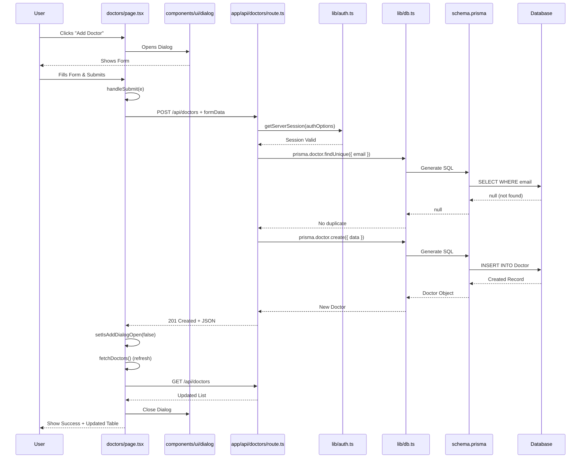

# Real-World File Interactions: Code Examples

This document shows real code examples from the codebase demonstrating how files interact with each other.

## 🔄 Example 1: User Views Doctors List

### Files Involved

```
1. User visits /doctors
2. middleware.ts → checks authentication
3. app/layout.tsx → wraps page
4. app/(app)/layout.tsx → adds sidebar
5. app/(app)/doctors/page.tsx → renders page
6. app/(app)/doctors/columns.tsx → defines table columns
7. GET /api/doctors → fetches data
8. app/api/doctors/route.ts → handles request
9. lib/db.ts → queries database
10. components/data-table/data-table.tsx → displays table
```

### Code Flow

**Step 1: Middleware Checks Auth**
```typescript
// middleware.ts
export default withAuth(
  function middleware(req) {
    if (req.nextUrl.pathname.startsWith("/doctors")) {
      if (!req.nextauth.token) {
        return NextResponse.redirect(new URL("/signin", req.url))
      }
    }
    return NextResponse.next()
  }
)
```

**Step 2: Page Component Loads**
```typescript
// app/(app)/doctors/page.tsx
"use client"

import { useSession } from "next-auth/react"
import { DataTable } from "@/components/data-table/data-table"
import { columns } from "./columns"

export default function DoctorsPage() {
  const { data: session } = useSession()
  const [doctors, setDoctors] = useState<Doctor[]>([])
  
  useEffect(() => {
    fetchDoctors()  // ← Calls API
  }, [])
  
  const fetchDoctors = async () => {
    const response = await fetch('/api/doctors')  // ← API call
    const result = await response.json()
    setDoctors(result.data)
  }
  
  return (
    <DataTable 
      data={doctors}      // ← Data from API
      columns={columns}   // ← From columns.tsx
    />
  )
}
```

**Step 3: Columns File Defines Structure**
```typescript
// app/(app)/doctors/columns.tsx
import { ColumnDef } from "@tanstack/react-table"
import { Button } from "@/components/ui/button"  // ← Uses UI component

export const columns: ColumnDef<Doctor>[] = [
  {
    accessorKey: 'firstName',
    header: 'First Name',
  },
  {
    id: 'actions',
    cell: ({ row }) => (
      <Button onClick={() => meta.onEdit(row.original.id)}>
        Edit
      </Button>
    )
  }
]
```

**Step 4: API Route Handles Request**
```typescript
// app/api/doctors/route.ts
import { getServerSession } from "next-auth"
import { authOptions } from "@/lib/auth"      // ← Uses auth config
import { prisma } from "@/lib/db"              // ← Uses database client

export async function GET(request: NextRequest) {
  const session = await getServerSession(authOptions)  // ← Auth check
  if (!session) {
    return NextResponse.json({ error: 'Unauthorized' }, { status: 401 })
  }
  
  const doctors = await prisma.doctor.findMany()  // ← Database query
  return NextResponse.json({ data: doctors })
}
```

**Step 5: Database Client**
```typescript
// lib/db.ts
import { PrismaClient } from "@prisma/client"

export const prisma = new PrismaClient()
// Uses types from prisma/schema.prisma automatically
```

**Step 6: DataTable Component**
```typescript
// components/data-table/data-table.tsx
import { Table } from "@/components/ui/table"      // ← Uses UI components
import { Button } from "@/components/ui/button"

export function DataTable({ data, columns }) {
  const table = useReactTable({ data, columns })
  
  return (
    <Table>
      {/* Renders table using UI components */}
    </Table>
  )
}
```

## 🔄 Example 2: User Creates a Doctor

### Complete Interaction Chain



### Code Snippets

**Page Component - Form Submission**
```typescript
// app/(app)/doctors/page.tsx
const handleSubmit = async (e: React.FormEvent) => {
  e.preventDefault()
  
  // Prepare data
  const formData = {
    firstName: formData.firstName,
    lastName: formData.lastName,
    email: formData.email,
    // ... more fields
  }
  
  // Make API call
  const response = await fetch('/api/doctors', {
    method: 'POST',
    headers: { 'Content-Type': 'application/json' },
    credentials: 'include',
    body: JSON.stringify(formData)
  })
  
  if (response.ok) {
    setIsAddDialogOpen(false)  // Close dialog
    fetchDoctors()             // Refresh list
    toast.success('Doctor added!')
  }
}
```

**API Route - Create Handler**
```typescript
// app/api/doctors/route.ts
export async function POST(request: NextRequest) {
  // 1. Check authentication
  const session = await getServerSession(authOptions)
  if (!session) {
    return NextResponse.json({ error: 'Unauthorized' }, { status: 401 })
  }
  
  // 2. Parse request body
  const body = await request.json()
  const { firstName, lastName, email } = body
  
  // 3. Check for duplicates
  const existing = await prisma.doctor.findUnique({
    where: { email }
  })
  if (existing) {
    return NextResponse.json({ error: 'Email exists' }, { status: 400 })
  }
  
  // 4. Create record
  const doctor = await prisma.doctor.create({
    data: { firstName, lastName, email }
  })
  
  // 5. Return response
  return NextResponse.json(doctor, { status: 201 })
}
```

## 🔄 Example 3: Authentication Flow

### Files Involved

```
1. User visits /signin
2. app/(auth)/signin/page.tsx → renders form
3. User submits → calls NextAuth signIn()
4. app/api/auth/[...nextauth]/route.ts → handles
5. lib/auth.ts → authorize function
6. lib/db.ts → queries User table
7. bcrypt → compares password
8. Creates JWT token
9. Sets cookie
10. Redirects to /dashboard
```

### Code Flow

**Sign In Page**
```typescript
// app/(auth)/signin/page.tsx
"use client"

import { signIn } from "next-auth/react"  // ← NextAuth function
import { Button } from "@/components/ui/button"
import { Input } from "@/components/ui/input"

export default function SignInPage() {
  const handleSubmit = async (e: React.FormEvent) => {
    e.preventDefault()
    
    // Call NextAuth signIn
    const result = await signIn('credentials', {
      identifier: username,
      password: password,
      redirect: true,
      callbackUrl: '/dashboard'
    })
  }
  
  return (
    <form onSubmit={handleSubmit}>
      <Input name="username" />
      <Input name="password" type="password" />
      <Button type="submit">Sign In</Button>
    </form>
  )
}
```

**NextAuth API Route**
```typescript
// app/api/auth/[...nextauth]/route.ts
import NextAuth from "next-auth"
import { authOptions } from "@/lib/auth"  // ← Uses auth config

export const handler = NextAuth(authOptions)
export { handler as GET, handler as POST }
```

**Auth Configuration**
```typescript
// lib/auth.ts
import { PrismaAdapter } from "@auth/prisma-adapter"
import { db } from "@/lib/db"  // ← Uses database client
import bcrypt from "bcryptjs"

export const authOptions = {
  adapter: PrismaAdapter(db),  // ← Connects to database
  providers: [
    CredentialsProvider({
      async authorize(credentials) {
        // 1. Find user
        const user = await db.user.findFirst({
          where: {
            OR: [
              { email: credentials.identifier },
              { username: credentials.identifier }
            ]
          }
        })
        
        // 2. Check password
        const isValid = await bcrypt.compare(
          credentials.password,
          user.passwordHash
        )
        
        // 3. Return user if valid
        if (isValid) {
          return { id: user.id, email: user.email, role: user.role }
        }
        return null
      }
    })
  ]
}
```

## 🔄 Example 4: Dashboard with Charts

### Files Involved

```
1. User visits /dashboard
2. app/(app)/dashboard/page.tsx → renders
3. Calls GET /api/dashboard
4. app/api/dashboard/route.ts → handles
5. lib/dashboard-data.ts → processes data
6. lib/db.ts → queries multiple tables
7. components/dashboard/KPITiles.tsx → displays stats
8. components/charts/BarChart.tsx → displays chart
```

### Code Flow

**Dashboard Page**
```typescript
// app/(app)/dashboard/page.tsx
"use client"

import { KPITiles } from "@/components/dashboard/KPITiles"
import { BarChart } from "@/components/charts/BarChart"
import { useEffect, useState } from "react"

export default function DashboardPage() {
  const [data, setData] = useState(null)
  
  useEffect(() => {
    fetch('/api/dashboard')  // ← Calls API
      .then(res => res.json())
      .then(data => setData(data))
  }, [])
  
  return (
    <div>
      <KPITiles data={data?.kpis} />      {/* ← Uses dashboard component */}
      <BarChart data={data?.chartData} />  {/* ← Uses chart component */}
    </div>
  )
}
```

**Dashboard API**
```typescript
// app/api/dashboard/route.ts
import { getServerSession } from "next-auth"
import { authOptions } from "@/lib/auth"
import { prisma } from "@/lib/db"
import { calculateDashboardData } from "@/lib/dashboard-data"  // ← Uses dashboard logic

export async function GET() {
  const session = await getServerSession(authOptions)
  if (!session) {
    return NextResponse.json({ error: 'Unauthorized' }, { status: 401 })
  }
  
  // Query multiple tables
  const [doctors, teachers, engineers, lawyers] = await Promise.all([
    prisma.doctor.count(),
    prisma.teacher.count(),
    prisma.engineer.count(),
    prisma.lawyer.count()
  ])
  
  // Process data
  const dashboardData = calculateDashboardData({
    doctors, teachers, engineers, lawyers
  })
  
  return NextResponse.json(dashboardData)
}
```

**Dashboard Data Processing**
```typescript
// lib/dashboard-data.ts
export function calculateDashboardData(data) {
  return {
    kpis: {
      totalDoctors: data.doctors,
      totalTeachers: data.teachers,
      // ... more KPIs
    },
    chartData: {
      labels: ['Doctors', 'Teachers', 'Engineers', 'Lawyers'],
      values: [data.doctors, data.teachers, data.engineers, data.lawyers]
    }
  }
}
```

## 🔄 Example 5: File Upload Flow

### Files Involved

```
1. User selects file
2. components/forms/file-input.tsx → handles selection
3. app/(app)/files/page.tsx → receives file
4. POST /api/upload → uploads file
5. app/api/upload/route.ts → handles upload
6. lib/file-manager.ts → saves file
7. lib/db.ts → saves metadata
8. Returns file URL
```

### Code Flow

**File Input Component**
```typescript
// components/forms/file-input.tsx
"use client"

import { useDropzone } from "react-dropzone"

export function FileInput({ onFileSelect }) {
  const onDrop = (acceptedFiles) => {
    onFileSelect(acceptedFiles[0])  // ← Passes to parent
  }
  
  const { getRootProps } = useDropzone({ onDrop })
  
  return <div {...getRootProps()}>Drop file here</div>
}
```

**Files Page**
```typescript
// app/(app)/files/page.tsx
"use client"

import { FileInput } from "@/components/forms/file-input"

export default function FilesPage() {
  const handleFileSelect = async (file: File) => {
    const formData = new FormData()
    formData.append('file', file)
    
    const response = await fetch('/api/upload', {
      method: 'POST',
      body: formData  // ← Sends file
    })
    
    const result = await response.json()
    // Handle result
  }
  
  return <FileInput onFileSelect={handleFileSelect} />
}
```

**Upload API**
```typescript
// app/api/upload/route.ts
import { getServerSession } from "next-auth"
import { authOptions } from "@/lib/auth"
import { saveFile } from "@/lib/file-manager"  // ← Uses file manager
import { prisma } from "@/lib/db"

export async function POST(request: NextRequest) {
  const session = await getServerSession(authOptions)
  if (!session) {
    return NextResponse.json({ error: 'Unauthorized' }, { status: 401 })
  }
  
  const formData = await request.formData()
  const file = formData.get('file') as File
  
  // Save file to disk
  const filePath = await saveFile(file, session.user.id)
  
  // Save metadata to database
  const upload = await prisma.upload.create({
    data: {
      filename: file.name,
      path: filePath,
      userId: session.user.id
    }
  })
  
  return NextResponse.json({ upload })
}
```

**File Manager**
```typescript
// lib/file-manager.ts
import fs from 'fs/promises'
import path from 'path'

export async function saveFile(file: File, userId: string) {
  const uploadsDir = path.join(process.cwd(), 'uploads', 'files')
  await fs.mkdir(uploadsDir, { recursive: true })
  
  const filename = `${userId}_${Date.now()}_${file.name}`
  const filePath = path.join(uploadsDir, filename)
  
  const bytes = await file.arrayBuffer()
  await fs.writeFile(filePath, Buffer.from(bytes))
  
  return filePath
}
```

## 📊 File Interaction Summary Table

| Action | Files Involved | Flow |
|--------|---------------|------|
| **View Doctors** | `doctors/page.tsx` → `columns.tsx` → `data-table.tsx` → `GET /api/doctors` → `lib/db.ts` | Page → Component → API → Database |
| **Create Doctor** | `doctors/page.tsx` → `POST /api/doctors` → `lib/auth.ts` → `lib/db.ts` → `prisma` | Page → API → Auth → Database |
| **Sign In** | `signin/page.tsx` → NextAuth API → `lib/auth.ts` → `lib/db.ts` → `bcrypt` | Page → Auth API → Database → Password Check |
| **View Dashboard** | `dashboard/page.tsx` → `GET /api/dashboard` → `lib/dashboard-data.ts` → `lib/db.ts` | Page → API → Processing → Database |
| **Upload File** | `files/page.tsx` → `file-input.tsx` → `POST /api/upload` → `lib/file-manager.ts` → `lib/db.ts` | Page → Component → API → File System → Database |

## 🎯 Key Takeaways

1. **Pages import Components** - Pages use components to build UI
2. **Components import UI Components** - Reusable pieces
3. **Pages call APIs** - Frontend calls backend via fetch
4. **APIs import Libraries** - Auth, DB, validation
5. **Libraries use Database** - lib/db.ts is the gateway
6. **Middleware runs first** - Checks every request
7. **Layouts wrap pages** - Provide structure

## 🔗 Related Documentation

- [Files & Folders Interactions](./28-files-folders-interactions.md) - Complete reference
- [Files Quick Reference](./29-files-quick-reference.md) - Quick lookup
- [Code Walkthrough: Pages](./24-code-walkthrough-pages.md) - Page examples
- [Code Walkthrough: API Routes](./25-code-walkthrough-api.md) - API examples

---

**These examples show exactly how files work together in real scenarios!**

